# AI School 看板 - 软件设计文档

## 文档信息

| 项目 | 内容 |
|------|------|
| 文档名称 | AI School 看板软件设计文档 |
| 版本号 | V1.0 |
| 编写日期 | 2026年 |
| 编写人 | 系统架构师 |
| 审核人 | - |
| 批准人 | - |

---

## 目录

1. [业务背景](#1-业务背景)
2. [需求场景分析](#2-需求场景分析)
3. [整体方案](#3-整体方案)
4. [测试设计](#4-测试设计)

---

## 1. 业务背景

AI School 看板是 AI 转型作战看板体系中的「学分经营」子看板。系统以**个人 AI 学分**为统一度量，将员工在课程学习（基础/进阶/实战）、AI 任职、AI 认证以及线下手工录入等多渠道获得的能力沉淀，折算为统一学分，并围绕「目标学分 / 当前学分 / 学分达成率」展开多维度统计与下钻，为各级管理者提供 AI 人才培养进度的经营视图。

与「AI 任职认证看板」聚焦认证/任职「是否达标」不同，AI School 看板关注的是**学习过程的量化经营**：以学分衡量个人成长、以部门标杆牵引追赶、以时间进度预警滞后。

### 1.1 目标用户

| 用户角色 | 角色描述 | 主要诉求 |
|----------|----------|----------|
| 公司/产品线管理者 | 负责 AI 转型整体经营的高层管理者 | 总览各部门/职位的学分达成情况，识别滞后组织，进行经营决策 |
| 部门负责人 | 二级～六级部门负责人 | 查看本部门及下级部门学分总览，对标部门标杆，牵引团队达成 |
| 专家/干部 | 被纳入 L1/L2/L3 岗位成熟度的关键人群 | 查看本群体学分达成情况，了解自身在群体中的相对位置 |
| 普通员工 | 纳入 AI 转型基线的全体员工 | 查看个人学分概览、目标差距、各分类完课明细与手工录入学分 |
| 系统/定时任务平台 | 负责触发学分重算的外部调度系统 | 通过接口触发全量/增量学分同步，保证看板数据时效 |

### 1.2 功能目标

#### 1.2.1 功能目标

- 提供**个人学分概览**：展示个人目标学分、当前学分、学分达成率、所在最小部门标杆达成率及达成日期。
- 提供**个人课程完成情况**：按训战分类（基础/进阶/实战）展示目标课程数、完课数、完课占比及课程清单（含完课标记）。
- 提供**职位学分总览**与**部门学分总览**：按职位类/部门维度统计基线人数、最高/最低/平均学分、平均目标学分、达成率、时间进度与预警。
- 提供**专家 & 干部学分总览**：按岗位 AI 成熟度（L1/L2/L3）分别统计专家、干部群体的学分达成情况。
- 提供**基线人数下钻明细**：从总览统计下钻到员工级学分明细，支持职位族/职位类/职位子类/岗位成熟度等条件过滤与分页。
- 提供**学分同步能力**：支持全量同步与按工号增量同步，并联动刷新部门标杆达成率。
- 提供**手工录入学分**：支持线下学分的录入、批量导入及个人维度分页查询。

#### 1.2.2 性能目标

- 单次总览/下钻查询响应时间 < 3 秒。
- 下钻明细分页查询单页（≤50 条）响应时间 < 2 秒。
- 全量学分同步（万级员工）在 10 分钟内完成；增量同步（按工号）秒级返回。
- 支持并发用户数 ≥ 100。

#### 1.2.3 可靠性目标

- 系统可用性 ≥ 99.9%。
- 学分同步采用事务管理，保证「计算—落库—删除过期—刷新标杆」全过程数据一致性，异常整体回滚。
- 完善的全局异常处理与日志记录，所有接口异常均被捕获并返回统一错误结构。

#### 1.2.4 安全目标

- 个人维度接口（个人学分概览、个人完课、个人手工录入学分）严格以 Cookie/入参工号为准，仅返回本人数据。
- 数据库连接信息支持 `ENC(...)` 加密存储。
- 全部 SQL 使用 MyBatis 参数化（`#{}`），动态列名（部门层级列）通过白名单校验，防止 SQL 注入。
- 生产环境使用 HTTPS 传输。

### 1.3 系统范围

#### 1.3.1 功能范围

- 个人学分概览查询。
- 个人课程完成情况查询。
- 职位/部门学分总览统计。
- 专家 & 干部学分总览统计。
- 基线人数下钻明细查询（分页 + 多条件过滤）。
- 个人学分同步（全量 / 增量）。
- 手工录入学分管理（录入、批量导入、查询）。

#### 1.3.2 非功能范围

- 学分计算口径的统一与可配置（认证学分上限 15、任职学分上限 25 等规则）。
- 数据同步的事务一致性与幂等。
- 查询性能优化（批量查询、索引、分页）。
- 安全防护、日志审计与异常处理。

---

## 2. 需求场景分析

### 2.1 用户诉求分析

#### 2.1.1 核心用户诉求

**诉求 1：统一学分度量需求**
- **诉求描述**：将课程完课、AI 认证、AI 任职、线下手工录入等多来源能力沉淀，折算为统一可比的「学分」。
- **使用场景**：员工查看个人学分构成；管理者比较不同人员/部门的学分达成。
- **期望结果**：每名员工有明确的「目标学分、当前学分、达成率」，口径统一、可解释。

**诉求 2：多维度学分总览需求**
- **诉求描述**：从职位类、部门、岗位成熟度（专家/干部）等多维度查看学分达成。
- **使用场景**：产品线管理者按四级部门对比达成率；部门负责人查看下级部门；查看专家/干部按 L1/L2/L3 的达成情况。
- **期望结果**：返回各分组的基线人数、最高/最低/平均学分、平均目标学分、达成率，并自动给出时间进度对比与预警。

**诉求 3：部门标杆牵引需求**
- **诉求描述**：以每个最小部门内的最高个人达成率作为「部门标杆」，牵引团队对标追赶。
- **使用场景**：员工在个人概览中看到本部门标杆达成率，明确差距。
- **期望结果**：标杆随个人学分变化自动刷新，且仅刷新受影响部门以保证时效。

**诉求 4：下钻定位需求**
- **诉求描述**：从汇总指标（如基线人数）下钻到员工明细，定位滞后人员。
- **使用场景**：管理者点击某部门基线人数，查看该范围内每名员工的学分、达成率、状态。
- **期望结果**：支持按职位族/类/子类、岗位成熟度过滤，分页返回，并附带状态预警标签。

**诉求 5：数据时效需求**
- **诉求描述**：完课、认证、任职、手工录入数据变更后，学分能够及时重算。
- **使用场景**：定时任务平台定时触发全量同步；某员工数据变更后触发增量同步。
- **期望结果**：全量/增量两种模式，增量仅重算指定工号并局部刷新标杆。

#### 2.1.2 用户痛点分析

| 痛点 | 痛点描述 | 影响程度 | 解决方案 |
|------|----------|----------|----------|
| 能力来源分散 | 课程、认证、任职、线下学分分散在多套系统 | 高 | 统一折算为个人学分，集中沉淀至 `t_personal_credit` |
| 缺乏过程牵引 | 仅看「是否达标」无法牵引过程 | 高 | 引入学分达成率 + 时间进度预警 + 部门标杆 |
| 口径不一致 | 各部门选课不同，目标学分难统一 | 中 | 基于四级部门选课确定目标课程，无选课时取全量课程 |
| 重算成本高 | 全量重算耗时影响时效 | 中 | 提供按工号增量同步与局部标杆刷新 |

### 2.2 功能分析

#### 2.2.1 功能需求梳理

**功能模块 1：个人学分概览**
- 功能描述：根据工号查询 `t_personal_credit` 的个人学分概览。
- 输入：工号（入参优先，否则 Cookie 解析）。
- 输出：`PersonalCredit`（目标学分、当前学分、达成率、部门标杆达成率、达成日期、岗位成熟度等）。

**功能模块 2：个人课程完成情况**
- 功能描述：按训战分类统计目标课程数、完课数、完课占比，并返回课程清单与完课标记。
- 输入：工号。
- 输出：`PersonalCourseCompletionResponseVO`（含 `courseStatistics` 列表）。

**功能模块 3：职位 / 部门学分总览**
- 功能描述：按职位类或部门维度统计学分总览，计算时间进度与预警。
- 输入：部门编码 `deptCode`（0/空默认云核心网产品线 031562）、角色 `role`（1 干部 / 2 专家 / 3 基层管理者）。
- 输出：`CreditStatisticsResponseVO`（分组统计列表 + 总计行）。

**功能模块 4：专家 & 干部学分总览**
- 功能描述：分别统计专家、干部按岗位 AI 成熟度（L1/L2/L3）的学分达成。
- 输入：部门编码（空/0 查全量）。
- 输出：`SchoolRoleSummaryResponseVO`（`expertSummary` + `cadreSummary`）。

**功能模块 5：基线人数下钻明细**
- 功能描述：下钻到员工级学分明细，支持多条件过滤与分页。
- 输入：`deptCode`、`deptLevel`、`roleType`、`jobFamily/jobCategory/jobSubCategory`、`positionMaturity`、`pageNum/pageSize`。
- 输出：`SchoolCreditDetailResponseVO`（`records` + 分页信息 + 可选项集合）。

**功能模块 6：学分同步**
- 功能描述：全量重算所有员工学分或按工号增量重算，并刷新部门标杆。
- 输入：全量无入参；增量传工号集合。
- 输出：同步结果。

**功能模块 7：手工录入学分**
- 功能描述：线下学分的录入、批量导入与查询。
- 输入：录入/导入数据；个人查询传工号。
- 输出：录入结果 / 分页列表。

#### 2.2.2 功能优先级划分

| 优先级 | 功能模块 | 说明 |
|--------|----------|------|
| P0（必须） | 个人学分概览、职位/部门学分总览、学分同步 | 看板核心，必须实现 |
| P0（必须） | 基线人数下钻明细、个人课程完成情况 | 核心查询与下钻 |
| P1（重要） | 专家 & 干部学分总览 | 关键人群经营 |
| P1（重要） | 手工录入学分（录入/导入/查询） | 数据补录 |
| P2（一般） | 数据导出 | 增强功能，后续实现 |

#### 2.2.3 功能详细分析

**功能：个人学分计算（同步核心逻辑）**

- 功能描述：以 `t_employee_sync` 最新周期（`period_id = MAX`）员工为基线，逐人计算学分并落库。
- 计算口径：
  1. **目标学分**：取员工四级部门在 `dept_course_selections` 的选课（基础/进阶/实战），按 `ai_course_planning_info` 课程学分求和；**该四级部门无选课时取全量目标课程**（`course_level ∈ {基础, 进阶, 实战}`）。
  2. **当前学分** = 基础/进阶完课学分 + 实战完课学分 + 手工录入学分（按工号汇总）+ AI 认证学分（专业级 15 / 工作级 10，同人取 MAX，自然上限 15）+ AI 任职学分（4 级及以上 25 / 3 级 10，同人取 MAX，自然上限 25，仅当前有效）。
     - 基础/进阶完课：以目标课程 `course_number` 查询 `t_micro_study_info_sync` ∪ `t_mooc_study_info_sync`（`is_pass='1'`）判定完课，命中即累加课程学分。
     - 实战完课：以 `hands_on_courses` 关联 `ai_course_planning_info`（`course_level='实战'`）得到已完成实战课程，有选课时仅累计目标范围内课程。
  3. **达成率** = 当前学分 / 目标学分 × 100（保留 2 位小数；目标为 0 时按约定处理）。
  4. **达成日期**：当前学分首次 ≥ 目标学分时记录，已有日期则保留。
- 落库：批量 `INSERT ... ON DUPLICATE KEY UPDATE`，并删除不在本次范围内的过期记录。
- 标杆：按最小部门计算组内最高个人达成率，写回 `deptBenchmarkCompletionRate`。

**功能：基线人数下钻明细查询**

- 功能流程：参数校验（`deptCode=0` 视为二级部门 031562）→ 统计总数 → 分页查询明细 → 计算时间进度学分目标 `scheduleTarget` 与状态（达成率 ≥100% 正常 / ≥60% 预警 / 否则滞后）→ 组装可选项集合返回。
- 异常处理：部门编码为空返回 400；系统异常返回 500。

#### 2.2.4 功能依赖关系

```
课程规划(ai_course_planning_info) + 部门选课(dept_course_selections)
        ↓ （确定目标课程/目标学分）
完课数据(micro/mooc/hands_on) + 认证/任职学分 + 手工录入学分
        ↓ （学分同步计算）
个人学分(t_personal_credit) → 部门标杆刷新
        ↓
个人概览 / 职位·部门总览 / 专家干部总览 / 下钻明细
```

#### 2.2.5 非功能需求

- 性能：批量查询按 1000/批；分页查询；总览查询走聚合 SQL。
- 可靠性：同步全过程事务化；增量同步对缺失工号抛异常回滚。
- 安全：动态部门层级列名白名单校验；个人接口仅返回本人数据。
- 可维护性：分层清晰，学分计算集中在 `PersonalCreditService#calculateEmployeeCredit`。

### 2.3 需求场景全景与设计覆盖矩阵

为保证「无场景遗漏」，下表对原始功能需求逐场景拆解，并映射到本文档的设计实现与流程章节。覆盖状态 ✅ 表示已在本设计中给出明确实现路径。

| 场景ID | 业务场景 | 触发入口 | 关键规则/分支 | 设计对应（类/方法） | 流程章节 | 覆盖 |
|--------|----------|----------|----------------|----------------------|----------|------|
| SC-01 | 个人学分概览 | `/api/personal-credit/overview` | 入参工号优先，否则 Cookie；无记录回填空对象 | `PersonalCreditService.getPersonalCreditOverview` | 3.4.1 | ✅ |
| SC-02 | 个人课程完成情况 | `/personal-course/completion` | 按基础/进阶/实战分类；某分类无课程返回 0 | `PersonalCourseCompletionService.getPersonalCourseCompletion` | 2.2.1 / 4.1.2 | ✅ |
| SC-03 | 职位学分总览 | `/api/credit/statistics/position` | deptCode 空/0 默认 031562；按 role 过滤 | `PersonalCreditService.getPositionStatistics` | 3.4.3 | ✅ |
| SC-04 | 部门学分总览 | `/api/credit/statistics/department` | 按层级取下一级分组列；默认四级白名单排序；6 级取本级；选中部门空分组补本部门汇总行 | `PersonalCreditService.getDepartmentStatistics` | 3.4.3 | ✅ |
| SC-05 | 专家&干部学分总览 | `/api/credit/statistics/role-summary` | 按 L1/L2/L3；空/0 查全量；状态分级 | `PersonalCreditService.getRoleSummary` | 3.4.5 | ✅ |
| SC-06 | 基线人数下钻明细(GET) | `/api/credit/statistics/detail` | 多条件过滤 + 分页；状态预警 | `PersonalCreditService.getSchoolCreditDetailList` | 3.4.4 | ✅ |
| SC-07 | 学分明细下钻(POST/GET) | `/api/school-credit-detail/list` | deptCode=0→031562 且 deptLevel=2；构建可选项集合 | `SchoolCreditDetailServiceImpl.getCreditDetailList` | 3.4.4 | ✅ |
| SC-08 | 个人手工录入学分分页 | `/personal-course/manual-enter-credit-list` | 工号优先入参；仅本人 | `ManualEnterCreditService.page` | 2.2.1 / 4.1.7 | ✅ |
| SC-09 | 手工学分录入/批量导入 | 手工录入接口 | 批量导入结果统计 | `ManualEnterCreditService` | 4.1.7 | ✅ |
| SC-10 | 课程规划明细查询 | `/course-planning-info/list` | 仅 基础/进阶/实战 参与目标 | `CoursePlanningInfoService.getAllCoursePlanningInfo` | 4.1.8 | ✅ |
| SC-11 | 全量学分同步 | `/api/personal-credit/sync` | 最新周期；批量落库；删除过期；刷新标杆 | `PersonalCreditService.syncAllPersonalCredits` | 3.4.2 | ✅ |
| SC-12 | 增量学分同步 | 内部/外部触发 | 仅重算指定工号；缺失工号回滚；局部刷新标杆 | `PersonalCreditService.syncPersonalCreditsForEmployees` | 3.4.2 | ✅ |
| SC-13 | 部门标杆刷新 | 同步后 | 每最小部门取最高个人达成率 | `updateDeptBenchmarks / updateDeptBenchmarksForDeptNumbers` | 3.4.2 | ✅ |
| SC-14 | 时间进度与预警 | 总览/明细 | 当日/全年；达成率<进度预警；分级 success/warning/danger | `calculateTimeProgressAndWarning / fillRoleSummaryStatus / fillDetailStatus` | 3.4.3-3.4.5 | ✅ |

**边界与异常场景覆盖**：工号缺失（401）、deptCode 为空（400）、最新周期缺失（全量 return / 增量抛异常）、目标学分为 0、学分格式非法、SQL 注入（层级列名白名单）、分页非法值规整，均在 4.3 异常测试与 3.8 DFX 中给出处理策略。

---

## 3. 整体方案

### 3.1 架构设计

系统采用经典三层架构：**表现层（Controller）** → **业务层（Service）** → **数据访问层（Mapper）**，并复用 AI 转型平台公共组件（`Result`、`DepartmentConstants`、`UserConfigService` 等）。

#### 3.1.1 架构分层

```
┌──────────────────────────────────────────────────────────────┐
│                       表现层 (Controller)                       │
│  PersonalCredit          PersonalCreditStatistics              │
│  Controller              Controller                            │
│  SchoolCreditDetail      PersonalCourseCompletion              │
│  Controller              Controller                            │
│  ManualEnterCredit       CoursePlanningInfo                    │
│  Controller              Controller       GlobalExceptionHandler│
└──────────────────────────────────────────────────────────────┘
                              ↓
┌──────────────────────────────────────────────────────────────┐
│                        业务层 (Service)                         │
│  PersonalCreditService（学分计算/同步/总览/下钻/标杆）            │
│  PersonalCourseCompletionService   SchoolCreditDetailService    │
│  ManualEnterCreditService          CoursePlanningInfoService    │
│  DepartmentInfoService             UserConfigService            │
└──────────────────────────────────────────────────────────────┘
                              ↓
┌──────────────────────────────────────────────────────────────┐
│                      数据访问层 (Mapper)                         │
│  PersonalCreditMapper        PersonalCourseCompletionMapper     │
│  CoursePlanningInfoMapper    ManualEnterCreditMapper            │
│  HandsOnCourseMapper         SchoolCreditDetailMapper           │
│  EmployeeMapper              DepartmentInfoMapper               │
└──────────────────────────────────────────────────────────────┘
                              ↓
┌──────────────────────────────────────────────────────────────┐
│                        数据库层 (MySQL)                          │
│  t_personal_credit          ai_course_planning_info            │
│  dept_course_selections     t_micro_study_info_sync            │
│  t_mooc_study_info_sync     hands_on_courses                   │
│  t_manual_enter_credit      t_employee_sync                    │
│  department_info_hrms                                          │
└──────────────────────────────────────────────────────────────┘
```

#### 3.1.2 架构说明

**表现层（Controller Layer）**
- 职责：接收 HTTP 请求、参数校验（如 `deptCode=0` 转云核心网二级部门 031562）、从 Cookie/入参解析工号、调用 Service、封装 `Result<T>` 返回、异常兜底。
- 设计要点：统一 `@RestController`；统一响应 `Result<T>`；个人接口工号优先取入参 `account`，否则 `UserConfigService.getUserAccountFromCookie`。

**业务层（Service Layer）**
- 职责：学分计算与同步、总览聚合、下钻分页、标杆刷新、状态/预警计算。
- 设计要点：`PersonalCreditService` 为核心，封装 `calculateEmployeeCredit`、`updateDeptBenchmarks`、`getPositionStatistics/getDepartmentStatistics/getRoleSummary/getSchoolCreditDetailList`；同步方法标注 `@Transactional`。

**数据访问层（Mapper Layer）**
- 职责：聚合统计 SQL、明细分页 SQL、批量插入/更新、按工号聚合学分查询。
- 设计要点：MyBatis 参数化；批量查询按 1000/批；动态层级列名经白名单（`isValidDeptLevel`）校验后拼接。

### 3.2 包架构设计

#### 3.2.1 包结构

```
com.huawei.aitransform
├── controller/
│   ├── PersonalCreditController.java            # /api/personal-credit（概览、同步）
│   ├── PersonalCreditStatisticsController.java  # /api/credit/statistics（总览、下钻、角色总览）
│   ├── SchoolCreditDetailController.java         # /api/school-credit-detail（明细下钻）
│   ├── PersonalCourseCompletionController.java   # /personal-course（个人完课）
│   ├── ManualEnterCreditController.java          # 手工录入学分
│   ├── CoursePlanningInfoController.java          # /course-planning-info（课程规划明细）
│   └── GlobalExceptionHandler.java
├── service/
│   ├── PersonalCreditService.java
│   ├── PersonalCourseCompletionService.java
│   ├── ManualEnterCreditService.java
│   ├── CoursePlanningInfoService.java
│   ├── DepartmentInfoService.java
│   ├── UserConfigService.java
│   └── impl/SchoolCreditDetailServiceImpl.java
├── mapper/
│   ├── PersonalCreditMapper.java
│   ├── PersonalCourseCompletionMapper.java
│   ├── CoursePlanningInfoMapper.java
│   ├── ManualEnterCreditMapper.java
│   ├── HandsOnCourseMapper.java
│   └── SchoolCreditDetailMapper.java
├── entity/
│   ├── PersonalCredit.java
│   ├── PersonalCourseCompletionResponseVO.java
│   ├── CreditOverviewVO.java / CreditStatisticsResponseVO.java
│   ├── SchoolRoleSummaryVO.java / SchoolRoleSummaryResponseVO.java
│   ├── SchoolCreditDetailVO.java / SchoolCreditDetailRequestVO.java / SchoolCreditDetailResponseVO.java
│   ├── CoursePlanningInfoVO.java / DeptCourseSelection.java
│   ├── ManualEnterCredit.java / ManualCreditSumRow.java / EmployeeCreditRow.java
│   └── EmployeeSyncDataVO.java
├── common/   (Result, PageResult)
├── constant/ (DepartmentConstants：CLOUD_CORE_NETWORK_DEPT_CODE=031562)
└── util/     (加密等工具)
```

#### 3.2.2 包职责说明

| 包名 | 职责 |
|------|------|
| controller | 接收请求、参数校验、工号解析、统一响应封装 |
| service | 学分计算/同步、总览聚合、下钻分页、标杆刷新、预警计算 |
| mapper | 学分及完课/课程/部门相关 SQL，批量与分页 |
| entity | 学分、课程、统计相关 VO/PO/DTO |
| common | 统一响应 `Result<T>`、分页 `PageResult<T>` |
| constant | 部门常量（云核心网产品线编码等） |
| util | 加密、工号处理等通用工具 |

### 3.3 系统类图

#### 3.3.1 核心类图

```plantuml
@startuml
package "Controller层" {
    class PersonalCreditController {
        +syncPersonalCredits(): Result<String>
        +getPersonalCreditOverview(account): Result<PersonalCredit>
    }
    class PersonalCreditStatisticsController {
        +getPositionStatistics(deptCode, role): Result<CreditStatisticsResponseVO>
        +getDepartmentStatistics(deptCode, role): Result<CreditStatisticsResponseVO>
        +getSchoolCreditDetail(req): Result<SchoolCreditDetailResponseVO>
        +getRoleSummary(deptCode): Result<SchoolRoleSummaryResponseVO>
    }
    class SchoolCreditDetailController {
        +getCreditDetailList(req): Result<SchoolCreditDetailResponseVO>
    }
    class PersonalCourseCompletionController {
        +getPersonalCourseCompletion(account): Result<PersonalCourseCompletionResponseVO>
    }
}

package "Service层" {
    class PersonalCreditService {
        +getPersonalCreditOverview(empNum): PersonalCredit
        +syncAllPersonalCredits(): void
        +syncPersonalCreditsForEmployees(empNums): void
        +getPositionStatistics(deptCode, role): CreditStatisticsResponseVO
        +getDepartmentStatistics(deptCode, role): CreditStatisticsResponseVO
        +getRoleSummary(deptCode): SchoolRoleSummaryResponseVO
        +getSchoolCreditDetailList(req): SchoolCreditDetailResponseVO
        -calculateEmployeeCredit(...): PersonalCredit
        -updateDeptBenchmarks(): void
    }
    class PersonalCourseCompletionService
    class SchoolCreditDetailService
    class ManualEnterCreditService
    class DepartmentInfoService
}

package "Mapper层" {
    interface PersonalCreditMapper {
        +getByEmployeeNumber(empNum): PersonalCredit
        +batchInsertOrUpdate(list): void
        +getPositionStatistics(deptCode, role): List<CreditOverviewVO>
        +getDepartmentStatistics(level, levelCode, deptCode, role): List<CreditOverviewVO>
        +getExpertRoleSummary(dept): List<SchoolRoleSummaryVO>
        +getCadreRoleSummary(dept): List<SchoolRoleSummaryVO>
        +countSchoolCreditDetail(req): long
        +getSchoolCreditDetailList(req): List<SchoolCreditDetailVO>
        +getMaxCompletionRateByDept(deptNum): BigDecimal
        +updateBenchmarkRateByDept(deptNum, rate): void
    }
    interface PersonalCourseCompletionMapper
    interface CoursePlanningInfoMapper
    interface HandsOnCourseMapper
    interface ManualEnterCreditMapper
}

PersonalCreditController --> PersonalCreditService
PersonalCreditStatisticsController --> PersonalCreditService
SchoolCreditDetailController --> SchoolCreditDetailService
PersonalCourseCompletionController --> PersonalCourseCompletionService

PersonalCreditService --> PersonalCreditMapper
PersonalCreditService --> PersonalCourseCompletionMapper
PersonalCreditService --> CoursePlanningInfoMapper
PersonalCreditService --> ManualEnterCreditMapper
PersonalCreditService --> HandsOnCourseMapper
PersonalCreditService --> DepartmentInfoService
@enduml
```

#### 3.3.2 实体类关系图

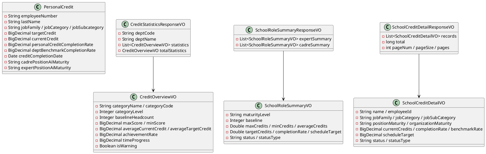

### 3.4 核心业务流程

#### 3.4.1 个人学分概览查询流程

##### 3.4.1.1 业务描述
从入参或 Cookie 解析工号，查询 `t_personal_credit` 返回个人学分概览；无记录时返回带工号的空对象，避免前端报错。

##### 3.4.1.2 时序图

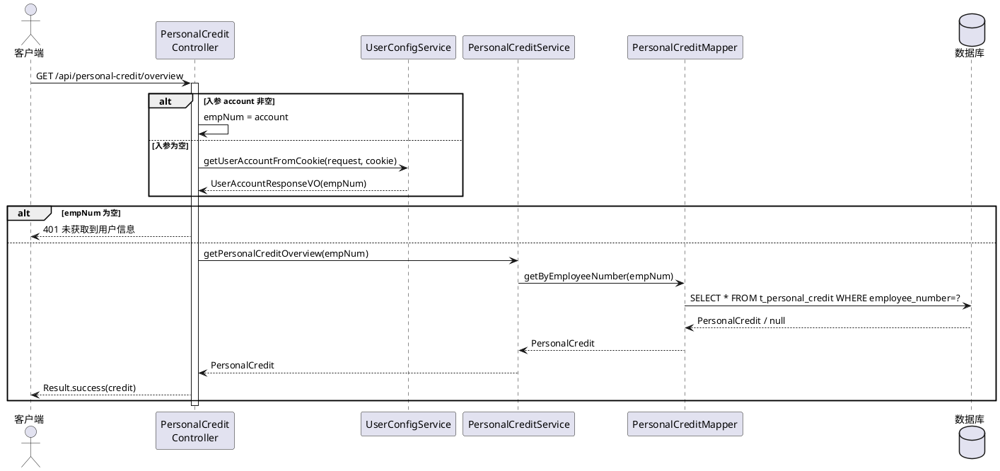

#### 3.4.2 个人学分批量同步流程

##### 3.4.2.1 业务描述
以 `t_employee_sync` 最新周期员工为基线，预加载课程/选课信息，逐人计算目标学分与当前学分，批量落库，删除过期记录，并刷新部门标杆。全过程事务化。

##### 3.4.2.2 时序图

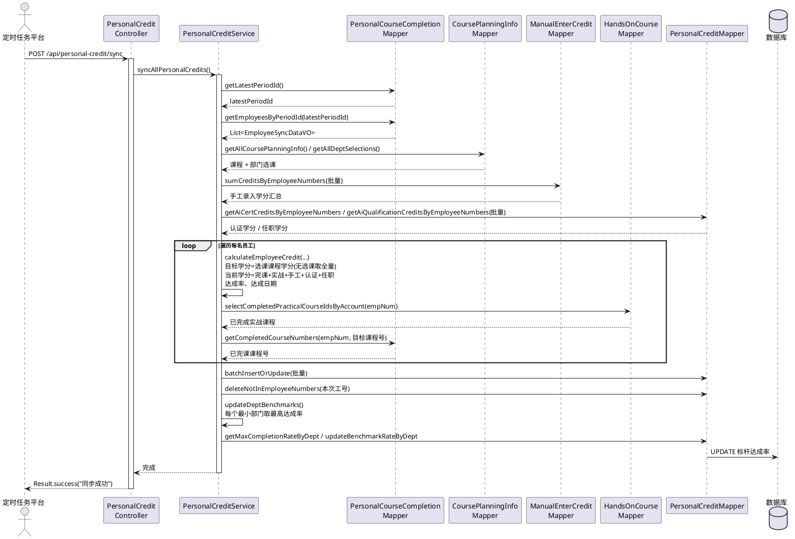

#### 3.4.3 部门 / 职位学分总览查询流程

##### 3.4.3.1 业务描述
根据部门编码与角色统计学分总览。部门维度按层级确定分组列（如云核心网默认查四级并按白名单排序），计算时间进度与预警，并附总计行（基于全量数据）。

##### 3.4.3.2 时序图

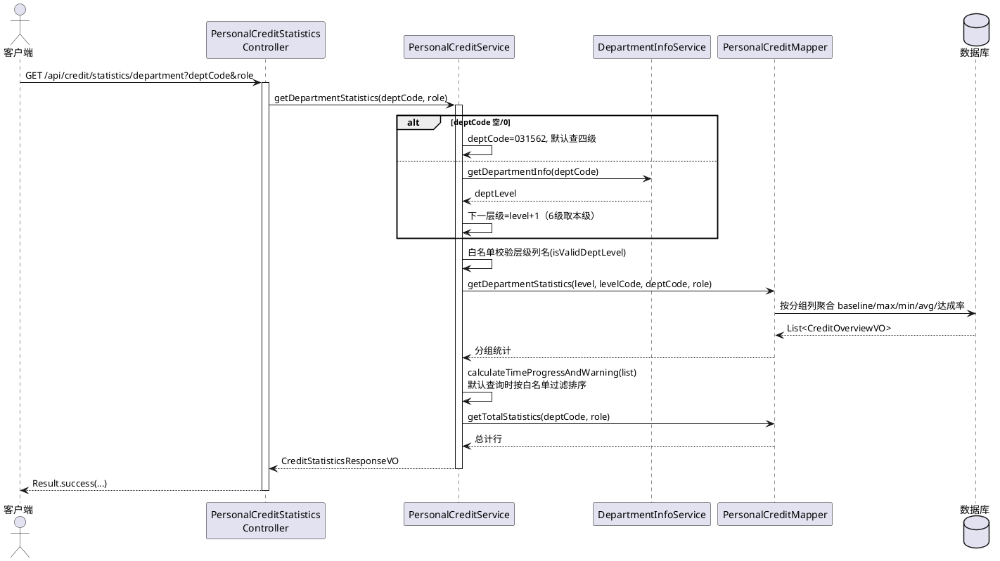

#### 3.4.4 基线人数下钻明细查询流程

##### 3.4.4.1 业务描述
从总览下钻到员工级学分明细，支持职位族/类/子类、岗位成熟度过滤与分页，并计算时间进度学分目标与状态预警。

##### 3.4.4.2 时序图

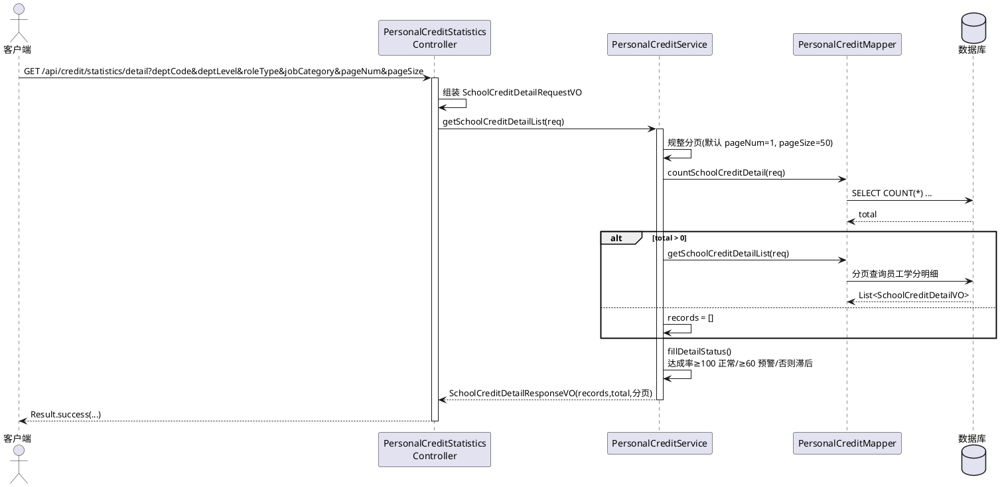

#### 3.4.5 专家 & 干部学分总览查询流程

##### 3.4.5.1 业务描述
按岗位 AI 成熟度（L1/L2/L3）分别统计专家、干部群体的基线、最高/最低/平均学分、目标学分、达成率，并按时间进度计算 `scheduleTarget` 与状态。

##### 3.4.5.2 时序图

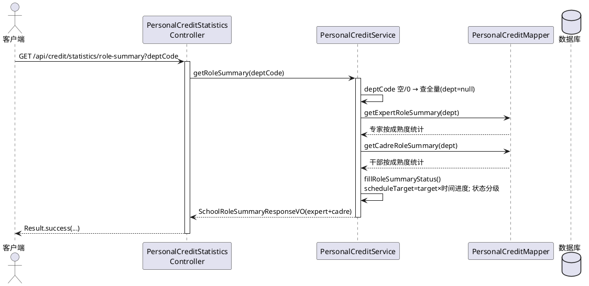

### 3.5 系统架构图

#### 3.5.1 部署架构图

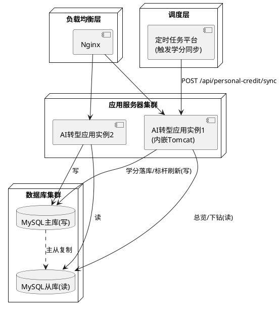

### 3.6 用例视图

#### 3.6.1 用例图

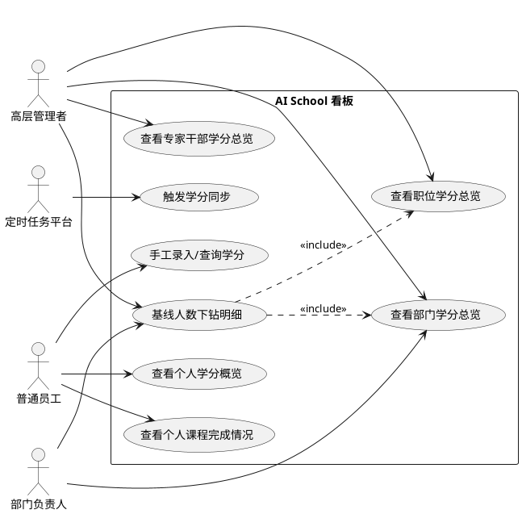

#### 3.6.2 用例详细说明

| 项目 | 内容 |
|------|------|
| 用例名称 | 基线人数下钻明细 |
| 参与者 | 部门负责人、高层管理者 |
| 前置条件 | 已完成学分同步，总览数据可用 |
| 基本流程 | 1. 点击某分组基线人数<br>2. 携带部门/角色/职位/成熟度条件下钻<br>3. 系统分页查询员工学分明细<br>4. 计算状态预警并返回 |
| 异常流程 | 部门编码为空返回 400；系统异常返回 500 |
| 后置条件 | 获得该范围员工学分明细列表 |

### 3.7 UI 设计

#### 3.7.1 总览看板

```
┌──────────────────────────────────────────────────────────────┐
│  AI School 学分经营看板        部门:[云核心网产品线▼] 角色:[全员▼] │
├──────────────────────────────────────────────────────────────┤
│  ┌─────────┐ ┌─────────┐ ┌─────────┐ ┌─────────┐ ┌─────────┐ │
│  │基线人数  │ │平均当前  │ │平均目标  │ │达成率    │ │时间进度  │ │
│  │  1280   │ │ 32.5学分 │ │ 50学分  │ │ 65.0%   │ │ 47.1%   │ │
│  └─────────┘ └─────────┘ └─────────┘ └─────────┘ └─────────┘ │
├──────────────────────────────────────────────────────────────┤
│  部门 / 职位学分总览（点击基线人数下钻）                          │
│  部门            基线  最高  最低  平均  目标  达成率  预警        │
│  分组核心网产品部 320   78    5    35   50   70.0%   正常        │
│  云核心网研究部   180   65    0    28   50   56.0% ▲滞后        │
└──────────────────────────────────────────────────────────────┘
```

#### 3.7.2 专家 & 干部学分总览

```
┌──────────────────────────────────────────────────────────────┐
│  专家学分总览                          干部学分总览              │
│  成熟度 基线 平均 目标 达成率 状态     成熟度 基线 平均 目标 状态  │
│  L1     60  40  50  80%  正常        L1   90  35  50  预警    │
│  L2     40  30  50  60%  预警        L2   50  28  50  滞后    │
│  L3     20  25  50  50%  滞后        L3   15  42  50  正常    │
└──────────────────────────────────────────────────────────────┘
```

#### 3.7.3 基线人数下钻明细页面

```
┌──────────────────────────────────────────────────────────────┐
│  学分明细下钻   职位类:[全部▼] 岗位成熟度:[全部▼]   [导出]        │
├──────────────────────────────────────────────────────────────┤
│  姓名  工号    职位类  成熟度 当前学分 达成率 标杆 状态           │
│  张三  1234..  软件类  L2     42      84%   95%  正常           │
│  李四  8765..  硬件类  L1     18      36%   95%  滞后           │
│  ...                                                           │
│  [上一页] [1] [2] [3] [下一页]   共 320 条                      │
└──────────────────────────────────────────────────────────────┘
```

#### 3.7.4 个人学分页面

```
┌──────────────────────────────────────────────────────────────┐
│  我的 AI 学分    当前 42 / 目标 50    达成率 84%   标杆 95%      │
├──────────────────────────────────────────────────────────────┤
│  课程完成情况                                                   │
│  分类   目标课程  完课  完课占比   课程清单(✓已完/○未完)          │
│  基础    10       8     80%      ✓AI基础 ✓机器学习 ○...        │
│  进阶    5        3     60%      ✓深度学习 ○...                │
│  实战    3        1     33%      ✓实战项目A ○...               │
├──────────────────────────────────────────────────────────────┤
│  手工录入学分                                  [录入]            │
│  日期        学分  来源/说明                                    │
│  2026-03-01  2.0   线下工作坊                                  │
└──────────────────────────────────────────────────────────────┘
```

### 3.8 DFX 分析

**功能（Function）**
- 覆盖个人概览、个人完课、职位/部门总览、专家干部总览、下钻明细、同步、手工录入全链路。
- 学分口径集中于 `calculateEmployeeCredit`，便于规则演进（认证上限 15、任职上限 25、目标课程口径等）。

**性能（Performance）**
- 同步：课程/选课预加载为内存 Map；认证/任职/手工学分按 1000/批查询；批量 `INSERT ... ON DUPLICATE KEY UPDATE`。
- 查询：总览走聚合 SQL；明细分页；增量同步仅重算指定工号并局部刷新标杆。
- 建议：对部门信息、课程规划等低频变化数据增加缓存（部门信息 1 小时、课程 30 分钟）。

**可靠性（Reliability）**
- 全量/增量同步均 `@Transactional(rollbackFor = Exception.class)`；增量同步对最新周期缺失工号抛 `IllegalArgumentException` 回滚。
- 全局异常处理统一返回 `Result.error`。

**安全（Security）**
- 个人接口仅以工号返回本人数据。
- 动态部门层级列名经 `isValidDeptLevel` 白名单校验，防注入；其余 SQL 全部参数化。
- 数据库密码支持加密；生产 HTTPS。

**可维护性（Maintainability）**
- 三层架构、职责单一；同步与统计逻辑分方法拆分；日志记录关键节点（周期、批次、异常课程学分格式等）。

**可扩展性（Extensibility）**
- 学分来源可扩展（新增来源仅在 `calculateEmployeeCredit` 叠加）；统计维度可通过新增 Mapper 方法扩展；响应使用 VO 便于增字段。
- 进一步的可扩展能力通过 3.10 的设计模式（学分来源 Provider 链、统计策略、同步模板方法）实现，详见下文。

#### 3.8.1 DFX 指标汇总

| DFX 维度 | 关键指标 | 目标值 | 设计保障措施 |
|----------|----------|--------|--------------|
| 功能 | 场景覆盖率 | 100% | 见 2.3 覆盖矩阵 |
| 性能 | 总览/下钻响应 | < 3s / < 2s | 聚合 SQL、分页、批量(1000/批)、缓存建议 |
| 性能 | 全量同步 | < 10min | 预加载 Map、批量 upsert、增量模式 |
| 可靠性 | 同步一致性 | 100% | `@Transactional` 全过程回滚 |
| 可靠性 | 可用性 | ≥ 99.9% | 集群 + 主从 + 健康检查 |
| 可信安全 | SQL 注入防护 | 100% | 参数化 + 层级列名白名单 |
| 可信安全 | 越权防护 | 100% | 个人接口仅返回本人数据 |
| 可维护性 | 圈复杂度 | 核心方法降阶 | 策略/模板模式拆分长方法 |

### 3.9 产品架构演进

为兼顾「当前可落地」与「未来可演进」，AI School 看板按三阶段规划架构演进，每阶段均保持对外接口契约稳定（`Result<T>`、URL 不变），仅内部结构优化。

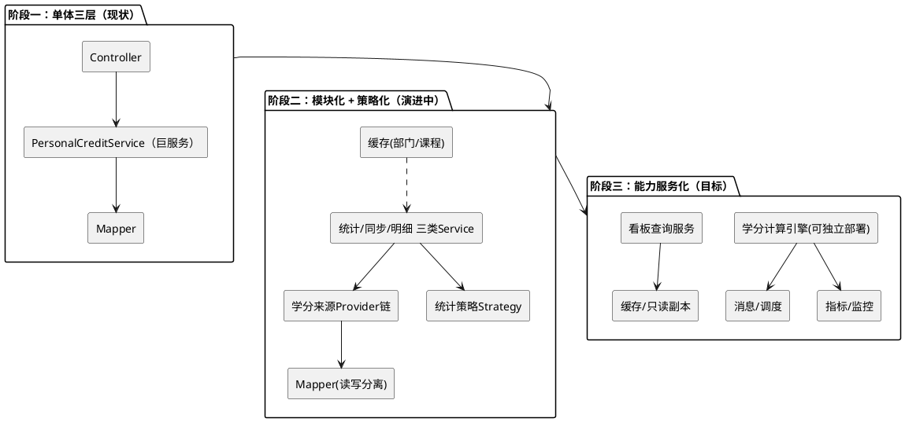

| 阶段 | 目标 | 关键动作 | 风险控制 |
|------|------|----------|----------|
| 阶段一（现状） | 功能可用 | 三层架构，`PersonalCreditService` 承载全部学分逻辑 | 接口契约先固化 |
| 阶段二（演进） | 高内聚低耦合 | 拆分「同步/统计/明细」Service；引入学分来源 Provider 链与统计策略；部门/课程缓存；读写分离 | 行为对齐回归（同一输入同结果）；灰度开关 |
| 阶段三（目标） | 能力服务化 | 学分计算引擎独立化、异步化；看板查询走只读副本/缓存；接入监控告警 | 双写校验、可回退 |

**演进原则**：对外契约不变（开闭于接口）；每次重构以「行为等价测试」护栏；新增能力优先以新增实现类完成，避免修改既有稳定逻辑。

### 3.10 设计模式与 SOLID 原则应用

针对当前 `PersonalCreditService` 中存在的「学分计算长方法 `calculateEmployeeCredit`」「部门维度 if-else 分支」「同步流程顺序耦合」「状态分级散落」等问题，采用以下设计模式重构，指导高内聚、低耦合、可复用、易扩展的实现。

#### 3.10.1 学分来源：策略 + 责任链（OCP / DIP）

将「课程完课 / 实战完课 / AI 认证 / AI 任职 / 手工录入」抽象为统一的学分来源 `CreditSourceProvider`，`CreditCalculator` 聚合所有 Provider 求和。新增学分来源只需新增实现类并注册，**无需修改**计算主流程。

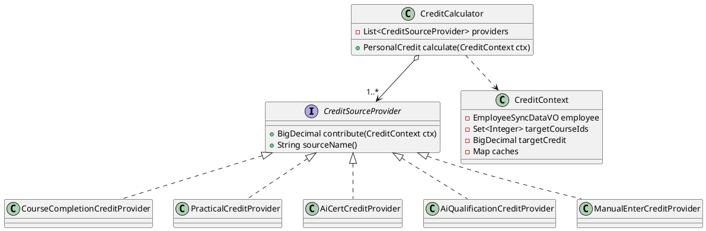

接口骨架（指导编码）：

```java
/** 学分来源贡献者：每个实现负责一种来源的学分计算（SRP） */
public interface CreditSourceProvider {
    /** 返回该来源对该员工的学分贡献；不可返回 null */
    BigDecimal contribute(CreditContext ctx);
    /** 来源名称（日志/审计用） */
    String sourceName();
    /** 自然上限：认证 15、任职 25，其余可返回 null 表示无上限 */
    default BigDecimal cap() { return null; }
}

@Component
public class AiCertCreditProvider implements CreditSourceProvider {
    @Override public BigDecimal contribute(CreditContext ctx) {
        BigDecimal c = ctx.getCertCredit();            // 专业级15/工作级10，同人MAX
        return cap() != null ? c.min(cap()) : c;       // 自然上限15
    }
    @Override public String sourceName() { return "AI_CERT"; }
    @Override public BigDecimal cap() { return new BigDecimal("15"); }
}

@Component
public class CreditCalculator {
    private final List<CreditSourceProvider> providers; // 构造注入，Spring 自动收集（DIP）
    public CreditCalculator(List<CreditSourceProvider> providers) { this.providers = providers; }

    public BigDecimal totalCurrentCredit(CreditContext ctx) {
        return providers.stream()
                .map(p -> p.contribute(ctx))
                .reduce(BigDecimal.ZERO, BigDecimal::add);
    }
}
```

> **收益**：`calculateEmployeeCredit` 由「过程式长方法」降为「装配 Context + 调用 Calculator」；新增来源（如外部竞赛学分）仅加一个 `@Component`，符合开闭原则。

#### 3.10.2 部门维度解析：策略 + 工厂（OCP / LSP）

将「部门层级 → 分组列名/编码列名」「默认四级白名单与排序」逻辑从 if-else 抽为 `DeptDimensionStrategy`，由 `DeptDimensionFactory` 按部门层级选择策略。

```java
public interface DeptDimensionStrategy {
    boolean support(int deptLevel, boolean defaultStrategy);
    DeptGroupColumn resolveGroupColumn(DepartmentInfoVO dept); // groupCol + codeCol
    List<CreditOverviewVO> postProcess(List<CreditOverviewVO> raw); // 如白名单过滤排序
}
// DefaultLevel4WhitelistStrategy / ChildLevelStrategy / LowestLevelStrategy ...
@Component
public class DeptDimensionFactory {
    private final List<DeptDimensionStrategy> strategies;
    public DeptDimensionStrategy of(int level, boolean isDefault) {
        return strategies.stream().filter(s -> s.support(level, isDefault))
            .findFirst().orElseThrow(() -> new IllegalArgumentException("无匹配部门维度策略"));
    }
}
```

> **收益**：消除 `getDepartmentStatistics` 中的多重 if-else；层级列名白名单校验内聚到策略内（安全 + 单一职责）。

#### 3.10.3 学分同步：模板方法 + 钩子（SRP / OCP）

全量同步与增量同步共享「预加载 → 逐人计算 → 批量落库 → 刷新标杆」骨架，差异（员工范围、是否删除过期、标杆刷新范围）以抽象钩子下沉到子类。

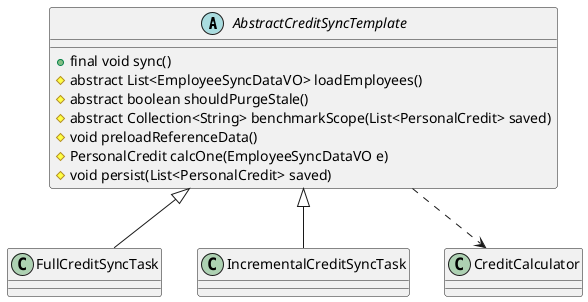

```java
public abstract class AbstractCreditSyncTemplate {
    @Transactional(rollbackFor = Exception.class)
    public final void sync() {            // 模板方法：固定骨架，子类不可改变流程
        preloadReferenceData();
        List<EmployeeSyncDataVO> emps = loadEmployees();      // 钩子：全量/增量差异
        List<PersonalCredit> saved = emps.stream().map(this::calcOne).collect(toList());
        persist(saved);
        if (shouldPurgeStale()) { purgeStale(saved); }        // 钩子：增量不删
        refreshBenchmarks(benchmarkScope(saved));             // 钩子：全量全部/增量局部
    }
    protected abstract List<EmployeeSyncDataVO> loadEmployees();
    protected abstract boolean shouldPurgeStale();
    protected abstract Collection<String> benchmarkScope(List<PersonalCredit> saved);
}
```

#### 3.10.4 状态分级：策略对象（SRP）

将散落在 `fillRoleSummaryStatus / fillDetailStatus` 的「达成率 → 状态」规则收敛为单一 `CompletionStatusEvaluator`，统一口径、便于调整阈值。

```java
public final class CompletionStatusEvaluator {
    public Status evaluate(double rate) {
        if (rate >= 100.0) return new Status("正常", "success");
        if (rate >= 60.0)  return new Status("预警", "warning");
        return new Status("滞后", "danger");
    }
}
```

#### 3.10.5 SOLID 原则落地对照

| 原则 | 当前问题 | 设计落地 |
|------|----------|----------|
| SRP 单一职责 | `PersonalCreditService` 同时负责计算/同步/统计/明细/标杆 | 拆为 `CreditCalculator`、同步模板、统计策略、`StatusEvaluator`，各司其职 |
| OCP 开闭 | 新增学分来源/人员维度需改长方法/if-else | 新增 `CreditSourceProvider`/`DeptDimensionStrategy` 实现类即可，不改既有逻辑 |
| LSP 里氏替换 | - | 各策略/模板子类可互换，行为契约一致（输入相同结果可比较） |
| ISP 接口隔离 | - | `CreditSourceProvider`、`DeptDimensionStrategy` 接口最小化，调用方只依赖所需方法 |
| DIP 依赖倒置 | Service 直接 new/耦合具体逻辑 | 面向接口编程，Provider/Strategy 由 Spring 注入（构造注入） |

### 3.11 编码实现指导

#### 3.11.1 分层与职责边界

- **Controller**：仅做参数解析/校验、工号解析、调用 Service、`Result<T>` 封装；不写业务逻辑、不直接访问 Mapper。
- **Service**：编排业务，调用 `CreditCalculator`/策略/Mapper；保持方法短小（建议单方法 ≤ 60 行，圈复杂度 ≤ 10）。
- **Mapper**：仅 SQL 与结果映射；动态列名必须白名单校验；批量查询 1000/批。

#### 3.11.2 命名与规范

| 类型 | 约定 | 示例 |
|------|------|------|
| Controller | `XxxController`，REST 前缀清晰 | `PersonalCreditStatisticsController` |
| Service 接口/实现 | `XxxService` / `XxxServiceImpl` | `SchoolCreditDetailService(Impl)` |
| 策略/提供者 | `XxxStrategy` / `XxxProvider` | `AiCertCreditProvider` |
| 模板任务 | `AbstractXxxTemplate` / `XxxTask` | `AbstractCreditSyncTemplate` |
| VO/DTO/PO | `XxxVO`/`XxxRequestVO`/`XxxResponseVO`/`XxxPO` | `SchoolCreditDetailResponseVO` |

#### 3.11.3 异常与事务约定

- 统一经 `GlobalExceptionHandler` 兜底，返回 `Result.error(code, msg)`；参数错误 400、未登录 401、系统异常 500。
- 同步类方法标注 `@Transactional(rollbackFor = Exception.class)`，模板方法 `sync()` 为事务边界；增量同步对缺失工号 `throw IllegalArgumentException` 触发回滚。
- 除零、null：金额/学分统一 `BigDecimal`，缺省 `BigDecimal.ZERO`；目标学分为 0 时达成率按约定（0 或视达标）处理。

#### 3.11.4 可测试性

- Provider/Strategy/Evaluator 均为无状态或入参驱动，便于单测 mock。
- 同步模板的钩子方法可分别独立单测；`CreditCalculator` 通过注入桩 Provider 验证求和与上限。

---

## 4. 测试设计

### 4.1 功能测试

#### 4.1.1 个人学分概览测试

| 类型 | 测试场景 | 测试步骤 | 检查点 |
|------|----------|----------|--------|
| 正常 | 入参工号查询概览 | 调用 `/api/personal-credit/overview?account=1234` | 返回 200，含目标/当前学分、达成率、标杆、达成日期 |
| 正常 | Cookie 工号查询 | 不传 account，携带 `account` Cookie | 以 Cookie 工号返回本人数据 |
| 边界 | 无学分记录工号 | 传入存在但无学分记录的工号 | 返回 200，空对象且回填工号 |
| 异常 | 未获取到工号 | 既无入参也无 Cookie | 返回 401「未获取到用户信息，请先登录」 |

#### 4.1.2 个人课程完成情况测试

| 类型 | 测试场景 | 测试步骤 | 检查点 |
|------|----------|----------|--------|
| 正常 | 查询个人完课 | `/personal-course/completion?account=1234` | 返回按分类(基础/进阶/实战)的目标数、完课数、占比、课程清单与完课标记 |
| 边界 | 某分类无课程 | 选课配置缺某分类 | 该分类仍返回，数值为 0 |
| 异常 | 工号缺失 | 无 account 无 Cookie | 返回 400 |

#### 4.1.3 职位 / 部门学分总览测试

| 类型 | 测试场景 | 测试步骤 | 检查点 |
|------|----------|----------|--------|
| 正常 | 默认部门总览 | `deptCode` 传空或 0 | 默认云核心网(031562)，按四级白名单顺序返回 + 总计行 |
| 正常 | 指定三级部门 | 传三级部门编码 | 返回其四级子部门分组统计 |
| 正常 | 角色过滤 | `role=2`（专家） | 仅统计专家群体 |
| 检查 | 时间进度与预警 | 任意有效查询 | 每行含 `timeProgress`，达成率<时间进度标记预警 |

#### 4.1.4 专家 & 干部学分总览测试

| 类型 | 测试场景 | 测试步骤 | 检查点 |
|------|----------|----------|--------|
| 正常 | 全量查询 | `deptCode` 空/0 | 返回 expertSummary 与 cadreSummary，按 L1/L2/L3 |
| 检查 | 状态分级 | 任意查询 | 达成率≥100 正常/≥60 预警/否则滞后；含 scheduleTarget |

#### 4.1.5 基线人数下钻明细测试

| 类型 | 测试场景 | 测试步骤 | 检查点 |
|------|----------|----------|--------|
| 正常 | 下钻分页 | 传 deptCode + 分页参数 | 返回 records + total + pages，单页≤pageSize |
| 正常 | 多条件过滤 | 传 jobCategory / positionMaturity | 结果均满足过滤条件 |
| 边界 | 空结果 | 过滤后无人 | 返回 200，records=[]，total=0 |
| 异常 | deptCode 为空 | 不传 deptCode（POST 接口） | 返回 400「部门编码不能为空」 |

#### 4.1.6 学分同步测试

| 类型 | 测试场景 | 测试步骤 | 检查点 |
|------|----------|----------|--------|
| 正常 | 全量同步 | POST `/api/personal-credit/sync` | 返回成功；`t_personal_credit` 重算，过期记录被删除，标杆刷新 |
| 检查 | 学分口径 | 校验某员工学分 | 当前学分=完课+实战+手工+认证(≤15)+任职(≤25)；达成率=当前/目标×100 |
| 正常 | 增量同步 | 调用增量同步指定工号 | 仅重算这些工号，局部刷新相关部门标杆 |
| 异常 | 增量含无效工号 | 工号在最新周期不存在 | 抛异常并整体回滚 |
| 边界 | 无最新周期 | `t_employee_sync` 无 period | 全量直接返回；增量抛 `IllegalStateException` |

#### 4.1.7 手工录入学分测试

| 类型 | 测试场景 | 测试步骤 | 检查点 |
|------|----------|----------|--------|
| 正常 | 录入/导入 | 录入或批量导入学分 | 数据落库；同步时按工号汇总叠加 |
| 正常 | 个人查询 | `/personal-course/manual-enter-credit-list` | 仅返回本人记录，分页正确 |

#### 4.1.8 课程规划明细测试

| 类型 | 测试场景 | 测试步骤 | 检查点 |
|------|----------|----------|--------|
| 正常 | 查询课程规划 | `/course-planning-info/list` | 返回全量课程明细 |
| 检查 | 目标课程范围 | 校验 course_level | 学分计算仅取 基础/进阶/实战 课程 |

### 4.2 性能测试

| 类型 | 测试场景 | 测试步骤 | 检查点 |
|------|----------|----------|--------|
| 正常 | 总览查询性能 | 万级数据下查询部门总览 | 响应 < 3 秒 |
| 正常 | 下钻分页性能 | 大基数部门分页下钻 | 单页(≤50)响应 < 2 秒 |
| 正常 | 全量同步性能 | 万级员工全量同步 | 10 分钟内完成，CPU/内存可控 |
| 正常 | 并发查询 | 100 并发查询总览 | 全部正常响应，错误率 < 1% |

### 4.3 异常测试

| 类型 | 测试场景 | 测试步骤 | 检查点 |
|------|----------|----------|--------|
| 异常 | 数据库连接异常 | 模拟 DB 断开后调用查询 | 返回 500，记录错误日志，不泄露敏感信息 |
| 异常 | 同步中途失败 | 同步过程中模拟异常 | 事务回滚，`t_personal_credit` 不出现脏数据 |
| 异常 | SQL 注入 | deptLevel/层级列名传非法值 | 白名单校验拦截，回退安全列名，不执行恶意 SQL |
| 异常 | 非法分页参数 | pageNum/pageSize 传 0 或负数 | 规整为默认值(1/50)，不报错 |
| 异常 | 学分格式错误 | 课程 credit 非数字 | 记录告警日志，按 0 处理，不中断同步 |

---

## 附录

### A. 关键数据库表

| 表名 | 用途 |
|------|------|
| t_personal_credit | 个人学分主表（目标/当前学分、达成率、标杆、达成日期、部门、职位、成熟度） |
| ai_course_planning_info | 课程规划明细（course_level/name/number/credit） |
| dept_course_selections | 部门选课（四级部门 → 课程ID列表，含实战） |
| t_micro_study_info_sync / t_mooc_study_info_sync | 微学习 / MOOC 完课记录（is_pass='1'） |
| hands_on_courses | 实战完课记录 |
| t_manual_enter_credit | 手工录入学分 |
| t_employee_sync | 员工同步表（最新周期 period_id 取基线） |
| department_info_hrms | 部门信息与层级 |

### B. 关键常量与口径

| 项 | 值/规则 |
|----|---------|
| 云核心网产品线部门编码 | `DepartmentConstants.CLOUD_CORE_NETWORK_DEPT_CODE = 031562` |
| AI 认证学分 | 专业级 15 / 工作级 10，同人取 MAX，自然上限 15 |
| AI 任职学分 | 4 级及以上 25 / 3 级 10，同人取 MAX，上限 25，仅当前有效 |
| 目标课程级别 | 基础 / 进阶 / 实战 |
| 状态分级 | 达成率 ≥100% 正常(success) / ≥60% 预警(warning) / 否则滞后(danger) |

### C. 版本历史

| 版本 | 日期 | 作者 | 说明 |
|------|------|------|------|
| V1.0 | 2026年 | 系统架构师 | 初版，AI School 看板完整设计 |

---

**文档结束**
