# AI 训战看板 - 软件设计文档

## 文档信息

| 项目 | 内容 |
|------|------|
| 文档名称 | AI 训战看板软件设计文档 |
| 版本号 | V1.0 |
| 编写日期 | 2026年 |
| 编写人 | 系统架构师 |
| 审核人 | - |
| 批准人 | - |

---

## 目录

1. [业务背景](#1-业务背景)
2. [需求场景分析](#2-需求场景分析)
3. [整体方案](#3-整体方案)
4. [测试设计](#4-测试设计)

---

## 1. 业务背景

AI 训战看板是 AI 转型作战看板体系中的「训战赋能」子看板。系统围绕 AI 转型训战课程体系（**基础 / 进阶 / 实战** 三类目标课程），统计员工的目标课程数与完课情况，并从**部门维度**与**岗位 AI 成熟度维度**（L1/L2/L3）汇总各部门、各群体的平均完课人数与平均完课率，同时支持下钻到员工级训战明细与完课矩阵，为各级管理者掌握训战推进进度、识别落后组织提供数据支撑。

训战数据统一沉淀在全员训战课程表 `t_employee_training_info`，其中基础/进阶完课来自微学习/MOOC，实战完课通过 `hands_on_courses` 同步回填，目标课程数来源于部门选课或每人配置字段。

### 1.1 目标用户

| 用户角色 | 角色描述 | 主要诉求 |
|----------|----------|----------|
| 公司/产品线管理者 | AI 转型整体训战推进的高层 | 总览各四级部门训战完课率，识别落后部门 |
| 部门负责人 | 三级～六级部门负责人 | 逐级下钻查看下级部门完课率，掌握本部门训战进度 |
| 训战运营人员 | 负责训战课程规划与运营 | 查看完课明细、导出完课矩阵，跟踪未完课人员 |
| 专家/干部管理者 | 关注关键人群训战 | 按岗位成熟度(L1/L2/L3)查看专家、干部训战完课 |
| 系统/定时任务平台 | 训战数据同步调度 | 触发全员训战信息同步、实战完课同步 |

### 1.2 功能目标

#### 1.2.1 功能目标

- 提供**部门课程完成率**统计：按父部门返回下一层级各部门的基线人数、基础/进阶/实战目标课程数、平均完课人数与平均完课率。
- 提供**岗位 AI 成熟度训战统计**：在指定部门范围内，按成熟度（L1/L2/L3）汇总干部或专家的目标课程均值、平均完课人数与完课率。
- 提供**部门全员训战总览下钻**：返回部门下每名员工的基础/进阶/实战目标课程数、完课数、完课占比及合计，支持按岗位成熟度过滤。
- 提供**全员目标课程完课矩阵**：列为部门选课目标课程并集，行为每人完课标记，供导出使用。
- 提供**训战数据同步能力**：全员训战信息同步（落 `t_employee_training_info`）、实战完课同步（`hands_on_courses` → 训战表）。

#### 1.2.2 性能目标

- 单次部门/成熟度统计查询响应时间 < 3 秒。
- 下钻明细与完课矩阵查询响应时间 < 5 秒。
- 全员训战信息同步（万级员工）在 10 分钟内完成。
- 支持并发用户数 ≥ 100。

#### 1.2.3 可靠性目标

- 系统可用性 ≥ 99.9%。
- 同步操作事务化（`@Transactional`），保证 `t_employee_training_info` 增/改/删一致性，异常整体回滚。
- 完善的全局异常处理与日志记录。

#### 1.2.4 安全目标

- 接口访问权限控制。
- 全部 SQL 参数化（`#{}`），部门层级列名按枚举映射，杜绝拼接注入。
- 数据库连接信息支持加密；生产 HTTPS。

### 1.3 系统范围

#### 1.3.1 功能范围

- 部门课程完成率查询（按下一层级子部门 / 白名单四级部门）。
- 岗位 AI 成熟度训战统计（干部 / 专家）。
- 部门全员训战总览下钻。
- 全员目标课程完课矩阵（导出）。
- 全员训战信息同步、实战完课同步。

#### 1.3.2 非功能范围

- 完课数解析口径（逗号分隔课程列表计数）的统一。
- 目标课程数口径（部门选课聚合 / 每人字段）的约定。
- 查询性能优化与同步事务一致性。
- 安全防护、日志审计、异常处理。

---

## 2. 需求场景分析

### 2.1 用户诉求分析

#### 2.1.1 核心用户诉求

**诉求 1：逐级下钻的部门完课率需求**
- **诉求描述**：从产品线到四级、五级、六级部门，逐级查看训战完课率。
- **使用场景**：`deptId=0` 或二级部门(031562)时看白名单四级部门；三级看四级子部门；四级看五级；五级看六级。
- **期望结果**：返回各子部门的基线人数、基础/进阶/实战目标课程数、平均完课人数与平均完课率。

**诉求 2：关键人群训战统计需求**
- **诉求描述**：按岗位 AI 成熟度（L1/L2/L3）查看专家、干部群体的训战完课。
- **使用场景**：选择干部(personType=1)或专家(personType=2)，按成熟度分组统计。
- **期望结果**：每个成熟度档返回目标课程均值、平均完课人数（总完课 ÷ 平均目标课程数）、平均完课率。

**诉求 3：训战明细下钻需求**
- **诉求描述**：从部门完课率下钻到员工级训战明细，定位未完课人员。
- **使用场景**：查看某部门全员的基础/进阶（及实战）目标课程数、完课数、完课占比与合计。
- **期望结果**：返回每人一行明细，支持按岗位成熟度过滤。

**诉求 4：完课矩阵导出需求**
- **诉求描述**：以「目标课程 × 人员」矩阵形式查看完课分布，便于线下跟踪。
- **使用场景**：导出某部门目标课程并集与每人完课标记。
- **期望结果**：列为目标课程并集，行含每人完课标记，可导出。

**诉求 5：训战数据时效需求**
- **诉求描述**：完课数据变化后，训战表能够及时同步刷新。
- **使用场景**：定时同步全员训战信息；实战完课通过 `hands_on_courses` 回填训战表。
- **期望结果**：同步幂等、事务一致，目标课程数与完课列表同步更新。

#### 2.1.2 用户痛点分析

| 痛点 | 痛点描述 | 影响程度 | 解决方案 |
|------|----------|----------|----------|
| 完课口径不一 | 基础/进阶/实战完课来源不同 | 高 | 统一沉淀至 `t_employee_training_info`，完课按逗号列表计数 |
| 下钻层级繁琐 | 多级部门逐层查看困难 | 高 | 按父部门层级自动返回下一层级子部门统计 |
| 关键人群难聚焦 | 难以单独看专家/干部训战 | 中 | 按成熟度维度统计，不依赖选课表 |
| 实战完课割裂 | 实战完课与训战表分离 | 中 | 实战完课同步任务回填训战表 |

### 2.2 功能分析

#### 2.2.1 功能需求梳理

**功能模块 1：部门课程完成率**
- 功能描述：按父部门返回下一层级各部门完课率统计。
- 输入：`deptId`（父部门）、`personType`（0 全员 / 1 干部 / 2 专家）。
- 输出：`List<DepartmentCourseCompletionRateVO>`。

**功能模块 2：岗位 AI 成熟度训战统计**
- 功能描述：在部门范围内按成熟度(L1/L2/L3)汇总干部/专家训战。
- 输入：`deptId`（0 转 031562）、`personType`（仅 1/2）。
- 输出：`List<PositionAiMaturityCourseCompletionRateVO>`。

**功能模块 3：部门全员训战总览下钻**
- 功能描述：返回部门下每名员工训战明细。
- 输入：`deptId`、`personType`、可选 `ai_maturity`(L1/L2/L3)。
- 输出：`List<DepartmentEmployeeTrainingOverviewVO>`。

**功能模块 4：全员目标课程完课矩阵**
- 功能描述：目标课程并集为列、每人完课标记为行的矩阵。
- 输入：`deptId`、`personType`、可选 `ai_maturity`。
- 输出：`DepartmentEmployeeCourseCompletionDetailVO`。

**功能模块 5：训战数据同步**
- 功能描述：全员训战信息同步、实战完课同步至训战表。
- 输入：`periodId`（训战信息同步）/ 实战完课数据。
- 输出：同步结果（插入/更新/删除计数）。

#### 2.2.2 功能优先级划分

| 优先级 | 功能模块 | 说明 |
|--------|----------|------|
| P0（必须） | 部门课程完成率、岗位成熟度训战统计 | 看板核心统计 |
| P0（必须） | 全员训战信息同步 | 数据基础 |
| P1（重要） | 部门全员训战总览下钻、实战完课同步 | 下钻与实战数据完整性 |
| P2（一般） | 完课矩阵导出 | 增强功能 |

#### 2.2.3 功能详细分析

**功能：部门课程完成率查询**

- 功能流程：
  1. 参数校验，`deptId=0` 或二级部门(031562)时仅取**白名单四级部门**（`COMPLETION_RATE_LEVEL4_DEPT_CODES`，固定顺序）；三级→四级子部门；四级→五级；五级→六级；六级→空列表。
  2. 对每个待统计部门，按其层级在 `t_employee_training_info` 用对应层级编码字段过滤**本部门**人员（不含下级）。
  3. `basic/advanced/practicalCourseCount` = 该部门所有人对应 `*_target_courses_num` 之和。
  4. 总完课数 = 该部门所有人对应 `*_courses` 逗号列表计数之和。
  5. 平均完课人数 = 总完课数 ÷ 总目标课程数（四舍五入为整数）；平均完课率 = 总完课数 ÷ 总目标课程数 × 100（2 位小数）。
- 输入：`deptId`、`personType`。
- 输出：每个待统计部门一条 `DepartmentCourseCompletionRateVO`。
- 异常：`deptId` 为空 400；`personType` 非 0/1/2 返回 400；六级部门返回 `[]`。

**功能：岗位 AI 成熟度训战统计**

- 功能流程：`deptId=0` 转 031562 → 查部门层级 → 按 `listByDeptLevelAndCode` 规则筛本部门直属人员 → 按 `cadre_position_ai_maturity`(干部) 或 `expert_position_ai_maturity`(专家) 非空过滤并分组 → 计算组内目标课程均值 \(\overline{B},\overline{A},\overline{P}\)、总完课 \(T_b,T_a,T_p\)、平均完课人数 \(T/\overline{target}\)、平均完课率 \(T/(N\cdot\overline{target})\times100\)。
- **不**依赖 `dept_course_selections` 选课表，目标课程数仅取每人 `*_target_courses_num`。
- 输入：`deptId`、`personType`(仅 1/2)。
- 输出：每个成熟度档一条 `PositionAiMaturityCourseCompletionRateVO`，排序 L1→L2→L3。

**功能：实战完课同步至训战表**

- 功能流程：从 `hands_on_courses` 取实战完课记录，关联 `ai_course_planning_info`(`course_level='实战'`)，将完课课程回填到 `t_employee_training_info` 的 `practical_courses`（逗号列表），并刷新 `practical_target_courses_num`。

#### 2.2.4 功能依赖关系

```
课程规划(ai_course_planning_info) + 部门选课(dept_course_selections)
        ↓ （确定目标课程数 *_target_courses_num）
全员训战信息同步 → t_employee_training_info（基础/进阶完课列表）
        ↑
实战完课同步(hands_on_courses) → practical_courses
        ↓
部门完课率 / 岗位成熟度统计 / 全员下钻 / 完课矩阵
```

#### 2.2.5 非功能需求

- 性能：待统计部门循环统计；完课列表解析在内存计算；同步分批(1000/批)。
- 可靠性：同步事务化、幂等（按周期增/改/删）。
- 安全：层级列名枚举映射；SQL 参数化。
- 可维护性：完课计数 `countCompletedCourses` 与目标均值计算口径集中复用。

### 2.3 需求场景全景与设计覆盖矩阵

为保证「无场景遗漏」，下表对原始功能需求逐场景拆解，并映射到本文档的设计实现与流程章节。

| 场景ID | 业务场景 | 触发入口 | 关键规则/分支 | 设计对应（类/方法） | 流程章节 | 覆盖 |
|--------|----------|----------|----------------|----------------------|----------|------|
| SC-01 | 部门课程完成率（默认/二级） | `/personal-course/department-completion-rate` deptId=0/031562 | 仅白名单四级部门，固定顺序 | `DepartmentCourseCompletionRateService` + `getLevel4DepartmentsByCodes` | 3.4.1 | ✅ |
| SC-02 | 部门完成率（三级下钻） | deptId=三级 | 返回四级子部门 | `getChildDepartments` | 3.4.1 | ✅ |
| SC-03 | 部门完成率（四/五级下钻） | deptId=四/五级 | 返回下一层级子部门 | `getChildDepartments` | 3.4.1 | ✅ |
| SC-04 | 部门完成率（六级） | deptId=六级 | 无下一层级，返回 `[]` | 范围策略 EmptyScope | 3.4.1 | ✅ |
| SC-05 | 岗位成熟度统计（干部） | `/trainning-courses/maturity-trainning-courses` personType=1 | 按 `cadre_position_ai_maturity` 分组；不依赖选课表 | `PositionAiMaturityTrainingStatsService` | 3.4.2 | ✅ |
| SC-06 | 岗位成熟度统计（专家） | personType=2 | 按 `expert_position_ai_maturity` 分组 | 同上 | 3.4.2 | ✅ |
| SC-07 | 部门全员训战总览下钻 | `/department-employee-training-overview` | personType 0/1/2；可选 ai_maturity | `DepartmentEmployeeTrainingOverviewService` | 3.4.3 | ✅ |
| SC-08 | 全员目标课程完课矩阵 | `/department-employee-course-completion-detail` | 目标课程并集为列，每人完课标记 | `DepartmentEmployeeCourseCompletionDetailService` | 2.2.1 / 4.1.4 | ✅ |
| SC-09 | 全员训战信息同步 | `syncEmployeeTrainingInfo(periodId)` | 按周期增/改/删；批量 1000/批 | `EmployeeTrainingInfoSyncServiceImpl` | 3.4.5 | ✅ |
| SC-10 | 实战完课同步至训战表 | 实战同步任务 | hands_on→practical_courses；刷新目标数 | `HandsOnCourseService` + 同步实现 | 3.4.4 | ✅ |
| SC-11 | 课程规划明细查询 | `/course-planning-info/list` | 基础/进阶/实战目标 | `CoursePlanningInfoService` | 4.1（关联） | ✅ |

**边界与异常场景覆盖**：deptId 为空（400）、personType 非 0/1/2（400）、成熟度统计 personType 非 1/2（400）、`ai_maturity` 非 L1/L2/L3 或与人员类型冲突（400）、过滤后无人（`[]`）、平均目标课程数为 0（除零保护按 0）、完课列表脏数据（trim 后计数）、periodId 为空（抛异常），均在 4.3 异常测试与 3.8 DFX 中给出处理策略。

---

## 3. 整体方案

### 3.1 架构设计

系统采用三层架构：**表现层（Controller）** → **业务层（Service）** → **数据访问层（Mapper）**，复用 AI 转型平台公共组件。

#### 3.1.1 架构分层

```
┌──────────────────────────────────────────────────────────────┐
│                       表现层 (Controller)                       │
│  PersonalCourseCompletionController   TrainingCoursesController │
│  (部门完课率/全员训战总览/完课矩阵)     (岗位成熟度训战统计)         │
│  CoursePlanningInfoController          GlobalExceptionHandler   │
└──────────────────────────────────────────────────────────────┘
                              ↓
┌──────────────────────────────────────────────────────────────┐
│                        业务层 (Service)                         │
│  DepartmentCourseCompletionRateService                         │
│  PositionAiMaturityTrainingStatsService                        │
│  DepartmentEmployeeTrainingOverviewService                     │
│  DepartmentEmployeeCourseCompletionDetailService               │
│  EmployeeTrainingInfoSyncService    HandsOnCourseService        │
│  DepartmentInfoService              CoursePlanningInfoService   │
└──────────────────────────────────────────────────────────────┘
                              ↓
┌──────────────────────────────────────────────────────────────┐
│                      数据访问层 (Mapper)                         │
│  EmployeeTrainingInfoMapper   PersonalCourseCompletionMapper    │
│  CoursePlanningInfoMapper     HandsOnCourseMapper               │
│  PracticalCourseInfoMapper    EmployeeMapper / DepartmentInfo   │
└──────────────────────────────────────────────────────────────┘
                              ↓
┌──────────────────────────────────────────────────────────────┐
│                        数据库层 (MySQL)                          │
│  t_employee_training_info     ai_course_planning_info          │
│  dept_course_selections       hands_on_courses                 │
│  practical_course_info        department_info_hrms             │
│  t_employee_sync                                               │
└──────────────────────────────────────────────────────────────┘
```

#### 3.1.2 架构说明

**表现层**
- 职责：接收请求、参数校验（`deptId` 必填、`personType` 取值、`ai_maturity` 仅 L1/L2/L3 且仅在干部/专家可用）、统一 `Result<T>` 返回。
- 设计要点：`PersonalCourseCompletionController` 统一前缀 `/personal-course`；`TrainingCoursesController` 前缀 `/trainning-courses`。

**业务层**
- 职责：待统计部门列表确定、按部门/成熟度统计、完课列表解析、平均完课人数与完课率计算、训战/实战同步。
- 设计要点：完课计数口径统一（`countCompletedCourses`）；成熟度统计不依赖选课表。

**数据访问层**
- 职责：训战表按层级过滤查询、目标课程数与完课列表读取、课程/选课读取、实战完课读取、批量增改删。
- 设计要点：层级编码字段按枚举映射；批量处理；参数化。

### 3.2 包架构设计

#### 3.2.1 包结构

```
com.huawei.aitransform
├── controller/
│   ├── PersonalCourseCompletionController.java   # /personal-course/*
│   ├── TrainingCoursesController.java            # /trainning-courses/maturity-trainning-courses
│   └── CoursePlanningInfoController.java
├── service/
│   ├── DepartmentCourseCompletionRateService.java
│   ├── PositionAiMaturityTrainingStatsService.java
│   ├── DepartmentEmployeeTrainingOverviewService.java
│   ├── DepartmentEmployeeCourseCompletionDetailService.java
│   ├── EmployeeTrainingInfoSyncService.java
│   ├── HandsOnCourseService.java
│   └── impl/
│       ├── DepartmentCourseCompletionRateServiceImpl.java
│       ├── PositionAiMaturityTrainingStatsServiceImpl.java
│       ├── DepartmentEmployeeTrainingOverviewServiceImpl.java
│       ├── DepartmentEmployeeCourseCompletionDetailServiceImpl.java
│       └── EmployeeTrainingInfoSyncServiceImpl.java
├── mapper/
│   ├── EmployeeTrainingInfoMapper.java
│   ├── PersonalCourseCompletionMapper.java
│   ├── CoursePlanningInfoMapper.java
│   ├── HandsOnCourseMapper.java
│   └── PracticalCourseInfoMapper.java
├── entity/
│   ├── DepartmentCourseCompletionRateVO.java
│   ├── PositionAiMaturityCourseCompletionRateVO.java
│   ├── DepartmentEmployeeTrainingOverviewVO.java
│   ├── DepartmentEmployeeCourseCompletionDetailVO.java
│   ├── EmployeeTrainingInfoPO.java / CourseInfoByLevelVO.java
│   ├── DeptCourseSelection.java / CoursePlanningInfoVO.java
│   └── PracticalCourseInfo.java
├── common/   (Result)
└── constant/ (DepartmentConstants：CLOUD_CORE_NETWORK_DEPT_CODE、COMPLETION_RATE_LEVEL4_DEPT_CODES)
```

#### 3.2.2 包职责说明

| 包名 | 职责 |
|------|------|
| controller | 请求接收、参数校验、统一响应 |
| service | 部门/成熟度统计、下钻、完课矩阵、训战/实战同步 |
| mapper | 训战表与课程/选课/实战相关 SQL，批量增改删 |
| entity | 训战统计与同步相关 VO/PO |
| common | 统一响应 `Result<T>` |
| constant | 云核心网二级部门、完课率白名单四级部门 |

### 3.3 系统类图

#### 3.3.1 核心类图

```plantuml
@startuml
package "Controller层" {
    class PersonalCourseCompletionController {
        +getDepartmentCourseCompletionRate(deptId, personType): Result<List<DepartmentCourseCompletionRateVO>>
        +getDepartmentEmployeeTrainingOverview(deptId, personType, ai_maturity): Result<List<DepartmentEmployeeTrainingOverviewVO>>
        +getDepartmentEmployeeCourseCompletionDetail(deptId, personType, ai_maturity): Result<DepartmentEmployeeCourseCompletionDetailVO>
    }
    class TrainingCoursesController {
        +listPositionAiMaturityStats(deptId, personType): Result<List<PositionAiMaturityCourseCompletionRateVO>>
    }
}

package "Service层" {
    class DepartmentCourseCompletionRateService {
        +getDepartmentCourseCompletionRate(deptId, personType): List<DepartmentCourseCompletionRateVO>
        -countCompletedCourses(coursesStr): int
    }
    class PositionAiMaturityTrainingStatsService {
        +listByDeptAndPersonType(deptId, personType): List<PositionAiMaturityCourseCompletionRateVO>
    }
    class DepartmentEmployeeTrainingOverviewService
    class DepartmentEmployeeCourseCompletionDetailService
    class EmployeeTrainingInfoSyncService {
        +syncEmployeeTrainingInfo(periodId): Map<String,Object>
    }
    class HandsOnCourseService
}

package "Mapper层" {
    interface EmployeeTrainingInfoMapper {
        +listByDeptLevelAndCode(level, deptCode, personType, maturity): List<EmployeeTrainingInfoPO>
        +batchInsert(list) / batchUpdate(list) / deleteByXxx(...)
    }
    interface CoursePlanningInfoMapper
    interface HandsOnCourseMapper
    interface PracticalCourseInfoMapper
}

PersonalCourseCompletionController --> DepartmentCourseCompletionRateService
PersonalCourseCompletionController --> DepartmentEmployeeTrainingOverviewService
PersonalCourseCompletionController --> DepartmentEmployeeCourseCompletionDetailService
TrainingCoursesController --> PositionAiMaturityTrainingStatsService

DepartmentCourseCompletionRateService --> EmployeeTrainingInfoMapper
DepartmentCourseCompletionRateService --> DepartmentInfoService
PositionAiMaturityTrainingStatsService --> EmployeeTrainingInfoMapper
EmployeeTrainingInfoSyncService --> EmployeeTrainingInfoMapper
EmployeeTrainingInfoSyncService --> CoursePlanningInfoMapper
EmployeeTrainingInfoSyncService --> PersonalCourseCompletionMapper
@enduml
```

#### 3.3.2 实体类关系图

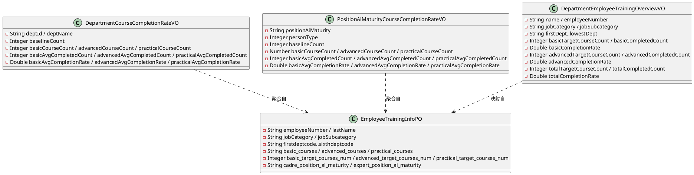

### 3.4 核心业务流程

#### 3.4.1 部门课程完成率查询流程

##### 3.4.1.1 业务描述
按父部门确定待统计部门列表（白名单四级 / 下一层级子部门），对每个部门统计基线人数、各级目标课程数、平均完课人数与平均完课率。

##### 3.4.1.2 时序图

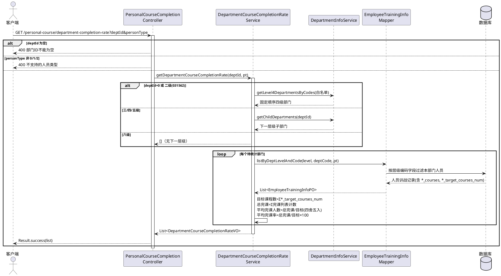

#### 3.4.2 岗位 AI 成熟度训战统计查询流程

##### 3.4.2.1 业务描述
在部门范围内按成熟度(L1/L2/L3)分组统计干部/专家训战，目标课程数仅取每人字段，不依赖选课表。

##### 3.4.2.2 时序图

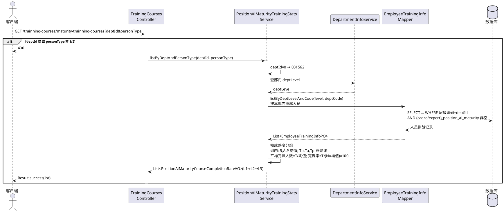

#### 3.4.3 部门全员训战总览下钻流程

##### 3.4.3.1 业务描述
返回部门下每名员工的基础/进阶（及实战）目标课程数、完课数、完课占比及合计；可按岗位成熟度过滤（仅干部/专家适用）。

##### 3.4.3.2 时序图

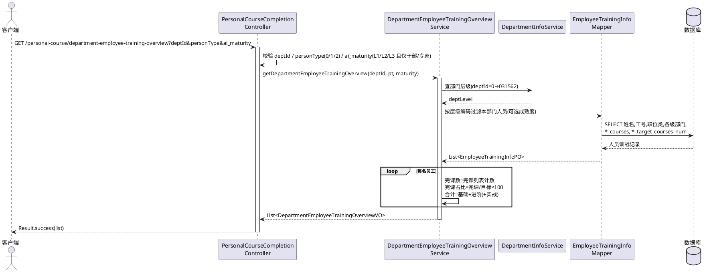

#### 3.4.4 实战完课同步至训战表流程

##### 3.4.4.1 业务描述
将 `hands_on_courses` 中的实战完课，关联 `ai_course_planning_info`(`course_level='实战'`)后，回填到 `t_employee_training_info` 的 `practical_courses`，并刷新实战目标课程数。

##### 3.4.4.2 时序图

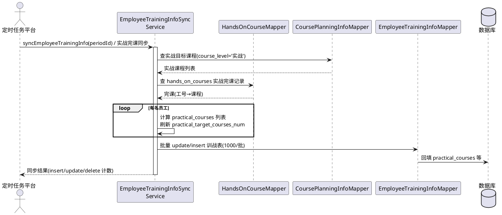

#### 3.4.5 全员训战信息同步流程

##### 3.4.5.1 业务描述
以 `t_employee_sync` 指定周期成员为基线，结合课程规划与部门选课，计算每人基础/进阶/实战目标课程数与完课列表，按周期对训战表执行增/改/删，事务保证一致性。

##### 3.4.5.2 时序图

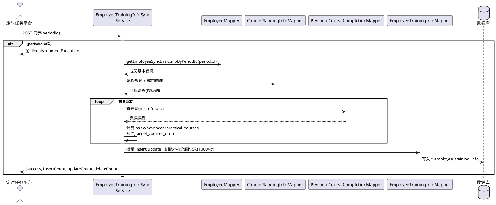

### 3.5 系统架构图

#### 3.5.1 部署架构图

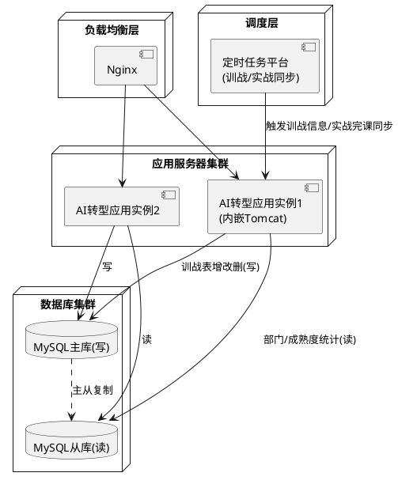

### 3.6 用例视图

#### 3.6.1 用例图

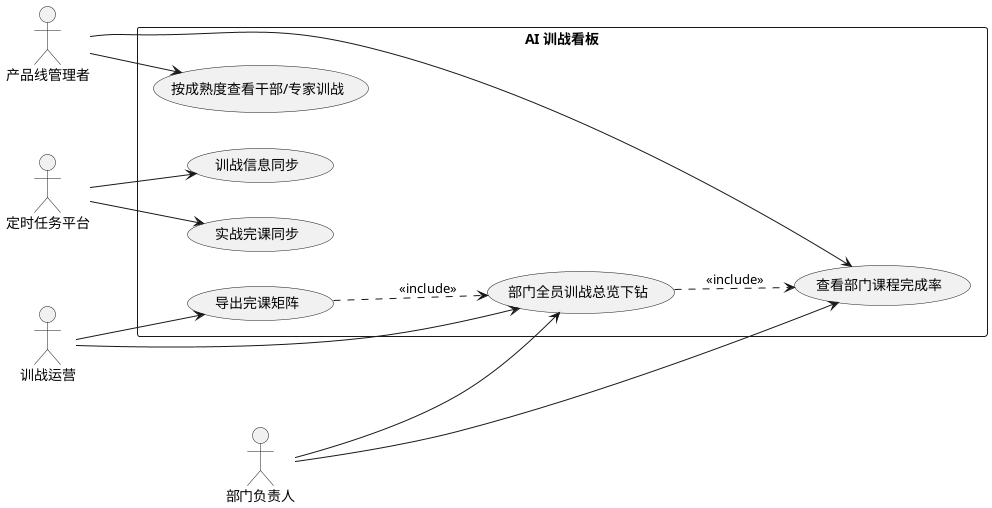

#### 3.6.2 用例详细说明

| 项目 | 内容 |
|------|------|
| 用例名称 | 查看部门课程完成率 |
| 参与者 | 产品线管理者、部门负责人 |
| 前置条件 | 训战信息已同步至 `t_employee_training_info` |
| 基本流程 | 1. 选择/传入父部门 deptId<br>2. 系统确定待统计部门列表<br>3. 逐部门统计基线、目标课程数、平均完课人数与完课率<br>4. 返回各部门统计 |
| 异常流程 | deptId 为空 400；personType 非法 400；六级部门返回空列表 |
| 后置条件 | 获得下一层级各部门训战完课率 |

### 3.7 UI 设计

#### 3.7.1 总览看板

```
┌──────────────────────────────────────────────────────────────┐
│  AI 训战推进看板    部门:[云核心网产品线▼]  人员:[全员▼]          │
├──────────────────────────────────────────────────────────────┤
│  部门课程完成率（点击部门可逐级下钻）                            │
│  部门            基线  基础目标 基础完课率 进阶完课率 实战完课率   │
│  分组核心网产品部 320   10       62%       36%       30%        │
│  云核心网研究部   180   10       55%       42%       33%        │
│  ...                                                           │
└──────────────────────────────────────────────────────────────┘
```

#### 3.7.2 岗位 AI 成熟度训战看板

```
┌──────────────────────────────────────────────────────────────┐
│  干部/专家训战（按岗位成熟度）   人员类型:[干部▼]                 │
├──────────────────────────────────────────────────────────────┤
│  成熟度 基线 基础目标均值 基础完课率 进阶完课率 实战完课率         │
│  L1     90   8           70%       50%       40%              │
│  L2     50   10          62%       45%       35%              │
│  L3     15   12          58%       48%       30%              │
└──────────────────────────────────────────────────────────────┘
```

#### 3.7.3 部门全员训战总览（下钻）页面

```
┌──────────────────────────────────────────────────────────────┐
│  部门全员训战总览   成熟度:[全部▼]                  [导出矩阵]    │
├──────────────────────────────────────────────────────────────┤
│  姓名 工号    职位类 基础(完/目) 进阶(完/目) 合计(完/目) 完课占比  │
│  张三 1234..  软件类  8/10        3/5         11/15      73.3%   │
│  李四 8765..  硬件类  6/10        2/5         8/15       53.3%   │
│  ...                                                           │
└──────────────────────────────────────────────────────────────┘
```

#### 3.7.4 完课矩阵（导出视图）

```
┌──────────────────────────────────────────────────────────────┐
│ 工号  姓名  课程A 课程B 课程C 课程D ...                          │
│ 1234  张三   ✓     ✓     ○     ✓                              │
│ 8765  李四   ✓     ○     ○     ✓                              │
│  （列为本部门选课目标课程并集，✓=完课 ○=未完课）                 │
└──────────────────────────────────────────────────────────────┘
```

### 3.8 DFX 分析

**功能（Function）**
- 覆盖部门完课率、成熟度统计、全员下钻、完课矩阵、训战/实战同步全链路。
- 完课计数与目标均值口径统一，便于演进。

**性能（Performance）**
- 待统计部门循环统计；完课列表内存解析；同步分批(1000/批)。
- 建议：部门信息/课程规划缓存；白名单四级部门固定顺序避免全表扫描。

**可靠性（Reliability）**
- 同步 `@Transactional(rollbackFor = Exception.class)`；按周期幂等增/改/删。
- 除零保护：目标课程数为 0 时平均完课人数/完课率按 0 处理。

**安全（Security）**
- 部门层级列名按枚举映射，不拼接外部输入；SQL 全参数化。
- `ai_maturity` 仅 L1/L2/L3 且仅干部/专家可用，参数严格校验。

**可维护性（Maintainability）**
- 按统计维度拆分独立 Service；同步逻辑集中在 `EmployeeTrainingInfoSyncServiceImpl`，注释关联接口文档。

**可扩展性（Extensibility）**
- 新增统计维度可新增 Service/Mapper；VO 预留字段（如实战是否纳入合计可配置）。
- 进一步的可扩展能力通过 3.10 的设计模式（部门范围策略、人员过滤策略、聚合策略、同步模板方法）实现，详见下文。

#### 3.8.1 DFX 指标汇总

| DFX 维度 | 关键指标 | 目标值 | 设计保障措施 |
|----------|----------|--------|--------------|
| 功能 | 场景覆盖率 | 100% | 见 2.3 覆盖矩阵 |
| 性能 | 部门/成熟度统计 | < 3s | 待统计部门循环 + 内存解析 + 白名单避免全表 |
| 性能 | 下钻/矩阵 | < 5s | 单部门范围查询 + 分页/导出流式 |
| 性能 | 全员同步 | < 10min | 批量(1000/批)、按周期增量 |
| 可靠性 | 同步一致性 | 100% | `@Transactional`、按周期幂等增/改/删 |
| 可靠性 | 除零安全 | 100% | 目标课程数为 0 时按 0 处理 |
| 可信安全 | SQL 注入防护 | 100% | 参数化 + 层级列名枚举映射 |
| 可信安全 | 参数合法性 | 100% | personType/ai_maturity 严格校验 |
| 可维护性 | 口径一致性 | 单点定义 | 完课计数/目标均值集中复用 |

### 3.9 产品架构演进

AI 训战看板按三阶段演进，保持对外接口契约稳定（URL 与 `Result<T>` 不变），逐步从单体三层走向能力服务化。

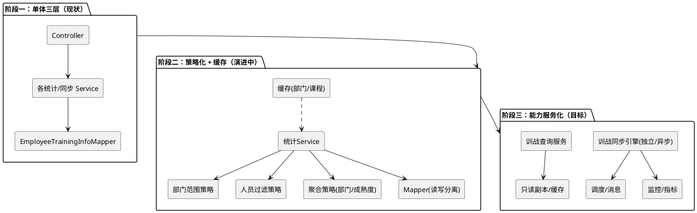

| 阶段 | 目标 | 关键动作 | 风险控制 |
|------|------|----------|----------|
| 阶段一（现状） | 功能可用 | 三层架构，按统计维度拆 Service | 接口契约先固化 |
| 阶段二（演进） | 高内聚低耦合 | 抽象部门范围策略、人员过滤策略、聚合策略；缓存 + 读写分离 | 行为等价回归、灰度开关 |
| 阶段三（目标） | 能力服务化 | 同步引擎独立异步化；查询走只读副本；接入监控 | 双写校验、可回退 |

### 3.10 设计模式与 SOLID 原则应用

针对当前实现中「部门范围 if-else（0/二级/三级/四/五/六级）」「personType 分支」「部门聚合与成熟度聚合代码重复」「同步流程顺序耦合」等问题，采用以下设计模式重构。

#### 3.10.1 待统计部门范围：策略 + 工厂（OCP / LSP）

将「按 deptId 确定待统计部门列表」从层层 if-else 抽象为 `CompletionScopeStrategy`，由工厂按部门层级选择。新增范围规则（如新增白名单维度）仅新增实现类。

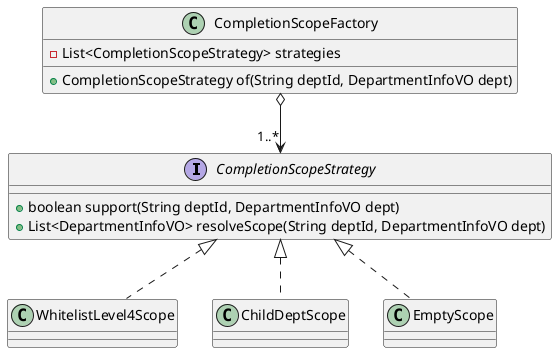

```java
public interface CompletionScopeStrategy {
    boolean support(String deptId, DepartmentInfoVO dept);      // 0/二级、三~五级、六级
    List<DepartmentInfoVO> resolveScope(String deptId, DepartmentInfoVO dept);
}

@Component
public class WhitelistLevel4Scope implements CompletionScopeStrategy {
    @Override public boolean support(String deptId, DepartmentInfoVO dept) {
        return "0".equals(deptId) || DepartmentConstants.CLOUD_CORE_NETWORK_DEPT_CODE.equals(deptId);
    }
    @Override public List<DepartmentInfoVO> resolveScope(String deptId, DepartmentInfoVO dept) {
        return deptService.getLevel4DepartmentsByCodes(
            DepartmentConstants.COMPLETION_RATE_LEVEL4_DEPT_CODES); // 固定顺序
    }
}
```

> **收益**：`getDepartmentCourseCompletionRate` 中多分支退化为「工厂选策略 → resolveScope → 循环统计」，新增层级/白名单规则不改主流程。

#### 3.10.2 人员过滤：策略（OCP / ISP）

将 personType（全员/干部/专家）与成熟度过滤抽象为 `PersonFilterStrategy`，统一作用于训战表查询条件，避免在多个 Service 重复 if-else。

```java
public interface PersonFilterStrategy {
    boolean support(int personType);
    /** 追加 personType 对应的过滤与分组字段（如干部按 cadre_position_ai_maturity 非空） */
    void applyTo(TrainingQuery query, String maturityFilter);
}
// AllStaffFilter(0) / CadreFilter(1) / ExpertFilter(2)
```

#### 3.10.3 统计聚合：策略 + 复用计数器（SRP / DRY）

部门维度与成熟度维度统计共享「完课计数、目标课程数求和、平均完课人数、平均完课率」算法，抽出 `CompletedCourseCounter` 与 `CourseCompletionAggregator`，由不同 `AggregationStrategy` 决定分组键（部门 / 成熟度）。

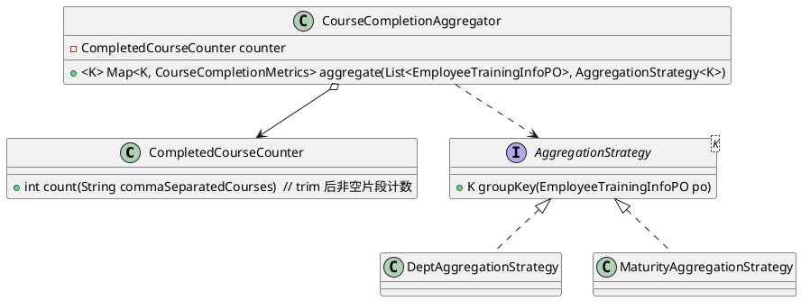

```java
public final class CompletedCourseCounter {
    /** 单人单维度完课数 = 逗号分隔后非空片段个数 */
    public int count(String courses) {
        if (courses == null || courses.trim().isEmpty()) return 0;
        return (int) Arrays.stream(courses.split(","))
                .map(String::trim).filter(s -> !s.isEmpty()).count();
    }
}
// 平均完课人数 = 总完课 ÷ 目标课程数（除零按 0）；平均完课率 = 总完课 ÷ 目标 × 100（2 位小数）
```

> **收益**：部门统计与成熟度统计复用同一聚合算法，仅分组键不同，消除重复代码，口径单点维护。

#### 3.10.4 训战/实战同步：模板方法（SRP / OCP）

全员训战信息同步与实战完课同步共享「加载源数据 → 计算目标/完课 → 批量增改删」骨架，差异以钩子下沉。

```java
public abstract class AbstractTrainingSyncTemplate {
    @Transactional(rollbackFor = Exception.class)
    public final Map<String,Object> sync(String periodId) {
        validate(periodId);
        List<EmployeeSyncDataVO> src = loadSource(periodId);
        List<EmployeeTrainingInfoPO> rows = src.stream().map(this::buildRow).collect(toList());
        return persistByPeriod(periodId, rows);   // 增/改/删 + 计数
    }
    protected abstract EmployeeTrainingInfoPO buildRow(EmployeeSyncDataVO e);
}
```

#### 3.10.5 SOLID 原则落地对照

| 原则 | 当前问题 | 设计落地 |
|------|----------|----------|
| SRP | 统计 Service 同时做范围解析、过滤、聚合、计数 | 拆为范围策略、过滤策略、`CompletedCourseCounter`、`CourseCompletionAggregator` |
| OCP | 新增层级/白名单/人员类型需改 if-else | 新增 `CompletionScopeStrategy`/`PersonFilterStrategy` 实现类即可 |
| LSP | - | 各策略子类可互换，输出契约一致 |
| ISP | - | 策略接口最小化（support + 单一职责方法） |
| DIP | Service 内联具体分支逻辑 | 面向接口编程，策略由 Spring 注入并工厂选择 |

### 3.11 编码实现指导

#### 3.11.1 分层与职责边界

- **Controller**：参数校验（deptId/personType/ai_maturity）、调用 Service、`Result<T>` 封装；不写聚合逻辑。
- **Service**：选范围策略 → 过滤策略 → 调聚合器；保持方法短小（≤ 60 行，圈复杂度 ≤ 10）。
- **Mapper**：训战表查询与批量增改删；部门层级编码字段按枚举映射，禁止拼接外部输入。

#### 3.11.2 命名与规范

| 类型 | 约定 | 示例 |
|------|------|------|
| Controller | `XxxController` | `TrainingCoursesController` |
| Service | `XxxService`/`XxxServiceImpl` | `DepartmentCourseCompletionRateService(Impl)` |
| 策略/工厂 | `XxxStrategy`/`XxxFactory` | `CompletionScopeStrategy` |
| 聚合/计数 | `XxxAggregator`/`XxxCounter` | `CompletedCourseCounter` |
| 同步模板 | `AbstractXxxTemplate` | `AbstractTrainingSyncTemplate` |
| VO/PO | `XxxVO`/`XxxPO` | `DepartmentCourseCompletionRateVO` |

#### 3.11.3 异常与事务约定

- 统一 `GlobalExceptionHandler` 兜底：参数错误 400、系统异常 500。
- 同步方法 `@Transactional(rollbackFor = Exception.class)`，模板 `sync()` 为事务边界；periodId 为空抛 `IllegalArgumentException`。
- 除零保护：目标课程数为 0 时平均完课人数/完课率统一按 0；完课列表脏数据 trim 后计数。

#### 3.11.4 可测试性

- `CompletedCourseCounter`、各策略为无状态/入参驱动，便于单测覆盖边界（空串、仅逗号、前后空格、目标为 0）。
- 聚合器可注入桩数据验证部门与成熟度两种分组结果。

---

## 4. 测试设计

### 4.1 功能测试

#### 4.1.1 部门课程完成率测试

| 类型 | 测试场景 | 测试步骤 | 检查点 |
|------|----------|----------|--------|
| 正常 | deptId=0 | 调用 `/personal-course/department-completion-rate?deptId=0` | 返回白名单四级部门(固定顺序)统计，每项含基线/目标课程数/平均完课人数/完课率 |
| 正常 | 三级部门 | 传三级 deptId | 返回其四级子部门统计 |
| 正常 | 四/五级部门 | 传四/五级 deptId | 返回下一层级子部门统计 |
| 边界 | 六级部门 | 传六级 deptId | 返回 `data: []` |
| 检查 | 计算口径 | 校验某部门 | 目标课程数=Σ*_target_courses_num；完课率=总完课/目标×100(2位小数) |
| 异常 | deptId 为空 | 不传 deptId | 返回 400 |
| 异常 | personType 非法 | personType=99 | 返回 400 |

#### 4.1.2 岗位 AI 成熟度训战统计测试

| 类型 | 测试场景 | 测试步骤 | 检查点 |
|------|----------|----------|--------|
| 正常 | 干部统计 | `/trainning-courses/maturity-trainning-courses?deptId&personType=1` | 按 cadre_position_ai_maturity 分组，L1→L2→L3 |
| 正常 | 专家统计 | personType=2 | 按 expert_position_ai_maturity 分组 |
| 正常 | deptId=0 | 传 0 | 服务端转 031562 后统计 |
| 检查 | 平均完课人数 | 校验某档 | =该维度总完课 ÷ 平均目标课程数(四舍五入) |
| 检查 | 不依赖选课表 | 校验数据来源 | 目标课程数仅取每人 *_target_courses_num，不查 dept_course_selections |
| 异常 | personType 非 1/2 | personType=0 | 返回 400 |
| 边界 | 过滤后无人 | 某档无人 | 该档省略或返回 0(按产品约定) |
| 边界 | 平均目标=0 | 某维度目标均值为 0 | 对应平均完课人数/完课率按 0，避免除零 |

#### 4.1.3 部门全员训战总览下钻测试

| 类型 | 测试场景 | 测试步骤 | 检查点 |
|------|----------|----------|--------|
| 正常 | 全员下钻 | `?deptId&personType=0` | 返回每人基础/进阶/合计目标数、完课数、完课占比 |
| 正常 | 成熟度过滤 | personType=1 且 ai_maturity=L2 | 仅返回 L2 干部 |
| 异常 | ai_maturity 非法 | ai_maturity=L9 | 返回 400「仅支持 L1、L2、L3」 |
| 异常 | 成熟度与人员类型冲突 | personType=0 且传 ai_maturity | 返回 400(仅干部/专家可用) |
| 边界 | 部门无人 | 空部门 | 返回 200，data=[] |

#### 4.1.4 完课矩阵测试

| 类型 | 测试场景 | 测试步骤 | 检查点 |
|------|----------|----------|--------|
| 正常 | 导出矩阵 | `/personal-course/department-employee-course-completion-detail?deptId&personType` | 列为目标课程并集，行含每人完课标记 |
| 检查 | 完课标记 | 校验某人 | 完课课程标记为完成，未完课标记未完成 |

#### 4.1.5 训战信息同步测试

| 类型 | 测试场景 | 测试步骤 | 检查点 |
|------|----------|----------|--------|
| 正常 | 周期同步 | 触发 syncEmployeeTrainingInfo(periodId) | 返回 insert/update/delete 计数；训战表与周期一致 |
| 边界 | periodId 无人员 | 周期内无成员 | 成功返回，各计数为 0 |
| 异常 | periodId 为空 | 不传周期 | 抛 IllegalArgumentException |

#### 4.1.6 实战完课同步测试

| 类型 | 测试场景 | 测试步骤 | 检查点 |
|------|----------|----------|--------|
| 正常 | 实战回填 | 触发实战完课同步 | hands_on_courses 完课回填 practical_courses，刷新 practical_target_courses_num |
| 检查 | 范围限制 | 有选课时 | 仅回填目标范围内实战课程 |

### 4.2 性能测试

| 类型 | 测试场景 | 测试步骤 | 检查点 |
|------|----------|----------|--------|
| 正常 | 部门统计性能 | 万级训战数据查询完成率 | 响应 < 3 秒 |
| 正常 | 下钻/矩阵性能 | 大基数部门下钻与矩阵 | 响应 < 5 秒 |
| 正常 | 同步性能 | 万级员工训战信息同步 | 10 分钟内完成 |
| 正常 | 并发查询 | 100 并发统计查询 | 全部正常响应，错误率 < 1% |

### 4.3 异常测试

| 类型 | 测试场景 | 测试步骤 | 检查点 |
|------|----------|----------|--------|
| 异常 | 数据库连接异常 | 模拟 DB 断开后调用统计 | 返回 500，记录错误日志 |
| 异常 | 同步中途失败 | 同步过程中模拟异常 | 事务回滚，训战表无脏数据 |
| 异常 | SQL 注入 | deptId 传注入串 | 参数化拦截，正常返回或空结果 |
| 异常 | 完课列表脏数据 | *_courses 含多余逗号/空格 | trim 后计数，空串/null 计 0，不报错 |
| 异常 | 目标课程数为 0 | 某维度目标为 0 | 平均完课人数/完课率按 0，避免除零 |

---

## 附录

### A. 关键数据库表

| 表名 | 用途 |
|------|------|
| t_employee_training_info | 全员训战课程表（basic/advanced/practical_courses 完课列表、*_target_courses_num 目标课程数、各级部门编码、cadre/expert_position_ai_maturity） |
| ai_course_planning_info | 课程规划（course_level=基础/进阶/实战、name、number、credit） |
| dept_course_selections | 部门选课（四级部门 → 课程ID列表，含实战） |
| hands_on_courses | 实战完课记录（同步回填训战表） |
| practical_course_info | 实战课程信息 |
| department_info_hrms | 部门信息与层级；getChildDepartments / getLevel4DepartmentsByCodes |
| t_employee_sync | 员工同步表（同步周期来源） |

### B. 关键常量与口径

| 项 | 值/规则 |
|----|---------|
| 云核心网二级部门 | `DepartmentConstants.CLOUD_CORE_NETWORK_DEPT_CODE = 031562` |
| 完课率白名单四级部门 | `COMPLETION_RATE_LEVEL4_DEPT_CODES`（047375、047374、043539、041852、038460、030699、038462、038461、047376，固定顺序） |
| 单人单维度完课数 | `*_courses` 逗号分隔后非空片段个数（`countCompletedCourses`） |
| 平均完课人数 | 总完课数 ÷ 目标课程数（四舍五入为整数；目标为 0 按 0） |
| 平均完课率 | 总完课数 ÷ 目标课程数 × 100（2 位小数） |
| personType | 0 全员 / 1 干部 / 2 专家；成熟度统计仅 1、2 |
| ai_maturity | L1 / L2 / L3，仅干部/专家可用 |

### C. 版本历史

| 版本 | 日期 | 作者 | 说明 |
|------|------|------|------|
| V1.0 | 2026年 | 系统架构师 | 初版，AI 训战看板完整设计 |

---

**文档结束**
