# 南海会议软件设计文档

## 文档信息

| 项目 | 内容 |
|------|------|
| 文档名称 | 南海会议软件设计文档 |
| 版本号 | V1.0 |
| 编写日期 | 2025年 |
| 编写人 | 系统架构师 |
| 审核人 | - |
| 批准人 | - |

---

## 目录

1. [系统概述](#1-系统概述)
2. [用户诉求与功能分析](#2-用户诉求与功能分析)
3. [系统架构](#3-系统架构)
4. [核心业务流程](#4-核心业务流程)
5. [系统架构图](#5-系统架构图)
6. [用例视图](#6-用例视图)
7. [过程视图](#7-过程视图)
8. [UI设计](#8-ui设计)
9. [兼容性分析](#9-兼容性分析)
10. [DFX分析](#10-dfx分析)
11. [约束与限制](#11-约束与限制)
12. [测试设计](#12-测试设计)

---

## 1. 系统概述

### 1.1 系统背景

南海会议软件是云核心网2025南海会议实战演练的后端系统，主要用于AI编程大赛的比赛管理、用户管理、提交记录管理和实时数据推送。系统支持比赛开始/结束、用户注册查询、提交记录统计、排行榜展示、实时数据推送等功能，为AI编程大赛提供完整的后端支撑。

### 1.2 系统目标

#### 1.2.1 功能目标
- 提供完整的比赛管理功能（开始比赛、结束比赛、获取比赛状态）
- 支持用户注册、查询、按组/小组查询用户
- 支持提交记录创建、查询、统计、排行榜
- 支持实时数据推送（WebSocket）
- 支持管理员认证和权限管理
- 支持与外部构建系统集成

#### 1.2.2 性能目标
- 支持并发用户数 ≥ 100
- 接口响应时间 < 1秒（普通查询）
- 实时推送延迟 < 500ms
- 数据库查询优化，避免全表扫描

#### 1.2.3 可靠性目标
- 系统可用性达到99.9%
- 支持异常恢复和数据一致性保障
- 完善的异常处理和日志记录
- 支持软删除机制，数据可恢复

#### 1.2.4 安全目标
- 支持管理员密码认证
- 接口访问权限控制
- 数据传输加密（HTTPS）
- SQL注入防护
- 会话管理安全

### 1.3 技术栈

- **开发语言**：Java 8
- **框架**：Spring Boot 2.7.18
- **持久层**：Spring Data JPA
- **数据库**：MySQL 8.0+ / H2（测试）
- **WebSocket**：Spring WebSocket + STOMP
- **构建工具**：Maven
- **应用服务器**：内嵌Tomcat

### 1.4 系统范围

#### 1.4.1 功能范围
- 比赛管理（开始、结束、状态查询、统计）
- 用户管理（创建、查询、按组查询）
- 提交记录管理（创建、查询、统计、排行榜）
- 实时数据推送（WebSocket）
- 管理员认证
- 与外部构建系统集成

#### 1.4.2 非功能范围
- 系统性能优化
- 安全防护
- 日志审计
- 异常处理
- 数据备份与恢复

---

## 2. 用户诉求与功能分析

### 2.1 用户诉求分析

#### 2.1.1 用户角色识别

系统主要服务于以下用户角色：

| 用户角色 | 角色描述 | 主要诉求 |
|----------|----------|----------|
| 参赛选手 | 参加AI编程大赛的选手 | 需要提交代码、查看自己的提交记录、查看排行榜、了解比赛状态 |
| 管理员 | 负责比赛管理和系统维护的管理员 | 需要开始/结束比赛、查看比赛统计、管理用户、查看所有提交记录 |
| 观众 | 观看比赛进展的观众 | 需要实时查看比赛统计、排行榜、提交记录 |
| 外部系统 | 需要调用本系统接口的外部系统（如构建系统） | 需要通过API接口获取比赛数据、提交记录等 |

#### 2.1.2 核心用户诉求

**诉求1：比赛管理需求**
- **诉求描述**：管理员需要能够开始比赛、结束比赛、查看比赛状态和统计数据
- **使用场景**：
  - 比赛开始前，管理员设置比赛开始时间
  - 比赛进行中，管理员查看比赛统计和进展
  - 比赛结束后，管理员查看最终统计结果
- **期望结果**：能够方便地管理比赛，实时了解比赛状态和统计数据

**诉求2：提交记录管理需求**
- **诉求描述**：选手需要提交代码，系统需要记录提交结果并统计
- **使用场景**：
  - 选手提交代码后，系统记录提交信息
  - 系统调用外部构建系统获取测试结果
  - 系统统计通过用例数、完成时间等信息
- **期望结果**：能够准确记录每次提交的结果，支持查询和统计

**诉求3：实时数据推送需求**
- **诉求描述**：观众和管理员需要实时了解比赛进展
- **使用场景**：
  - 有新的提交记录时，实时推送给前端
  - 统计数据更新时，实时推送给前端
  - 排行榜更新时，实时推送给前端
- **期望结果**：能够实时推送数据更新，无需手动刷新

**诉求4：排行榜和统计需求**
- **诉求描述**：用户需要查看排行榜和统计数据
- **使用场景**：
  - 查看TOP3排行榜
  - 查看各组通过率统计
  - 查看各小组统计
- **期望结果**：能够快速获取排行榜和统计数据，支持多维度统计

**诉求5：用户管理需求**
- **诉求描述**：管理员需要管理参赛用户
- **使用场景**：
  - 创建用户
  - 查询用户信息
  - 按组/小组查询用户
- **期望结果**：能够方便地管理用户信息

#### 2.1.3 用户痛点分析

| 痛点 | 痛点描述 | 影响程度 | 解决方案 |
|------|----------|----------|----------|
| 数据更新不及时 | 需要手动刷新才能看到最新数据 | 高 | 使用WebSocket实时推送数据更新 |
| 统计维度单一 | 只能查看简单的统计数据 | 中 | 支持多维度统计（按组、按小组、按时间等） |
| 提交记录查询效率低 | 无法快速查询提交记录 | 中 | 提供多种查询方式（按用户、按分支、按时间等） |
| 缺乏实时性 | 无法实时了解比赛进展 | 高 | 使用WebSocket实现实时推送 |
| 外部系统集成复杂 | 与构建系统集成困难 | 中 | 提供标准API接口，支持轮询机制 |

### 2.2 功能分析

#### 2.2.1 功能需求梳理

基于用户诉求分析，系统需要提供以下核心功能：

**功能模块1：比赛管理**
- **功能描述**：提供比赛开始、结束、状态查询、统计等功能
- **核心功能点**：
  - 开始比赛（更新比赛开始时间，清空提交记录）
  - 获取当前比赛信息
  - 获取比赛统计数据（总用例数、参与人数、通过率、平均完成时间等）
  - 计算剩余时间
- **输入**：管理员操作、比赛ID
- **输出**：比赛信息、统计数据

**功能模块2：用户管理**
- **功能描述**：提供用户创建、查询等功能
- **核心功能点**：
  - 创建用户（用户名、工号、组类型、小组等）
  - 查询用户（按ID、按用户名）
  - 获取所有用户
  - 按组/小组查询用户
  - 统计用户数量
- **输入**：用户信息
- **输出**：用户信息列表

**功能模块3：提交记录管理**
- **功能描述**：提供提交记录创建、查询、统计等功能
- **核心功能点**：
  - 创建提交记录
  - 查询提交记录（按用户、按分支、按时间等）
  - 获取TOP3排行榜
  - 获取最近提交记录
  - 计算通过率
  - 软删除/恢复提交记录
- **输入**：提交信息（用户ID、分支、通过用例数、完成时间等）
- **输出**：提交记录列表、统计数据

**功能模块4：实时数据推送（WebSocket）**
- **功能描述**：提供实时数据推送功能
- **核心功能点**：
  - 实时推送提交记录更新
  - 实时推送统计数据更新
  - 实时推送排行榜更新
  - 实时推送比赛状态更新
- **输入**：数据更新事件
- **输出**：WebSocket消息推送

**功能模块5：管理员认证**
- **功能描述**：提供管理员登录认证功能
- **核心功能点**：
  - 管理员登录
  - 会话管理
  - 权限验证
- **输入**：用户名、密码
- **输出**：登录状态、会话信息

**功能模块6：外部系统集成**
- **功能描述**：与外部构建系统集成，获取测试结果
- **核心功能点**：
  - 查询构建任务（支持轮询）
  - 查询包运行结果
  - 获取测试报告（XML/JSON格式）
  - 解析测试结果（通过用例数等）
- **输入**：代码仓地址、分支名称
- **输出**：测试结果（通过用例数、完成时间等）

#### 2.2.2 功能优先级划分

| 优先级 | 功能模块 | 优先级说明 |
|--------|----------|------------|
| P0（必须） | 比赛管理、用户管理、提交记录管理 | 核心功能，必须实现 |
| P0（必须） | 管理员认证 | 安全功能，必须实现 |
| P1（重要） | 实时数据推送（WebSocket） | 重要功能，提升用户体验 |
| P1（重要） | 外部系统集成 | 重要功能，支持自动化测试 |
| P2（一般） | 数据导出功能 | 增强功能，可以后续实现 |
| P2（一般） | 数据可视化功能 | 增强功能，可以后续实现 |

#### 2.2.3 功能详细分析

**功能1：开始比赛**

**功能描述**：
管理员开始比赛，更新比赛开始时间并清空所有提交记录（软删除）。

**功能流程**：
1. 验证管理员登录状态
2. 软删除所有提交记录
3. 更新比赛开始时间为当前时间
4. 返回比赛信息

**输入参数**：
- 无（从Session获取管理员登录状态）

**输出结果**：
- 比赛信息（ID、开始时间、总用例数等）

**异常处理**：
- 未登录：返回错误信息
- 系统异常：返回500错误

**功能2：创建提交记录**

**功能描述**：
创建提交记录，记录用户的代码提交信息。

**功能流程**：
1. 接收提交信息（用户ID、分支、通过用例数、完成时间等）
2. 创建提交记录
3. 保存到数据库
4. 触发WebSocket推送
5. 返回提交记录

**输入参数**：
- userId（Long，必填）：用户ID
- branch（String，必填）：分支名称
- passed（Integer，可选）：通过用例数
- completionTime（Integer，可选）：完成时间（秒）

**输出结果**：
- 提交记录信息（ID、用户ID、分支、通过用例数、完成时间、提交时间等）

**异常处理**：
- 参数无效：返回400错误
- 用户不存在：返回404错误
- 系统异常：返回500错误

**功能3：获取比赛统计**

**功能描述**：
获取比赛的详细统计数据，包括各组通过率、平均完成时间、小组排名等。

**功能流程**：
1. 获取比赛信息
2. 统计总参与人数
3. 统计AI组/非AI组人数和通过率
4. 计算各组平均完成时间
5. 统计各小组数据并排序
6. 返回统计数据

**输入参数**：
- competitionId（Long，必填）：比赛ID

**输出结果**：
- 比赛统计数据（总用例数、参与人数、各组统计、小组排名等）

**异常处理**：
- 比赛不存在：返回404错误
- 系统异常：返回500错误

**功能4：实时数据推送**

**功能描述**：
通过WebSocket实时推送数据更新。

**功能流程**：
1. 客户端建立WebSocket连接
2. 订阅相关主题
3. 系统在数据更新时推送消息
4. 客户端接收并更新界面

**输入参数**：
- WebSocket连接
- 订阅主题（/topic/submissions、/topic/stats等）

**输出结果**：
- WebSocket消息推送

**异常处理**：
- 连接失败：记录日志
- 推送失败：记录日志，不影响主流程

#### 2.2.4 功能依赖关系

```
比赛管理
    ↓
用户管理（依赖）
    ↓
提交记录管理（依赖）
    ↓
实时数据推送（依赖）
    ↓
外部系统集成（依赖）
```

#### 2.2.5 功能非功能需求

**性能需求**：
- 单次查询响应时间 < 1秒
- 实时推送延迟 < 500ms
- 支持并发用户数 ≥ 100
- 数据库查询优化

**可靠性需求**：
- 系统可用性 ≥ 99.9%
- 数据一致性保证
- 异常情况自动恢复
- 支持软删除，数据可恢复

**安全需求**：
- 管理员密码认证
- 接口访问权限控制
- 会话管理安全
- SQL注入防护
- 数据传输加密

**可维护性需求**：
- 代码结构清晰
- 完善的日志记录
- 完善的文档说明

---

## 3. 系统架构

### 3.1 总体架构

系统采用经典的三层架构模式：**表现层（Controller）** → **业务层（Service）** → **数据访问层（Repository）**

#### 3.1.1 架构分层

```
┌─────────────────────────────────────────────────────────┐
│                     表现层 (Controller)                   │
│  ┌──────────────┐  ┌──────────────┐  ┌──────────────┐  │
│  │ Competition  │  │ Submission   │  │ User         │  │
│  │ Controller   │  │ Controller   │  │ Controller   │  │
│  └──────────────┘  └──────────────┘  └──────────────┘  │
│  ┌──────────────┐  ┌──────────────┐                    │
│  │ Auth         │  │ Page         │                    │
│  │ Controller   │  │ Controller   │                    │
│  └──────────────┘  └──────────────┘                    │
└─────────────────────────────────────────────────────────┘
                          ↓
┌─────────────────────────────────────────────────────────┐
│                     业务层 (Service)                      │
│  ┌──────────────┐  ┌──────────────┐  ┌──────────────┐  │
│  │ Competition  │  │ Submission   │  │ User          │  │
│  │ Service      │  │ Service     │  │ Service      │  │
│  └──────────────┘  └──────────────┘  └──────────────┘  │
│  ┌──────────────┐  ┌──────────────┐                    │
│  │ UserInfo     │  │ WebSocket    │                    │
│  │ Service      │  │ Handler      │                    │
│  └──────────────┘  └──────────────┘                    │
└─────────────────────────────────────────────────────────┘
                          ↓
┌─────────────────────────────────────────────────────────┐
│                   数据访问层 (Repository)                  │
│  ┌──────────────┐  ┌──────────────┐  ┌──────────────┐  │
│  │ Competition  │  │ Submission   │  │ User         │  │
│  │ Repository   │  │ Repository   │  │ Repository  │  │
│  └──────────────┘  └──────────────┘  └──────────────┘  │
│  ┌──────────────┐                                       │
│  │ UserInfo     │                                       │
│  │ Repository   │                                       │
│  └──────────────┘                                       │
└─────────────────────────────────────────────────────────┘
                          ↓
┌─────────────────────────────────────────────────────────┐
│                     数据库层 (MySQL/H2)                    │
│  ┌──────────────┐  ┌──────────────┐  ┌──────────────┐  │
│  │ competitions│  │ submissions   │  │ users         │  │
│  └──────────────┘  └──────────────┘  └──────────────┘  │
│  ┌──────────────┐                                       │
│  │ user_info    │                                       │
│  └──────────────┘                                       │
└─────────────────────────────────────────────────────────┘
```

#### 3.1.2 架构说明

**表现层（Controller Layer）**
- **职责**：接收HTTP请求、参数校验、调用Service层、返回统一响应、异常捕获
- **设计要点**：
  - 使用`@RestController`注解，自动序列化响应
  - 统一使用`ApiResponse<T>`作为响应格式
  - 使用`GlobalExceptionHandler`统一处理异常
  - 参数校验在Controller层进行

**业务层（Service Layer）**
- **职责**：业务逻辑处理、数据聚合和计算、调用Repository层、事务管理
- **设计要点**：
  - 使用`@Service`注解标识服务类
  - 业务逻辑封装在Service层，Controller层不包含业务逻辑
  - 复杂业务逻辑可以拆分为多个私有方法
  - 使用`@Transactional`管理事务（如需要）

**数据访问层（Repository Layer）**
- **职责**：数据库操作封装、JPA查询定义、结果集映射
- **设计要点**：
  - 使用Spring Data JPA的`Repository`接口
  - 使用`@Query`注解定义自定义查询
  - 使用实体类（Entity）作为数据模型
  - 避免在Repository层包含业务逻辑

### 3.2 包架构设计

#### 3.2.1 包结构

```
com.nanhai.competition
├── CompetitionApplication.java                    # 主启动类
├── config/                                        # 配置类
│   ├── CorsConfig.java                           # 跨域配置
│   ├── WebSocketConfig.java                      # WebSocket配置
│   ├── WebMvcConfig.java                         # Web MVC配置
│   ├── AuthInterceptor.java                      # 认证拦截器
│   ├── BuildApiConfig.java                       # 构建API配置
│   └── RestTemplateConfig.java                   # RestTemplate配置
├── controller/                                   # 控制器层
│   ├── CompetitionController.java                # 比赛控制器
│   ├── SubmissionController.java                 # 提交记录控制器
│   ├── UserController.java                      # 用户控制器
│   ├── UserInfoController.java                  # 用户信息控制器
│   ├── AuthController.java                      # 认证控制器
│   └── PageController.java                      # 页面控制器
├── dto/                                          # 数据传输对象
│   ├── ApiResponse.java                         # 统一响应格式
│   ├── CompetitionStatsDTO.java                 # 比赛统计DTO
│   ├── SubmissionDTO.java                       # 提交记录DTO
│   ├── UserRankDTO.java                         # 用户排名DTO
│   ├── SubGroupStatsDTO.java                    # 小组统计DTO
│   ├── BuildJobResponseDTO.java                 # 构建任务响应DTO
│   ├── BuildPackageRunResponseDTO.java          # 包运行响应DTO
│   ├── BuildTriggerDTO.java                     # 构建触发DTO
│   ├── UserInfoDTO.java                         # 用户信息DTO
│   └── LoginRequest.java                        # 登录请求DTO
├── entity/                                       # 实体类
│   ├── Competition.java                         # 比赛实体
│   ├── Submission.java                          # 提交记录实体
│   ├── User.java                                # 用户实体
│   └── UserInfo.java                            # 用户信息实体
├── exception/                                    # 异常处理
│   ├── GlobalExceptionHandler.java             # 全局异常处理器
│   ├── BusinessException.java                   # 业务异常
│   └── ResourceNotFoundException.java          # 资源未找到异常
├── repository/                                   # 数据访问层
│   ├── CompetitionRepository.java               # 比赛Repository
│   ├── SubmissionRepository.java                # 提交记录Repository
│   ├── UserRepository.java                      # 用户Repository
│   └── UserInfoRepository.java                 # 用户信息Repository
├── service/                                      # 服务层
│   ├── CompetitionService.java                  # 比赛服务接口
│   ├── SubmissionService.java                  # 提交记录服务接口
│   ├── UserService.java                        # 用户服务接口
│   ├── UserInfoService.java                    # 用户信息服务接口
│   └── impl/                                    # 服务实现类
│       ├── CompetitionServiceImpl.java          # 比赛服务实现
│       ├── SubmissionServiceImpl.java           # 提交记录服务实现
│       ├── UserServiceImpl.java                 # 用户服务实现
│       └── UserInfoServiceImpl.java            # 用户信息服务实现
└── websocket/                                    # WebSocket处理
    └── CompetitionWebSocketHandler.java         # WebSocket处理器
```

#### 3.2.2 包职责说明

| 包名 | 职责 | 说明 |
|------|------|------|
| config | 配置类 | Spring Boot配置、WebSocket配置、跨域配置等 |
| controller | 控制器层 | 处理HTTP请求，调用Service层 |
| dto | 数据传输对象 | 用于前后端数据交互的DTO类 |
| entity | 实体类 | JPA实体类，对应数据库表 |
| exception | 异常处理 | 全局异常处理器和自定义异常类 |
| repository | 数据访问层 | Spring Data JPA Repository接口 |
| service | 业务层 | 业务逻辑处理接口和实现类 |
| websocket | WebSocket处理 | WebSocket消息处理和推送 |

### 3.3 系统类图

#### 3.3.1 核心类图

```plantuml
@startuml
package "Controller层" {
    class CompetitionController {
        -CompetitionService competitionService
        -SubmissionService submissionService
        +startCompetition(session: HttpSession): ApiResponse<Competition>
        +getCurrentCompetition(): ApiResponse<Competition>
        +getCompetitionStats(competitionId: Long): ApiResponse<CompetitionStatsDTO>
    }
    
    class SubmissionController {
        -SubmissionService submissionService
        -CompetitionService competitionService
        -UserInfoService userInfoService
        +createSubmission(userId: Long, branch: String, ...): ApiResponse<Submission>
        +getUserSubmissions(userId: Long): ApiResponse<List<SubmissionDTO>>
        +getAllSubmissions(): ApiResponse<List<SubmissionDTO>>
        +getTop3Submissions(): ApiResponse<List<UserRankDTO>>
    }
    
    class UserController {
        -UserService userService
        +createUser(username: String, ...): ApiResponse<User>
        +getUser(userId: Long): ApiResponse<User>
        +getAllUsers(): ApiResponse<List<User>>
    }
    
    class AuthController {
        -CompetitionService competitionService
        +login(loginRequest: LoginRequest, session: HttpSession): ApiResponse<String>
    }
}

package "Service层" {
    class CompetitionService {
        +startCompetition(): Competition
        +getCurrentCompetition(): Competition
        +getCompetitionStats(competitionId: Long): CompetitionStatsDTO
    }
    
    class SubmissionService {
        +createSubmission(userId: Long, branch: String, ...): Submission
        +getUserSubmissions(userId: Long): List<SubmissionDTO>
        +getAllSubmissions(): List<SubmissionDTO>
        +getTop3Submissions(): List<UserRankDTO>
        +queryBuildJob(submission: Submission, buildPath: String, branch: String): BuildJobResponseDTO
    }
    
    class UserService {
        +createUser(username: String, ...): User
        +getUser(userId: Long): User
        +getAllUsers(): List<User>
    }
}

package "Repository层" {
    interface CompetitionRepository {
        +findAll(): List<Competition>
        +save(competition: Competition): Competition
        +findById(id: Long): Optional<Competition>
    }
    
    interface SubmissionRepository {
        +save(submission: Submission): Submission
        +findByUserId(userId: Long): List<Submission>
        +findAllOrderBySubmitTimeDesc(): List<Submission>
        +findByPassedOrderBySubmitTimeAsc(passed: Integer): List<Submission>
        +softDeleteById(id: Long): void
    }
    
    interface UserRepository {
        +save(user: User): User
        +findById(id: Long): Optional<User>
        +findByUsername(username: String): Optional<User>
        +findAll(): List<User>
    }
}

package "Entity层" {
    class Competition {
        -Long id
        -LocalDateTime startTime
        -Integer totalCases
        -String adminPassword
    }
    
    class Submission {
        -Long id
        -Long userId
        -String branch
        -Integer passed
        -Integer completionTime
        -LocalDateTime submitTime
        -String isDeleted
    }
    
    class User {
        -Long id
        -String username
        -String employeeId
        -String groupType
        -String subGroup
        -String userCategory
        -String avatar
    }
    
    class ApiResponse<T> {
        -Integer code
        -String message
        -T data
        +success(data: T): ApiResponse<T>
        +error(message: String): ApiResponse<T>
    }
}

' 关系定义
CompetitionController --> CompetitionService
SubmissionController --> SubmissionService
UserController --> UserService
AuthController --> CompetitionService

CompetitionService --> CompetitionRepository
SubmissionService --> SubmissionRepository
UserService --> UserRepository

CompetitionService ..> Competition
SubmissionService ..> Submission
UserService ..> User
CompetitionController ..> ApiResponse
SubmissionController ..> ApiResponse
UserController ..> ApiResponse

@enduml
```

#### 3.3.2 实体类关系图

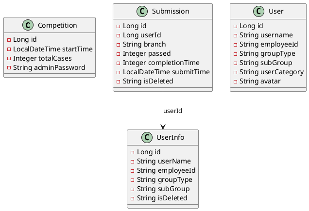

---

## 4. 核心业务流程

### 4.1 开始比赛流程

#### 4.1.1 业务描述
管理员开始比赛，更新比赛开始时间并清空所有提交记录（软删除）。

#### 4.1.2 时序图（PlantUML）

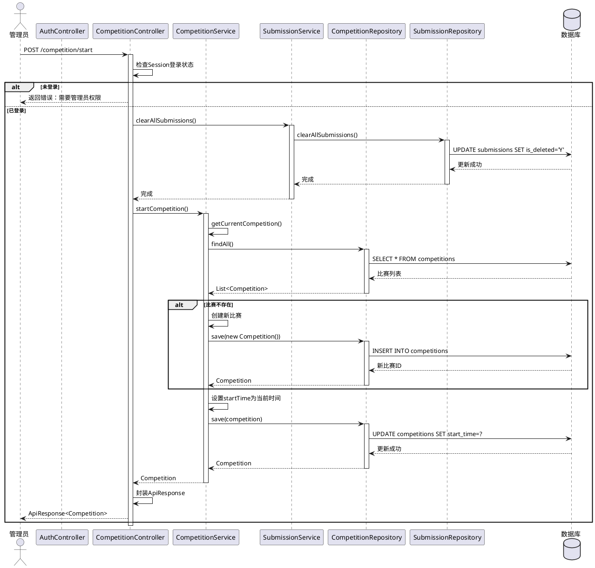

### 4.2 创建提交记录流程

#### 4.2.1 业务描述
创建提交记录，记录用户的代码提交信息，并可选地调用外部构建系统获取测试结果。

#### 4.2.2 时序图（PlantUML）

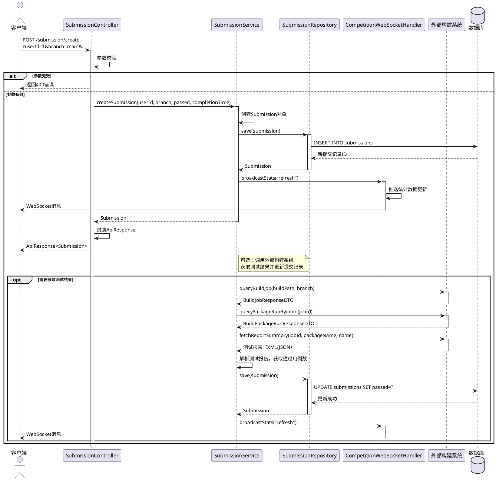

### 4.3 获取比赛统计流程

#### 4.3.1 业务描述
获取比赛的详细统计数据，包括各组通过率、平均完成时间、小组排名等。

#### 4.3.2 时序图（PlantUML）

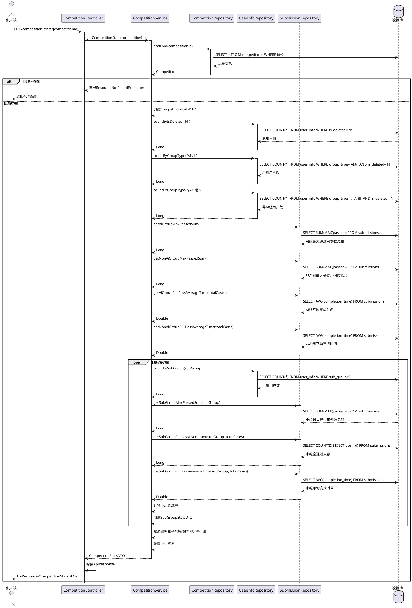

### 4.4 实时数据推送流程

#### 4.4.1 业务描述
通过WebSocket实时推送数据更新给前端。

#### 4.4.2 时序图（PlantUML）

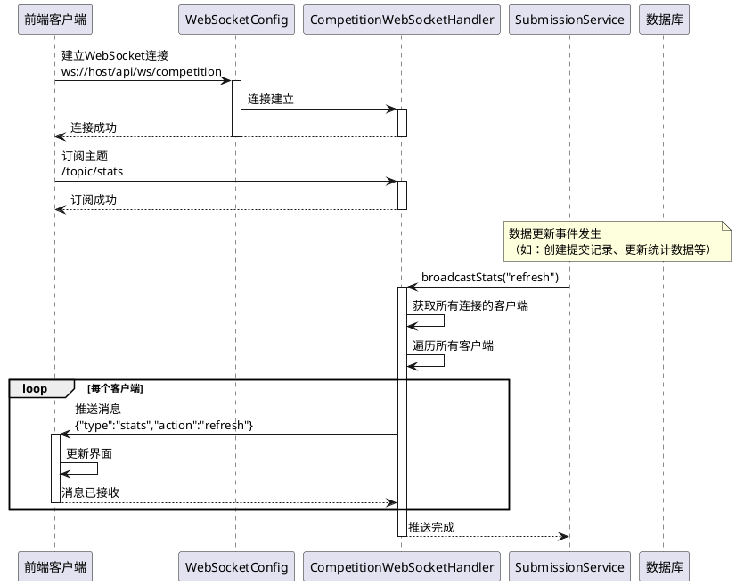

---

## 5. 系统架构图

### 5.1 系统总体架构图

```plantuml
@startuml
!define RECTANGLE class

package "客户端层" {
    RECTANGLE 浏览器
    RECTANGLE 移动APP
}

package "接入层" {
    RECTANGLE Nginx负载均衡
    RECTANGLE API网关
}

package "应用层" {
    package "Web服务" {
        RECTANGLE "Competition\nController"
        RECTANGLE "Submission\nController"
        RECTANGLE "User\nController"
        RECTANGLE "Auth\nController"
    }
    
    package "业务服务" {
        RECTANGLE "Competition\nService"
        RECTANGLE "Submission\nService"
        RECTANGLE "User\nService"
    }
    
    package "数据访问" {
        RECTANGLE "Competition\nRepository"
        RECTANGLE "Submission\nRepository"
        RECTANGLE "User\nRepository"
    }
    
    package "WebSocket服务" {
        RECTANGLE "WebSocket\nHandler"
    }
}

package "数据层" {
    database "MySQL主库\n(写操作)" as MySQL_Master
    database "MySQL从库\n(读操作)" as MySQL_Slave
}

package "外部系统" {
    RECTANGLE "构建系统\n(Build System)"
}

package "基础设施层" {
    RECTANGLE "日志系统"
    RECTANGLE "监控系统"
    RECTANGLE "配置中心"
}

浏览器 --> Nginx负载均衡
移动APP --> Nginx负载均衡

Nginx负载均衡 --> "Competition\nController"
Nginx负载均衡 --> "Submission\nController"
Nginx负载均衡 --> "User\nController"
Nginx负载均衡 --> "Auth\nController"

"Competition\nController" --> "Competition\nService"
"Submission\nController" --> "Submission\nService"
"User\nController" --> "User\nService"

"Competition\nService" --> "Competition\nRepository"
"Submission\nService" --> "Submission\nRepository"
"User\nService" --> "User\nRepository"

"Competition\nRepository" --> MySQL_Slave
"Submission\nRepository" --> MySQL_Master
"User\nRepository" --> MySQL_Slave

MySQL_Master ..> MySQL_Slave : 主从复制

"Submission\nService" --> "构建系统\n(Build System)"
"Submission\nService" --> "WebSocket\nHandler"
"WebSocket\nHandler" --> 浏览器 : WebSocket推送

"Competition\nService" ..> "日志系统"
"Submission\nService" ..> "监控系统"
@enduml
```

### 5.2 部署架构图

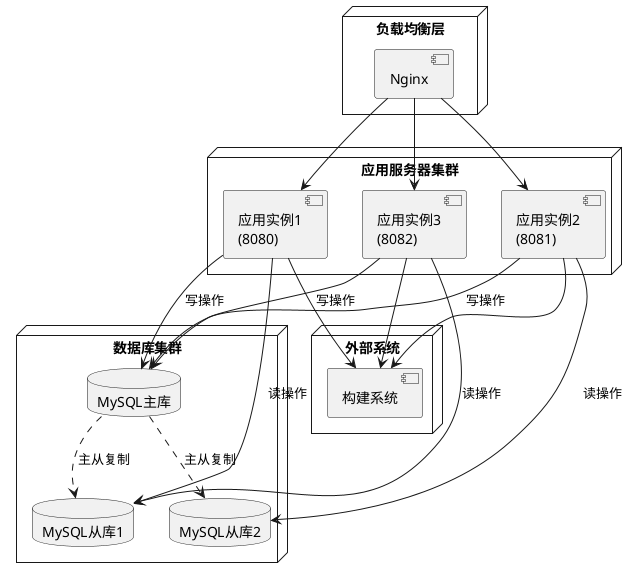

---

## 6. 用例视图

### 6.1 用例图

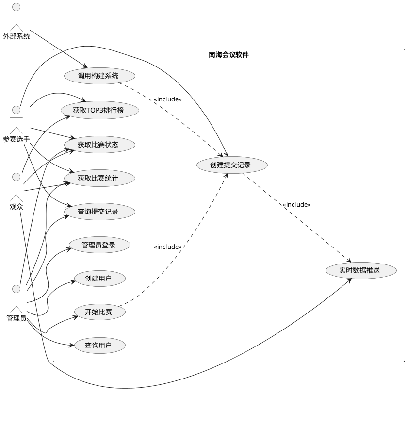

### 6.2 用例详细说明

#### 6.2.1 UC1: 开始比赛

| 项目 | 内容 |
|------|------|
| 用例名称 | 开始比赛 |
| 参与者 | 管理员 |
| 前置条件 | 管理员已登录系统 |
| 基本流程 | 1. 管理员点击开始比赛<br>2. 系统验证管理员登录状态<br>3. 系统软删除所有提交记录<br>4. 系统更新比赛开始时间为当前时间<br>5. 系统返回比赛信息 |  |
| 异常流程 | 1. 未登录：返回错误信息<br>2. 系统异常：返回500错误 |
| 后置条件 | 比赛已开始，所有提交记录已清空 |

#### 6.2.2 UC4: 创建提交记录

| 项目 | 内容 |
|------|------|
| 用例名称 | 创建提交记录 |
| 参与者 | 参赛选手、外部系统 |
| 前置条件 | 比赛已开始 |
| 基本流程 | 1. 选手提交代码或外部系统触发提交<br>2. 系统创建提交记录<br>3. 系统保存提交记录到数据库<br>4. 系统触发WebSocket推送<br>5. 系统返回提交记录信息<br>6. （可选）系统调用外部构建系统获取测试结果<br>7. （可选）系统更新提交记录的通过用例数 |
| 异常流程 | 1. 参数无效：返回400错误<br>2. 用户不存在：返回404错误<br>3. 系统异常：返回500错误 |
| 后置条件 | 提交记录已创建，统计数据已更新 |

#### 6.2.3 UC3: 获取比赛统计

| 项目 | 内容 |
|------|------|
| 用例名称 | 获取比赛统计 |
| 参与者 | 参赛选手、管理员、观众 |
| 前置条件 | 比赛已开始 |
| 基本流程 | 1. 用户请求比赛统计数据<br>2. 系统获取比赛信息<br>3. 系统统计总参与人数<br>4. 系统统计各组人数和通过率<br>5. 系统计算各组平均完成时间<br>6. 系统统计各小组数据并排序<br>7. 系统返回统计数据 |
| 异常流程 | 1. 比赛不存在：返回404错误<br>2. 系统异常：返回500错误 |
| 后置条件 | 用户获得比赛统计数据 |

---

## 7. 过程视图

### 7.1 开始比赛处理过程

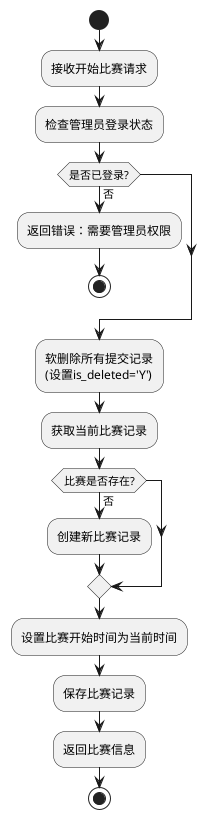

### 7.2 创建提交记录处理过程

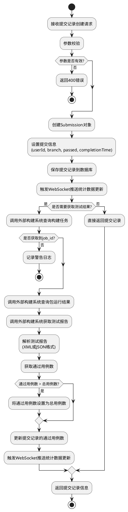

### 7.3 获取比赛统计处理过程

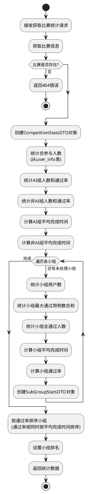

---

## 8. UI设计

### 8.1 界面设计原则

1. **简洁明了**：界面布局清晰，信息层次分明
2. **易于操作**：操作流程简单，减少用户学习成本
3. **响应式设计**：支持PC端和移动端访问
4. **实时更新**：使用WebSocket实现实时数据更新
5. **数据可视化**：使用图表展示统计数据，直观易懂

### 8.2 主要界面设计

#### 8.2.1 比赛统计页面

**页面布局**：
```
┌─────────────────────────────────────────────────────────┐
│  南海会议AI编程大赛 - 比赛统计                            │
├─────────────────────────────────────────────────────────┤
│  比赛状态: [进行中]  [开始比赛] [结束比赛]                │
├─────────────────────────────────────────────────────────┤
│  总体统计:                                               │
│  ┌──────────┐  ┌──────────┐  ┌──────────┐            │
│  │ 总用例数  │  │ 参与人数  │  │ 比赛时长  │            │
│  │   20     │  │   100    │  │  120分钟 │            │
│  └──────────┘  └──────────┘  └──────────┘            │
├─────────────────────────────────────────────────────────┤
│  组别统计:                                               │
│  ┌──────────────────────────────────────────────────┐  │
│  │ AI组: 通过率 85.5%, 平均完成时间 15:30, 通过人数 50│  │
│  │ 非AI组: 通过率 78.2%, 平均完成时间 18:45, 通过人数 30│  │
│  └──────────────────────────────────────────────────┘  │
├─────────────────────────────────────────────────────────┤
│  小组排名:                                               │
│  ┌──────────────────────────────────────────────────┐  │
│  │ 排名 │ 小组名称 │ 通过率 │ 平均完成时间 │ 通过人数 │  │
│  ├──────────────────────────────────────────────────┤  │
│  │  1  │ AI-1小组 │ 90.0% │   12:30    │   12   │  │
│  │  2  │ AI-2小组 │ 88.5% │   13:15    │   11   │  │
│  │  3  │ AI-3小组 │ 85.0% │   14:20    │   10   │  │
│  │ ... │  ...    │  ... │    ...     │   ...  │  │
│  └──────────────────────────────────────────────────┘  │
└─────────────────────────────────────────────────────────┘
```

**功能说明**：
- 比赛状态：显示当前比赛状态，管理员可以开始/结束比赛
- 总体统计：显示总用例数、参与人数、比赛时长等
- 组别统计：显示AI组和非AI组的通过率、平均完成时间、通过人数
- 小组排名：按通过率和平均完成时间排序显示各小组排名

#### 8.2.2 提交记录页面

**页面布局**：
```
┌─────────────────────────────────────────────────────────┐
│  提交记录                                                 │
├─────────────────────────────────────────────────────────┤
│  查询条件:                                                │
│  用户: [下拉选择框]  分支: [输入框]  [查询] [重置]        │
├─────────────────────────────────────────────────────────┤
│  提交记录列表 (共100条):                                   │
│  ┌──────────────────────────────────────────────────┐  │
│  │ 用户 │ 分支 │ 通过用例数 │ 完成时间 │ 提交时间 │ 操作│  │
│  ├──────────────────────────────────────────────────┤  │
│  │ 张三 │ main │    20    │  12:30  │ 10:00:00 │ 详情│  │
│  │ 李四 │ dev  │    18    │  15:45  │ 10:05:00 │ 详情│  │
│  │ ... │ ... │   ...   │   ...   │  ...    │ ...│  │
│  └──────────────────────────────────────────────────┘  │
│  [上一页] [1] [2] [3] [下一页]                           │
└─────────────────────────────────────────────────────────┘
```

**功能说明**：
- 查询条件：支持按用户、分支等条件查询
- 结果展示：表格形式展示，支持分页
- 实时更新：通过WebSocket实时推送新的提交记录

#### 8.2.3 TOP3排行榜页面

**页面布局**：
```
┌─────────────────────────────────────────────────────────┐
│  TOP3排行榜                                              │
├─────────────────────────────────────────────────────────┤
│  ┌──────────────────────────────────────────────────┐  │
│  │                    🥇 第一名                      │  │
│  │  用户名: 张三  |  组别: AI组  |  小组: AI-1小组   │  │
│  │  通过用例数: 20  |  完成时间: 12:30              │  │
│  └──────────────────────────────────────────────────┘  │
│  ┌──────────────────────────────────────────────────┐  │
│  │                    🥈 第二名                      │  │
│  │  用户名: 李四  |  组别: AI组  |  小组: AI-2小组   │  │
│  │  通过用例数: 20  |  完成时间: 13:15              │  │
│  └──────────────────────────────────────────────────┘  │
│  ┌──────────────────────────────────────────────────┐  │
│  │                    🥉 第三名                      │  │
│  │  用户名: 王五  |  组别: 非AI组 |  小组: 非AI-1小组 │  │
│  │  通过用例数: 20  |  完成时间: 14:20              │  │
│  └──────────────────────────────────────────────────┘  │
└─────────────────────────────────────────────────────────┘
```

**功能说明**：
- 显示TOP3排行榜
- 实时更新：通过WebSocket实时推送排行榜更新
- 显示详细信息：用户名、组别、小组、通过用例数、完成时间

### 8.3 响应式设计

#### 8.3.1 PC端设计
- 屏幕宽度 ≥ 1200px：完整布局，显示所有功能
- 屏幕宽度 768px - 1199px：紧凑布局，部分功能折叠
- 屏幕宽度 < 768px：移动端布局

#### 8.3.2 移动端设计
- 单列布局，垂直排列
- 表格数据支持横向滚动
- 按钮大小适合触摸操作
- 实时推送消息以通知形式显示

---

## 9. 兼容性分析

### 9.1 浏览器兼容性

| 浏览器 | 版本要求 | 兼容性说明 |
|--------|----------|------------|
| Chrome | ≥ 60 | 完全支持，推荐使用 |
| Firefox | ≥ 55 | 完全支持 |
| Safari | ≥ 12 | 完全支持 |
| Edge | ≥ 79 | 完全支持 |
| IE | 不支持 | 不支持IE浏览器 |

### 9.2 操作系统兼容性

| 操作系统 | 版本要求 | 兼容性说明 |
|----------|----------|------------|
| Windows | Windows 7+ | 完全支持 |
| macOS | macOS 10.12+ | 完全支持 |
| Linux | Ubuntu 16.04+ | 完全支持 |
| Android | Android 5.0+ | 支持移动端访问 |
| iOS | iOS 11.0+ | 支持移动端访问 |

### 9.3 数据库兼容性

| 数据库 | 版本要求 | 兼容性说明 |
|--------|----------|------------|
| MySQL | 8.0+ | 完全支持，推荐使用 |
| H2 | 2.0+ | 完全支持，用于测试环境 |
| MariaDB | 10.3+ | 理论上兼容，需测试验证 |

### 9.4 Java版本兼容性

| Java版本 | 兼容性说明 |
|----------|------------|
| JDK 1.8 | 完全支持，当前使用版本 |
| JDK 11 | 理论上兼容，需测试验证 |
| JDK 17 | 理论上兼容，需测试验证 |

### 9.5 接口兼容性

#### 9.5.1 版本管理策略
- 当前版本：v1.0
- 版本升级原则：向后兼容，新增接口使用新版本号
- 废弃接口：保留至少2个版本周期

#### 9.5.2 数据格式兼容性
- 请求格式：JSON格式，UTF-8编码
- 响应格式：统一使用ApiResponse<T>格式
- 日期格式：ISO 8601格式（yyyy-MM-dd HH:mm:ss）

### 9.6 WebSocket兼容性

#### 9.6.1 WebSocket协议支持
- 支持WebSocket协议（RFC 6455）
- 支持STOMP协议（Simple Text Oriented Messaging Protocol）
- 支持SockJS降级方案（用于不支持WebSocket的浏览器）

#### 9.6.2 浏览器WebSocket支持
- Chrome：完全支持
- Firefox：完全支持
- Safari：完全支持
- Edge：完全支持
- IE：不支持，使用SockJS降级

---

## 10. DFX分析

### 10.1 功能设计（Function）

#### 10.1.1 功能完整性

✅ **已实现的功能**：
- 比赛管理（开始、结束、状态查询、统计）
- 用户管理（创建、查询、按组查询）
- 提交记录管理（创建、查询、统计、排行榜）
- 实时数据推送（WebSocket）
- 管理员认证
- 与外部构建系统集成
- 软删除机制

#### 10.1.2 功能扩展性

**设计考虑**：
- 使用接口和实现类分离，支持功能扩展
- 使用DTO模式，便于接口扩展
- 数据库设计支持新增字段
- WebSocket支持多主题订阅

### 10.2 性能设计（Performance）

#### 10.2.1 数据库查询优化

**已实施的优化**：
1. **索引优化**：
   - 在`user_id`、`branch`、`submit_time`等常用查询字段上建立索引
   - 在关联查询的字段上建立索引
   - 建立复合索引优化多条件查询

2. **SQL优化**：
   - 使用JPA的`@Query`注解优化复杂查询
   - 使用聚合函数（SUM、MAX、AVG等）减少查询次数
   - 避免N+1查询问题
   - 使用分页查询限制结果数量

3. **连接池优化**：
```yaml
spring:
  datasource:
    hikari:
      minimum-idle: 5          # 最小空闲连接数
      maximum-pool-size: 20    # 最大连接池大小
      connection-timeout: 30000 # 连接超时时间
      idle-timeout: 30000      # 空闲连接超时时间
      max-lifetime: 1800000    # 连接最大生命周期
```

#### 10.2.2 缓存设计

**建议实施的缓存策略**：

1. **比赛信息缓存**：
   - 比赛信息变化频率低，适合缓存
   - 缓存时间：5分钟
   - 缓存key：`competition:current`

2. **统计数据缓存**：
   - 统计数据可以缓存一定时间
   - 缓存时间：30秒
   - 缓存key：`stats:competition:{competitionId}`

3. **用户信息缓存**：
   - 用户信息变化频率低，适合缓存
   - 缓存时间：10分钟
   - 缓存key：`user:{userId}`

#### 10.2.3 异步处理

**已实施的异步处理**：

1. **外部构建系统调用异步化**：
   - 使用线程池处理构建任务查询
   - 支持轮询机制，避免阻塞
   - 使用`@Async`注解实现异步处理（可选）

2. **WebSocket推送异步化**：
   - WebSocket推送不阻塞主业务流程
   - 使用线程池处理推送任务

#### 10.2.4 性能指标

| 指标 | 目标值 | 说明 |
|------|--------|------|
| 单次查询响应时间 | < 1秒 | 普通查询 |
| 实时推送延迟 | < 500ms | WebSocket推送 |
| 并发用户数 | ≥ 100 | 同时在线用户 |
| 数据库连接数 | ≤ 20 | 连接池大小 |
| CPU使用率 | < 80% | 正常负载下 |
| 内存使用率 | < 80% | 正常负载下 |

### 10.3 可靠性设计（Reliability）

#### 10.3.1 异常处理

**已实施的异常处理**：

1. **全局异常处理器**：
```java
@RestControllerAdvice
public class GlobalExceptionHandler {
    @ExceptionHandler(Exception.class)
    public ApiResponse<Object> handleException(Exception e) {
        logger.error("系统异常：", e);
        return ApiResponse.error("系统异常：" + e.getMessage());
    }
}
```

2. **业务异常处理**：
   - 参数校验异常：返回400错误
   - 业务逻辑异常：返回相应错误码和错误信息
   - 系统异常：返回500错误，记录详细日志

#### 10.3.2 数据一致性保障

**设计考虑**：

1. **事务管理**：
   - 关键操作使用事务，保证数据一致性
   - 使用`@Transactional`注解管理事务
   - 设置事务回滚策略

2. **数据校验**：
   - 创建前校验数据有效性
   - 更新后验证更新结果
   - 关键操作记录操作日志

3. **软删除机制**：
   - 使用软删除，数据可恢复
   - 查询时过滤已删除数据
   - 支持恢复软删除的数据

#### 10.3.3 容错设计

**建议实施的容错机制**：

1. **重试机制**：
   - 外部系统调用失败时自动重试
   - 使用`@Retryable`注解实现重试
   - 重试次数：3次，重试间隔：1秒

2. **降级策略**：
   - 外部构建系统不可用时，返回默认值
   - WebSocket推送失败时，记录日志但不影响主流程
   - 使用`@HystrixCommand`实现降级（可选）

3. **超时控制**：
   - 设置接口超时时间
   - 设置数据库查询超时时间
   - 设置外部系统调用超时时间
   - 超时后返回友好错误信息

#### 10.3.4 可靠性指标

| 指标 | 目标值 | 说明 |
|------|--------|------|
| 系统可用性 | ≥ 99.9% | 年度可用时间 |
| 平均故障恢复时间 | < 30分钟 | MTTR |
| 数据一致性 | 100% | 事务保证 |
| 异常捕获率 | 100% | 所有异常都被捕获 |

### 10.4 可信安全设计（Security）

#### 10.4.1 数据安全

**已实施的安全措施**：

1. **管理员密码存储**：
   - 管理员密码存储在数据库中
   - 支持密码验证
   - 建议：生产环境使用加密存储

2. **SQL注入防护**：
   - 使用JPA的参数化查询
   - 使用`@Query`注解的命名参数
   - 输入参数校验和过滤

#### 10.4.2 接口安全

**建议实施的安全措施**：

1. **接口访问控制**：
   - 使用`@PreAuthorize`注解控制接口访问权限
   - 只有管理员可以执行开始比赛等操作
   - 普通用户只能执行查询操作

2. **参数校验**：
   - 使用`@Valid`注解进行参数校验
   - 自定义校验规则
   - 防止恶意输入

3. **HTTPS传输**：
   - 生产环境使用HTTPS协议
   - 保证数据传输安全
   - 使用TLS 1.2+协议

4. **会话管理**：
   - 使用HttpSession管理会话
   - 设置会话超时时间
   - 使用安全的Cookie配置

#### 10.4.3 日志安全

**设计考虑**：

1. **敏感信息脱敏**：
   - 日志中不输出完整的密码等敏感信息
   - 使用脱敏工具处理敏感数据

2. **操作审计**：
   - 记录关键操作日志
   - 包括操作人、操作时间、操作内容
   - 使用AOP实现操作审计（可选）

#### 10.4.4 安全指标

| 指标 | 目标值 | 说明 |
|------|--------|------|
| SQL注入防护 | 100% | 所有SQL使用参数化查询 |
| 敏感信息脱敏 | 100% | 日志中不包含敏感信息 |
| 接口访问控制 | 100% | 所有接口都有权限控制 |
| 数据加密传输 | 100% | 生产环境使用HTTPS |

### 10.5 可维护性设计（Maintainability）

#### 10.5.1 代码结构

**已实施的结构**：
- 清晰的分层架构（Controller → Service → Repository）
- 按功能模块划分包结构
- 统一的命名规范
- 完善的代码注释

#### 10.5.2 日志设计

**已实施的日志**：
```yaml
logging:
  level:
    root: INFO
    com.nanhai: DEBUG
  pattern:
    console: "%d{yyyy-MM-dd HH:mm:ss} [%thread] %-5level %logger{36} - %msg%n"
  file:
    name: logs/competition.log
    max-size: 10MB
    max-history: 30
```

**建议增强的日志**：
- 在关键业务节点添加日志
- 记录请求参数和响应结果
- 记录异常堆栈信息
- 使用结构化日志格式

#### 10.5.3 文档设计

**已实施的文档**：
- README.md：项目说明
- 软件设计文档：本文档

**建议补充的文档**：
- API文档（Swagger/OpenAPI）
- 数据库设计文档
- 部署运维文档
- 开发规范文档

### 10.6 可扩展性设计（Extensibility）

#### 10.6.1 接口扩展性

**设计考虑**：
- 接口参数使用可选参数，支持向后兼容
- 响应对象使用DTO，便于扩展字段
- 接口版本管理，支持多版本共存

#### 10.6.2 功能扩展性

**设计考虑**：
- 使用接口和实现类分离，便于扩展实现
- Service层接口化，便于扩展实现
- 数据库设计支持新增字段和表
- WebSocket支持多主题订阅

### 10.7 可用性设计（Availability）

#### 10.7.1 高可用架构

**建议实施的方案**：

1. **应用集群**：
   - 部署多个应用实例
   - 使用Nginx进行负载均衡
   - 支持故障自动切换

2. **数据库主从**：
   - 主库负责写操作
   - 从库负责读操作
   - 使用读写分离提高性能
   - 支持主从切换

3. **健康检查**：
   - 提供健康检查接口
   - 监控应用状态
   - 自动故障恢复

#### 10.7.2 可用性指标

| 指标 | 目标值 | 说明 |
|------|--------|------|
| 系统可用性 | ≥ 99.9% | 年度可用时间 |
| 故障恢复时间 | < 30分钟 | MTTR |
| 数据备份频率 | 每天 | 全量备份 |
| 数据恢复时间 | < 2小时 | RTO |

---

## 11. 约束与限制

### 11.1 技术约束

#### 11.1.1 开发环境约束
- **Java版本**：必须使用JDK 1.8，不支持其他版本
- **Maven版本**：建议使用Maven 3.6+
- **IDE**：建议使用IntelliJ IDEA或Eclipse
- **数据库**：MySQL 8.0+或H2（测试），不支持其他数据库

#### 11.1.2 运行环境约束
- **操作系统**：支持Windows、Linux、macOS
- **内存要求**：最低2GB，推荐4GB+
- **磁盘空间**：最低10GB，推荐20GB+
- **网络要求**：需要能够访问数据库服务器和外部构建系统

#### 11.1.3 框架约束
- **Spring Boot版本**：2.7.18，升级需要测试验证
- **Spring Data JPA版本**：随Spring Boot版本，升级需要测试验证
- **MySQL驱动版本**：随Spring Boot版本，升级需要测试验证

### 11.2 业务约束

#### 11.2.1 数据约束
- **比赛数量**：系统只支持一个比赛（单例模式）
- **用户组类型**：支持AI组和非AI组
- **小组数量**：AI组4个小组，非AI组2个小组
- **查询范围**：单次查询最多返回10000条记录

#### 11.2.2 操作约束
- **开始比赛**：只能由管理员执行
- **创建提交记录**：需要提供有效的用户ID
- **并发限制**：单个用户最多同时发起10个查询请求

### 11.3 性能约束

#### 11.3.1 响应时间约束
- **普通查询**：响应时间 < 1秒
- **统计查询**：响应时间 < 3秒
- **外部系统调用**：响应时间 < 30秒（含轮询）

#### 11.3.2 并发约束
- **并发用户数**：最多支持100个并发用户
- **数据库连接数**：最多20个连接
- **单用户请求频率**：每秒最多10个请求

### 11.4 安全约束

#### 11.4.1 访问约束
- **接口访问**：需要用户登录或管理员权限（部分接口）
- **敏感操作**：需要管理员权限
- **数据访问**：只能访问有权限的数据

#### 11.4.2 数据约束
- **敏感数据**：不能在前端直接显示完整敏感信息
- **日志记录**：不能记录敏感信息到日志
- **数据传输**：生产环境必须使用HTTPS

### 11.5 兼容性约束

#### 11.5.1 浏览器约束
- **不支持IE浏览器**：只支持现代浏览器（Chrome、Firefox、Safari、Edge）
- **移动端支持**：支持移动端浏览器访问，但功能可能受限

#### 11.5.2 接口约束
- **接口版本**：当前版本v1.0，升级需要保持向后兼容
- **数据格式**：只支持JSON格式，不支持XML格式
- **字符编码**：只支持UTF-8编码

### 11.6 部署约束

#### 11.6.1 服务器约束
- **服务器数量**：至少需要1台应用服务器，1台数据库服务器
- **服务器配置**：应用服务器至少2核4G，数据库服务器至少4核8G
- **网络要求**：应用服务器和数据库服务器需要在同一内网

#### 11.6.2 环境约束
- **开发环境**：可以单机部署
- **测试环境**：建议独立部署
- **生产环境**：必须集群部署，至少2台应用服务器

### 11.7 维护约束

#### 11.7.1 数据维护
- **数据备份**：需要定期备份数据库
- **数据清理**：需要定期清理历史数据
- **数据迁移**：数据迁移需要停机维护

#### 11.7.2 系统维护
- **系统升级**：需要停机维护
- **配置修改**：需要重启应用
- **日志清理**：需要定期清理日志文件

---

## 12. 测试设计

### 12.1 测试策略

#### 12.1.1 测试层次

```
┌─────────────────────────────────────────┐
│           单元测试 (Unit Test)            │
│  - Service层业务逻辑测试                  │
│  - Repository层查询测试                  │
│  - 工具类测试                            │
└─────────────────────────────────────────┘
                  ↓
┌─────────────────────────────────────────┐
│         集成测试 (Integration Test)       │
│  - Controller层接口测试                   │
│  - Service层集成测试                     │
│  - 数据库集成测试                        │
└─────────────────────────────────────────┘
                  ↓
┌─────────────────────────────────────────┐
│         系统测试 (System Test)            │
│  - 功能测试                              │
│  - 性能测试                              │
│  - 安全测试                              │
└─────────────────────────────────────────┘
                  ↓
┌─────────────────────────────────────────┐
│         验收测试 (Acceptance Test)        │
│  - 用户验收测试                          │
│  - 业务场景测试                          │
└─────────────────────────────────────────┘
```

#### 12.1.2 测试类型

| 测试类型 | 测试范围 | 测试工具 | 覆盖率目标 |
|----------|----------|----------|------------|
| 单元测试 | Service层、工具类 | JUnit、Mockito | ≥ 80% |
| 集成测试 | Controller层、数据库 | Spring Boot Test | ≥ 70% |
| 接口测试 | RESTful API | Postman、JMeter | 100% |
| 性能测试 | 系统性能 | JMeter | - |
| 安全测试 | 安全漏洞 | OWASP ZAP | - |

### 12.2 单元测试设计

#### 12.2.1 Service层测试

**测试用例：CompetitionServiceImpl**

```java
@SpringBootTest
class CompetitionServiceImplTest {
    
    @Autowired
    private CompetitionService competitionService;
    
    @MockBean
    private CompetitionRepository competitionRepository;
    
    @MockBean
    private UserInfoRepository userInfoRepository;
    
    @MockBean
    private SubmissionRepository submissionRepository;
    
    @Test
    void testStartCompetition_Success() {
        // Given
        Competition competition = new Competition();
        competition.setId(1L);
        competition.setTotalCases(20);
        
        when(competitionRepository.findAll())
            .thenReturn(Collections.singletonList(competition));
        when(competitionRepository.save(any(Competition.class)))
            .thenReturn(competition);
        
        // When
        Competition result = competitionService.startCompetition();
        
        // Then
        assertNotNull(result);
        assertNotNull(result.getStartTime());
    }
    
    @Test
    void testGetCompetitionStats_Success() {
        // Given
        Long competitionId = 1L;
        Competition competition = new Competition();
        competition.setId(competitionId);
        competition.setStartTime(LocalDateTime.now());
        competition.setTotalCases(20);
        
        when(competitionRepository.findById(competitionId))
            .thenReturn(Optional.of(competition));
        when(userInfoRepository.countByIsDeleted("N"))
            .thenReturn(100L);
        when(userInfoRepository.countByGroupType("AI组"))
            .thenReturn(50L);
        when(userInfoRepository.countByGroupType("非AI组"))
            .thenReturn(50L);
        when(submissionRepository.getAiGroupMaxPassedSum())
            .thenReturn(1000L);
        when(submissionRepository.getNonAiGroupMaxPassedSum())
            .thenReturn(800L);
        
        // When
        CompetitionStatsDTO result = competitionService.getCompetitionStats(competitionId);
        
        // Then
        assertNotNull(result);
        assertEquals(20, result.getTotalCases());
        assertEquals(100, result.getTotalParticipants());
    }
}
```

#### 12.2.2 Repository层测试

**测试用例：SubmissionRepository**

```java
@SpringBootTest
@AutoConfigureTestDatabase(replace = AutoConfigureTestDatabase.Replace.NONE)
class SubmissionRepositoryTest {
    
    @Autowired
    private SubmissionRepository submissionRepository;
    
    @Test
    void testFindByUserId() {
        // Given
        Long userId = 1L;
        
        // When
        List<Submission> result = submissionRepository.findByUserId(userId);
        
        // Then
        assertNotNull(result);
        // 验证SQL查询结果
    }
}
```

### 12.3 集成测试设计

#### 12.3.1 Controller层测试

**测试用例：CompetitionController**

```java
@SpringBootTest
@AutoConfigureMockMvc
class CompetitionControllerTest {
    
    @Autowired
    private MockMvc mockMvc;
    
    @Test
    void testGetCurrentCompetition_Success() throws Exception {
        // When & Then
        mockMvc.perform(get("/nanhai/api/competition/current"))
            .andExpect(status().isOk())
            .andExpect(jsonPath("$.code").value(200))
            .andExpect(jsonPath("$.data").exists());
    }
    
    @Test
    void testStartCompetition_Unauthorized() throws Exception {
        // When & Then
        mockMvc.perform(post("/nanhai/api/competition/start"))
            .andExpect(status().isOk())
            .andExpect(jsonPath("$.code").value(400))
            .andExpect(jsonPath("$.message").value("需要管理员权限，请先登录"));
    }
}
```

### 12.4 接口测试设计

#### 12.4.1 接口测试用例

**测试用例1：开始比赛**

| 测试项 | 测试内容 | 预期结果 |
|--------|----------|----------|
| 正常开始 | 管理员已登录，调用开始比赛接口 | 返回200，比赛开始时间已更新 |
| 未登录 | 未登录用户调用开始比赛接口 | 返回400，提示需要管理员权限 |
| 系统异常 | 数据库连接失败 | 返回500，系统异常 |

**测试用例2：创建提交记录**

| 测试项 | 测试内容 | 预期结果 |
|--------|----------|----------|
| 正常创建 | userId=1, branch="main", passed=20 | 返回200，提交记录已创建 |
| 参数无效 | userId=null | 返回400，参数无效 |
| 用户不存在 | userId=99999 | 返回404，用户不存在 |

**测试用例3：获取比赛统计**

| 测试项 | 测试内容 | 预期结果 |
|--------|----------|----------|
| 正常查询 | competitionId=1 | 返回200，包含统计数据 |
| 比赛不存在 | competitionId=99999 | 返回404，比赛不存在 |
| 系统异常 | 数据库连接失败 | 返回500，系统异常 |

#### 12.4.2 接口测试脚本（Postman）

```json
{
  "name": "开始比赛",
  "request": {
    "method": "POST",
    "url": "http://localhost:8080/nanhai/api/competition/start",
    "header": [
      {
        "key": "Cookie",
        "value": "JSESSIONID=xxx"
      }
    ]
  },
  "tests": [
    {
      "name": "状态码为200",
      "script": "pm.test('Status code is 200', function () { pm.response.to.have.status(200); });"
    },
    {
      "name": "返回数据格式正确",
      "script": "pm.test('Response has data', function () { var jsonData = pm.response.json(); pm.expect(jsonData.code).to.eql(200); });"
    }
  ]
}
```

### 12.5 性能测试设计

#### 12.5.1 性能测试场景

**场景1：并发查询测试**

| 指标 | 目标值 | 测试方法 |
|------|--------|----------|
| 并发用户数 | 100 | 使用JMeter模拟100个并发用户 |
| 响应时间 | < 1秒 | 95%的请求响应时间 < 1秒 |
| 吞吐量 | > 50 TPS | 每秒处理50个请求 |
| 错误率 | < 1% | 错误请求占比 < 1% |

**场景2：大数据量查询测试**

| 指标 | 目标值 | 测试方法 |
|------|--------|----------|
| 数据量 | 10000条 | 查询10000条提交记录 |
| 响应时间 | < 3秒 | 响应时间 < 3秒 |
| 内存使用 | < 2GB | 查询时内存使用 < 2GB |

#### 12.5.2 JMeter测试计划

```xml
<?xml version="1.0" encoding="UTF-8"?>
<jmeterTestPlan version="1.2">
  <hashTree>
    <TestPlan guiclass="TestPlanGui" testclass="TestPlan" testname="比赛统计性能测试">
      <elementProp name="TestPlan.arguments" elementType="Arguments" guiclass="ArgumentsPanel">
        <collectionProp name="Arguments.arguments"/>
      </elementProp>
      <stringProp name="TestPlan.user_define_classpath"></stringProp>
      <boolProp name="TestPlan.serialize_threadgroups">false</boolProp>
      <boolProp name="TestPlan.functional_mode">false</boolProp>
    </TestPlan>
    <hashTree>
      <ThreadGroup guiclass="ThreadGroupGui" testclass="ThreadGroup" testname="并发查询测试">
        <stringProp name="ThreadGroup.on_sample_error">continue</stringProp>
        <elementProp name="ThreadGroup.main_controller" elementType="LoopController">
          <boolProp name="LoopController.continue_forever">false</boolProp>
          <intProp name="LoopController.loops">10</intProp>
        </elementProp>
        <stringProp name="ThreadGroup.num_threads">100</stringProp>
        <stringProp name="ThreadGroup.ramp_time">10</stringProp>
      </ThreadGroup>
      <hashTree>
        <HTTPSamplerProxy guiclass="HttpTestSampleGui" testclass="HTTPSamplerProxy" testname="获取比赛统计">
          <elementProp name="HTTPsampler.Arguments" elementType="Arguments">
            <collectionProp name="Arguments.arguments"/>
          </elementProp>
          <stringProp name="HTTPSampler.domain">localhost</stringProp>
          <stringProp name="HTTPSampler.port">8080</stringProp>
          <stringProp name="HTTPSampler.path">/nanhai/api/competition/stats/1</stringProp>
          <stringProp name="HTTPSampler.method">GET</stringProp>
        </HTTPSamplerProxy>
      </hashTree>
    </hashTree>
  </hashTree>
</jmeterTestPlan>
```

### 12.6 安全测试设计

#### 12.6.1 SQL注入测试

**测试用例**：

| 测试项 | 测试内容 | 预期结果 |
|--------|----------|----------|
| SQL注入攻击 | branch="' OR '1'='1" | 返回400，参数校验失败 |
| 特殊字符 | branch="<script>alert(1)</script>" | 返回400，参数校验失败 |
| 正常参数 | branch="main" | 返回200，正常查询 |

#### 12.6.2 权限测试

**测试用例**：

| 测试项 | 测试内容 | 预期结果 |
|--------|----------|----------|
| 未授权访问 | 未登录访问开始比赛接口 | 返回400，需要管理员权限 |
| 普通用户访问 | 普通用户访问开始比赛接口 | 返回400，需要管理员权限 |
| 管理员访问 | 管理员访问开始比赛接口 | 返回200，操作成功 |

### 12.7 测试环境

#### 12.7.1 测试环境配置

| 环境 | 用途 | 配置 |
|------|------|------|
| 单元测试环境 | 单元测试 | 本地开发环境，使用H2数据库 |
| 集成测试环境 | 集成测试 | 独立测试服务器，使用MySQL数据库 |
| 性能测试环境 | 性能测试 | 独立性能测试服务器 |
| 安全测试环境 | 安全测试 | 独立安全测试服务器 |

#### 12.7.2 测试数据准备

**测试数据要求**：
- 准备足够的测试数据（至少1000条提交记录）
- 覆盖各种业务场景（不同用户、不同分支、不同通过用例数）
- 包含边界值测试数据
- 包含异常数据（用于异常测试）

### 12.8 测试覆盖率

#### 12.8.1 代码覆盖率目标

| 模块 | 覆盖率目标 | 说明 |
|------|------------|------|
| Service层 | ≥ 80% | 业务逻辑核心 |
| Controller层 | ≥ 70% | 接口层 |
| Repository层 | ≥ 60% | 数据访问层 |
| 工具类 | ≥ 90% | 工具方法 |

#### 12.8.2 功能覆盖率目标

| 功能模块 | 覆盖率目标 | 说明 |
|----------|------------|------|
| 比赛管理 | 100% | 所有接口和场景 |
| 用户管理 | 100% | 所有接口和场景 |
| 提交记录管理 | 100% | 所有接口和场景 |
| 实时数据推送 | 100% | 所有推送场景 |

### 12.9 功能测试用例

#### 12.9.1 比赛管理功能测试

| 类型 | 测试场景 | 测试步骤 | 检查点 |
|------|----------|----------|--------|
| 正常场景 | 管理员开始比赛 | 1. 管理员登录系统<br>2. 调用POST /nanhai/api/competition/start接口<br>3. 查看返回结果 | 1. 接口返回200状态码<br>2. 返回数据中code为200<br>3. 比赛开始时间已更新为当前时间<br>4. 所有提交记录已软删除（is_deleted='Y'） |
| 正常场景 | 获取当前比赛信息 | 1. 调用GET /nanhai/api/competition/current接口<br>2. 查看返回结果 | 1. 接口返回200状态码<br>2. 返回比赛信息（ID、开始时间、总用例数等）<br>3. 如果比赛不存在，自动创建新比赛 |
| 正常场景 | 获取比赛统计数据 | 1. 调用GET /nanhai/api/competition/stats/{competitionId}接口<br>2. 传入有效的比赛ID<br>3. 查看返回结果 | 1. 接口返回200状态码<br>2. 返回完整的统计数据<br>3. 包含总用例数、参与人数、各组通过率、平均完成时间<br>4. 包含各小组统计数据并按通过率排序 |
| 异常场景 | 未登录用户开始比赛 | 1. 未登录状态下调用POST /nanhai/api/competition/start接口<br>2. 查看返回结果 | 接口返回200状态码，但code为400，message提示"需要管理员权限，请先登录" |
| 异常场景 | 获取不存在的比赛统计 | 1. 调用GET /nanhai/api/competition/stats/99999接口<br>2. 传入不存在的比赛ID<br>3. 查看返回结果 | 接口返回200状态码，但code为404，message提示"比赛不存在" |
| 异常场景 | 数据库连接异常 | 1. 模拟数据库连接失败<br>2. 调用任意比赛管理接口<br>3. 查看返回结果 | 接口返回500错误或系统异常信息，并记录错误日志 |

#### 12.9.2 用户管理功能测试

| 类型 | 测试场景 | 测试步骤 | 检查点 |
|------|----------|----------|--------|
| 正常场景 | 创建用户 | 1. 调用POST /nanhai/api/user/create接口<br>2. 传入有效的用户信息（username, groupType, subGroup等）<br>3. 查看返回结果 | 1. 接口返回200状态码<br>2. 返回创建的用户信息<br>3. 数据库中已保存用户记录<br>4. 用户信息完整准确 |
| 正常场景 | 根据ID查询用户 | 1. 调用GET /nanhai/api/user/{userId}接口<br>2. 传入有效的用户ID<br>3. 查看返回结果 | 1. 接口返回200状态码<br>2. 返回用户详细信息<br>3. 用户信息与数据库一致 |
| 正常场景 | 根据用户名查询用户 | 1. 调用GET /nanhai/api/user/username/{username}接口<br>2. 传入有效的用户名<br>3. 查看返回结果 | 1. 接口返回200状态码<br>2. 返回用户详细信息<br>3. 用户名匹配正确 |
| 正常场景 | 获取所有用户 | 1. 调用GET /nanhai/api/user/all接口<br>2. 查看返回结果 | 1. 接口返回200状态码<br>2. 返回所有用户列表<br>3. 列表不为空且包含所有用户 |
| 正常场景 | 按组查询用户 | 1. 调用GET /nanhai/api/user/group/{groupType}接口<br>2. 传入有效的组类型（AI组或非AI组）<br>3. 查看返回结果 | 1. 接口返回200状态码<br>2. 返回指定组的所有用户<br>3. 所有用户的groupType与查询条件一致 |
| 异常场景 | 创建用户时参数缺失 | 1. 调用POST /nanhai/api/user/create接口<br>2. 缺少必填参数（如username）<br>3. 查看返回结果 | 接口返回400错误，提示参数缺失或无效 |
| 异常场景 | 查询不存在的用户 | 1. 调用GET /nanhai/api/user/99999接口<br>2. 传入不存在的用户ID<br>3. 查看返回结果 | 接口返回404错误，提示用户不存在 |
| 异常场景 | 创建重复用户名的用户 | 1. 调用POST /nanhai/api/user/create接口创建用户A<br>2. 再次调用接口创建相同用户名的用户B<br>3. 查看返回结果 | 接口返回400或500错误，提示用户名已存在或数据库约束冲突 |

#### 12.9.3 提交记录管理功能测试

| 类型 | 测试场景 | 测试步骤 | 检查点 |
|------|----------|----------|--------|
| 正常场景 | 创建提交记录 | 1. 调用POST /nanhai/api/submission/create接口<br>2. 传入有效的提交信息（userId, branch, passed, completionTime）<br>3. 查看返回结果 | 1. 接口返回200状态码<br>2. 返回创建的提交记录信息<br>3. 数据库中已保存提交记录<br>4. WebSocket已推送统计数据更新 |
| 正常场景 | 查询用户的提交记录 | 1. 调用GET /nanhai/api/submission/user/{userId}接口<br>2. 传入有效的用户ID<br>3. 查看返回结果 | 1. 接口返回200状态码<br>2. 返回该用户的所有提交记录列表<br>3. 提交记录按提交时间倒序排列<br>4. 不包含软删除的记录 |
| 正常场景 | 获取所有提交记录 | 1. 调用GET /nanhai/api/submission/all接口<br>2. 查看返回结果 | 1. 接口返回200状态码<br>2. 返回所有提交记录列表<br>3. 提交记录按提交时间倒序排列<br>4. 不包含软删除的记录 |
| 正常场景 | 根据分支查询提交记录 | 1. 调用GET /nanhai/api/submission/branch/{branch}接口<br>2. 传入有效的分支名称<br>3. 查看返回结果 | 1. 接口返回200状态码<br>2. 返回指定分支的所有提交记录<br>3. 所有提交记录的branch与查询条件一致 |
| 正常场景 | 获取TOP3排行榜 | 1. 调用GET /nanhai/api/submission/top3接口<br>2. 查看返回结果 | 1. 接口返回200状态码<br>2. 返回TOP3排行榜列表<br>3. 排行榜按完成时间升序排列（通过用例数为20）<br>4. 包含用户信息（用户名、组别、小组等） |
| 正常场景 | 获取最近提交记录 | 1. 调用GET /nanhai/api/submission/recent?limit=10接口<br>2. 传入limit参数<br>3. 查看返回结果 | 1. 接口返回200状态码<br>2. 返回最近10条提交记录<br>3. 提交记录按提交时间倒序排列 |
| 异常场景 | 创建提交记录时参数缺失 | 1. 调用POST /nanhai/api/submission/create接口<br>2. 缺少必填参数（如userId或branch）<br>3. 查看返回结果 | 接口返回400错误，提示参数缺失或无效 |
| 异常场景 | 创建提交记录时用户不存在 | 1. 调用POST /nanhai/api/submission/create接口<br>2. 传入不存在的用户ID（如99999）<br>3. 查看返回结果 | 接口返回404错误，提示用户不存在，或数据库外键约束失败 |
| 异常场景 | SQL注入攻击 | 1. 调用GET /nanhai/api/submission/branch/' OR '1'='1接口<br>2. 传入包含SQL注入代码的分支名称<br>3. 查看返回结果 | 接口返回400错误或正常返回空结果，数据库未执行恶意SQL语句，系统能够防护SQL注入攻击 |

#### 12.9.4 管理员认证功能测试

| 类型 | 测试场景 | 测试步骤 | 检查点 |
|------|----------|----------|--------|
| 正常场景 | 管理员登录 | 1. 调用POST /nanhai/api/auth/login接口<br>2. 传入正确的管理员密码<br>3. 查看返回结果 | 1. 接口返回200状态码<br>2. 返回登录成功信息<br>3. Session中已设置isLoggedIn=true<br>4. Cookie中已设置JSESSIONID |
| 正常场景 | 登录后访问需要权限的接口 | 1. 管理员登录系统<br>2. 调用POST /nanhai/api/competition/start接口<br>3. 查看返回结果 | 1. 接口返回200状态码<br>2. 能够成功执行开始比赛操作<br>3. 不需要再次输入密码 |
| 异常场景 | 使用错误密码登录 | 1. 调用POST /nanhai/api/auth/login接口<br>2. 传入错误的管理员密码<br>3. 查看返回结果 | 接口返回200状态码，但code为400，message提示"密码错误"或"登录失败" |
| 异常场景 | 登录时参数缺失 | 1. 调用POST /nanhai/api/auth/login接口<br>2. 不传入密码参数<br>3. 查看返回结果 | 接口返回400错误，提示参数缺失或无效 |
| 异常场景 | 未登录访问需要权限的接口 | 1. 未登录状态下调用POST /nanhai/api/competition/start接口<br>2. 查看返回结果 | 接口返回200状态码，但code为400，message提示"需要管理员权限，请先登录" |

#### 12.9.5 实时数据推送功能测试

| 类型 | 测试场景 | 测试步骤 | 检查点 |
|------|----------|----------|--------|
| 正常场景 | WebSocket连接建立 | 1. 前端建立WebSocket连接（ws://host/nanhai/api/ws/competition）<br>2. 订阅主题（/topic/stats）<br>3. 查看连接状态 | 1. WebSocket连接成功建立<br>2. 订阅主题成功<br>3. 能够接收服务器推送的消息 |
| 正常场景 | 提交记录更新推送 | 1. 建立WebSocket连接并订阅/topic/stats主题<br>2. 创建一条新的提交记录<br>3. 查看是否收到推送消息 | 1. 在创建提交记录后，客户端收到WebSocket推送消息<br>2. 消息内容为{"type":"stats","action":"refresh"}<br>3. 前端界面自动刷新统计数据 |
| 正常场景 | 统计数据更新推送 | 1. 建立WebSocket连接并订阅/topic/stats主题<br>2. 更新提交记录的通过用例数<br>3. 查看是否收到推送消息 | 1. 在更新统计数据后，客户端收到WebSocket推送消息<br>2. 前端界面自动更新统计数据 |
| 异常场景 | WebSocket连接失败 | 1. 尝试建立WebSocket连接<br>2. 使用错误的URL或服务器不可用<br>3. 查看连接状态 | WebSocket连接失败，前端显示连接错误信息，系统记录错误日志 |
| 异常场景 | WebSocket推送失败 | 1. 建立WebSocket连接<br>2. 模拟推送失败场景（如客户端断开连接）<br>3. 查看系统行为 | 系统记录推送失败日志，但不影响主业务流程，后续推送能够正常进行 |

#### 12.9.6 外部系统集成功能测试

| 类型 | 测试场景 | 测试步骤 | 检查点 |
|------|----------|----------|--------|
| 正常场景 | 调用构建系统查询构建任务 | 1. 创建提交记录时触发构建任务查询<br>2. 系统调用外部构建系统API<br>3. 查看返回结果 | 1. 系统成功调用外部构建系统API<br>2. 获取到job_id<br>3. 如果初始响应为空，系统进行轮询（最多7次，间隔3秒）<br>4. 最终获取到有效的job_id |
| 正常场景 | 调用构建系统查询包运行结果 | 1. 获取到job_id后，系统调用包运行结果查询API<br>2. 查看返回结果 | 1. 系统成功调用外部构建系统API<br>2. 获取到包运行结果<br>3. 识别出go_ut或py_ut包<br>4. 确定报告文件名称（report.xml或report.json） |
| 正常场景 | 调用构建系统获取测试报告 | 1. 获取到包运行结果后，系统调用测试报告查询API<br>2. 系统解析测试报告（XML或JSON）<br>3. 查看返回结果 | 1. 系统成功调用外部构建系统API<br>2. 获取到测试报告内容<br>3. 正确解析XML或JSON格式的报告<br>4. 提取通过用例数<br>5. 更新提交记录的通过用例数 |
| 异常场景 | 外部构建系统不可用 | 1. 模拟外部构建系统服务不可用<br>2. 创建提交记录并触发构建任务查询<br>3. 查看系统行为 | 1. 系统记录外部系统调用失败日志<br>2. 提交记录创建成功，但通过用例数为空或0<br>3. 系统不因外部系统失败而崩溃 |
| 异常场景 | 外部构建系统响应超时 | 1. 模拟外部构建系统响应超时<br>2. 创建提交记录并触发构建任务查询<br>3. 查看系统行为 | 1. 系统在超时后停止轮询<br>2. 记录超时日志<br>3. 提交记录创建成功，但通过用例数为空或0<br>4. 系统不因超时而阻塞 |

---

## 附录

### A. 术语表

| 术语 | 说明 |
|------|------|
| 比赛 | AI编程大赛，包含开始时间、总用例数等信息 |
| 提交记录 | 用户提交代码的记录，包含通过用例数、完成时间等 |
| 通过用例数 | 代码通过测试用例的数量 |
| 完成时间 | 代码运行完成所需的时间（秒） |
| 软删除 | 通过标记字段（is_deleted）删除数据，数据可恢复 |
| WebSocket | 实时通信协议，用于推送数据更新 |
| DTO | Data Transfer Object，数据传输对象 |
| Repository | Spring Data JPA的数据访问层接口 |

### B. 参考文档

- Spring Boot官方文档：https://spring.io/projects/spring-boot
- Spring Data JPA官方文档：https://spring.io/projects/spring-data-jpa
- MySQL官方文档：https://dev.mysql.com/doc/
- WebSocket官方文档：https://developer.mozilla.org/en-US/docs/Web/API/WebSocket
- PlantUML官方文档：https://plantuml.com/

### C. 版本历史

| 版本 | 日期 | 作者 | 说明 |
|------|------|------|------|
| V1.0 | 2025年 | 系统架构师 | 初始版本，包含完整的系统设计文档 |

---

**文档结束**

