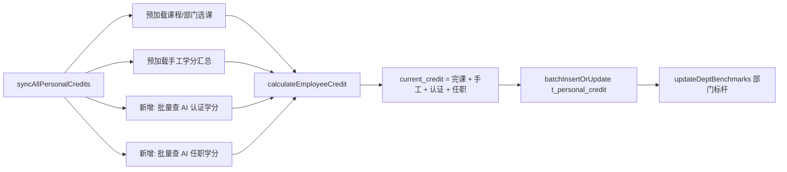

# 接口修改文档 - 个人学分同步新增"AI 任职认证学分"

## 一、背景与目标

当前 `POST /api/personal-credit/sync` 同步流程由 `PersonalCreditService.syncAllPersonalCredits()` 与增量版本 `syncPersonalCreditsForEmployees(Set<String>)` 负责，写入表 `t_personal_credit` 的 `current_credit` 只包含两部分：

1. **部门选课完课学分**：基于 `t_personal_course_completion` × `t_course_planning_info` × `course_selections`（部门选课）。
2. **手工录入学分**：`t_manual_enter_credit.SUM(credits)`。

本次在同步接口中**新增第 3 部分：AI 任职认证学分**，规则如下：

| 类别         | 档位       | 学分 | 单类上限 |
| ------------ | ---------- | ---- | -------- |
| **AI 认证** | 专业级     | 15   | 15       |
| **AI 认证** | 工作级     | 10   | 15       |
| **AI 任职** | 4 级及以上 | 25   | 25       |
| **AI 任职** | 3 级       | 10   | 25       |

最终 `current_credit = 完课学分 + 手工学分 + AI 认证学分 + AI 任职学分`。

**不改动项**：

- `target_credit`（目标学分）保持原有计算口径不变。
- `personal_credit_completion_rate = current_credit / target_credit × 100`，公式不变，因分子变大，达成率会随之抬升。
- `credit_completion_date`：当 `current_credit >= target_credit` 且原先为空则置为当前时间，逻辑不变。
- 表结构：**不新增字段**，全部体现在 `current_credit`。

## 二、接口说明

| 项目       | 内容                                               |
| ---------- | -------------------------------------------------- |
| URL        | `POST /api/personal-credit/sync`                   |
| 鉴权       | 同现有，由定时任务平台调用                         |
| 请求参数   | 无                                                 |
| 返回格式   | `Result<String>`                                   |
| 本次变更点 | 内部计算逻辑新增两段学分来源；对外协议/入参出参不变 |

## 三、数据源与取数口径

### 3.1 AI 认证学分（上限 15）

- **来源表**：`dwr_t_cert_record_t`
- **关联工号**：`t_employee_sync.employee_number`（无字母）与证书表匹配时：
  - 证书表 `employee_number` 可能为 NULL，可能仅填 `w3_account`。
  - 采用 `COALESCE(employee_number, w3_account)` 作为聚合 key，并用 `(cert.employee_number IN (:empList) OR cert.w3_account IN (:empList))` 做范围过滤（与 `认证查询SQL说明.md` 一致）。
- **有效性过滤**：`status = 1 OR approved_status = 1`。
- **标题白名单（共 6 条）**：
  - 专业级（15 分）
    - `华为研究类能力认证（专业级，AI算法技术）`
    - `华为研究类能力认证（专业级，AI决策推理）`
    - `华为研究类能力认证（专业级，AI图像语言语义）`
  - 工作级（10 分）
    - `华为研究类能力认证（工作级，AI算法技术）`
    - `华为研究类能力认证（工作级，AI决策推理）`
    - `华为研究类能力认证（工作级，AI图像语言语义）`
- **取值规则**：同一员工对命中档位取 `MAX(CASE WHEN ... THEN 15/10/0 END)`。
  - 有专业级 → 15
  - 仅工作级 → 10
  - 否则 → 0
  - 自然满足 15 分上限。

### 3.2 AI 任职学分（上限 25）

- **来源表**：`t_qualifications`
- **关联工号**：`t_qualifications.employee_number`（无字母）= `t_employee_sync.employee_number`。
- **范围过滤（任一成立）**：
  - `direction_cn_name IN ('数据科学与AI工程（ICT）','AI算法及应用（ICT）','AI软件工程与工具（ICT）','AI系统测试（ICT）')`
  - 或 `competence_subcategory_cn = 'AI算法及应用'`
- **有效期**：
  - `competence_from IS NOT NULL`
  - `competence_to IS NOT NULL`
  - `CURDATE() BETWEEN competence_from AND competence_to`（**仅当前有效任职**）
- **等级映射**：
  - `competence_rating_cn IN ('4级','5级','6级','7级','8级')` → 25
  - `competence_rating_cn = '3级'` → 10
  - 其他（`2级/1级/初级/NULL/其他`） → 0
- **取值规则**：同一员工取 `MAX`，自然满足 25 分上限。

## 四、方案设计

### 4.1 数据流



### 4.2 代码改动点

#### 4.2.1 Mapper 新增方法

文件：`AI_Transform/src/main/java/com/huawei/aitransform/mapper/PersonalCreditMapper.java`

```java
/**
 * 批量查询 AI 认证学分（工号 -> 认证学分）。
 * 专业级 15、工作级 10，同一人 MAX 取最高，上限 15。
 */
List<EmployeeCreditRow> getAiCertCreditsByEmployeeNumbers(@Param("employeeNumbers") List<String> employeeNumbers);

/**
 * 批量查询 AI 任职学分（工号 -> 任职学分）。
 * 4 级及以上 25、3 级 10，同一人 MAX 取最高，上限 25，仅当前有效任职。
 */
List<EmployeeCreditRow> getAiQualificationCreditsByEmployeeNumbers(@Param("employeeNumbers") List<String> employeeNumbers);
```

辅助实体（新建）：`AI_Transform/src/main/java/com/huawei/aitransform/entity/EmployeeCreditRow.java`

```java
public class EmployeeCreditRow {
    private String employeeNumber;
    private java.math.BigDecimal credit;
    // getter/setter
}
```

> 也可直接复用现有 `ManualCreditSumRow` 模式：2 字段行记录类型。

#### 4.2.2 XML 新增 SQL

文件：`AI_Transform/src/main/resources/mapper/PersonalCreditMapper.xml`

```xml
<select id="getAiCertCreditsByEmployeeNumbers" resultType="com.huawei.aitransform.entity.EmployeeCreditRow">
    SELECT
        COALESCE(c.employee_number, c.w3_account) AS employeeNumber,
        MAX(CASE
              WHEN c.cer_title IN (
                  '华为研究类能力认证（专业级，AI算法技术）',
                  '华为研究类能力认证（专业级，AI决策推理）',
                  '华为研究类能力认证（专业级，AI图像语言语义）'
              ) THEN 15
              WHEN c.cer_title IN (
                  '华为研究类能力认证（工作级，AI算法技术）',
                  '华为研究类能力认证（工作级，AI决策推理）',
                  '华为研究类能力认证（工作级，AI图像语言语义）'
              ) THEN 10
              ELSE 0
            END) AS credit
    FROM dwr_t_cert_record_t c
    WHERE (c.status = 1 OR c.approved_status = 1)
      AND (
           c.employee_number IN
           <foreach collection="employeeNumbers" item="e" open="(" separator="," close=")">#{e}</foreach>
           OR c.w3_account IN
           <foreach collection="employeeNumbers" item="e" open="(" separator="," close=")">#{e}</foreach>
      )
      AND c.cer_title IN (
          '华为研究类能力认证（专业级，AI算法技术）',
          '华为研究类能力认证（专业级，AI决策推理）',
          '华为研究类能力认证（专业级，AI图像语言语义）',
          '华为研究类能力认证（工作级，AI算法技术）',
          '华为研究类能力认证（工作级，AI决策推理）',
          '华为研究类能力认证（工作级，AI图像语言语义）'
      )
    GROUP BY COALESCE(c.employee_number, c.w3_account)
    HAVING credit > 0
</select>

<select id="getAiQualificationCreditsByEmployeeNumbers" resultType="com.huawei.aitransform.entity.EmployeeCreditRow">
    SELECT
        q.employee_number AS employeeNumber,
        MAX(CASE
              WHEN q.competence_rating_cn IN ('4级','5级','6级','7级','8级') THEN 25
              WHEN q.competence_rating_cn = '3级' THEN 10
              ELSE 0
            END) AS credit
    FROM t_qualifications q
    WHERE q.employee_number IN
        <foreach collection="employeeNumbers" item="e" open="(" separator="," close=")">#{e}</foreach>
      AND q.employee_number IS NOT NULL
      AND q.employee_number != ''
      AND (
            q.direction_cn_name IN (
              '数据科学与AI工程（ICT）','AI算法及应用（ICT）',
              'AI软件工程与工具（ICT）','AI系统测试（ICT）'
            )
            OR q.competence_subcategory_cn = 'AI算法及应用'
          )
      AND q.competence_from IS NOT NULL
      AND q.competence_to IS NOT NULL
      AND CURDATE() BETWEEN q.competence_from AND q.competence_to
    GROUP BY q.employee_number
    HAVING credit > 0
</select>
```

#### 4.2.3 Service 改动

文件：`AI_Transform/src/main/java/com/huawei/aitransform/service/PersonalCreditService.java`

1. 在 `syncAllPersonalCredits()` 与 `syncPersonalCreditsForEmployees(Set<String>)` 预加载阶段新增：

```java
Map<String, BigDecimal> certCreditMap = loadCreditMap(
        personalCreditMapper::getAiCertCreditsByEmployeeNumbers, employeeNumbers);
Map<String, BigDecimal> qualCreditMap = loadCreditMap(
        personalCreditMapper::getAiQualificationCreditsByEmployeeNumbers, employeeNumbers);
```

`loadCreditMap` 为私有工具方法，按 1000/批分页调用（与现有 `manualCreditSumMap` 分批方式一致）：

```java
private Map<String, BigDecimal> loadCreditMap(
        Function<List<String>, List<EmployeeCreditRow>> queryFn,
        List<String> employeeNumbers) {
    Map<String, BigDecimal> map = new HashMap<>();
    if (employeeNumbers == null || employeeNumbers.isEmpty()) return map;
    int batchSize = 1000;
    for (int i = 0; i < employeeNumbers.size(); i += batchSize) {
        int end = Math.min(i + batchSize, employeeNumbers.size());
        List<EmployeeCreditRow> rows = queryFn.apply(employeeNumbers.subList(i, end));
        if (rows == null) continue;
        for (EmployeeCreditRow r : rows) {
            if (r == null || r.getEmployeeNumber() == null) continue;
            map.put(r.getEmployeeNumber(),
                    r.getCredit() != null ? r.getCredit() : BigDecimal.ZERO);
        }
    }
    return map;
}
```

2. `calculateEmployeeCredit(...)` 签名增加两个入参：

```java
private PersonalCredit calculateEmployeeCredit(EmployeeSyncDataVO employee,
                                               Map<Integer, BigDecimal> courseCreditMap,
                                               Map<String, BigDecimal> courseNumberCreditMap,
                                               Map<String, List<Integer>> deptSelectionMap,
                                               List<CoursePlanningInfoVO> allCourses,
                                               Map<String, PersonalCredit> existingCreditMap,
                                               Map<String, BigDecimal> manualCreditSumMap,
                                               Map<String, BigDecimal> certCreditMap,
                                               Map<String, BigDecimal> qualCreditMap) { ... }
```

3. `totalCurrentCredit` 叠加（现有 `currentCredit.add(manualCredit)` 基础上继续叠加）：

```java
BigDecimal certCredit = safeGet(certCreditMap, empNum);
BigDecimal qualCredit = safeGet(qualCreditMap, empNum);
BigDecimal totalCurrentCredit = currentCredit
        .add(manualCredit)
        .add(certCredit)
        .add(qualCredit);
```

其中 `safeGet` 封装为：

```java
private static BigDecimal safeGet(Map<String, BigDecimal> m, String k) {
    if (m == null) return BigDecimal.ZERO;
    BigDecimal v = m.get(k);
    return v != null ? v : BigDecimal.ZERO;
}
```

4. 两个调用点（全量 / 增量）都要同步传入新 Map。

### 4.3 增量同步

`syncPersonalCreditsForEmployees(Set<String>)` 流程与全量一致：

- 入参 `empNums` 直接作为 SQL 的 `:empList`。
- `certCreditMap` / `qualCreditMap` 仅加载指定工号范围。
- 其余逻辑（部门标杆局部刷新 `updateDeptBenchmarksForDeptNumbers`）不变。

## 五、计算示例

| 员工 | 完课学分 | 手工学分 | 认证情况               | 任职情况          | 认证 | 任职 | current | target | 达成率   |
| ---- | -------- | -------- | ---------------------- | ----------------- | ---- | ---- | ------- | ------ | -------- |
| A    | 30       | 10       | 专业级 AI 算法技术     | 4 级 AI 系统测试  | 15   | 25   | 80      | 80     | 100.00%  |
| B    | 20       | 0        | 工作级 AI 决策推理     | 3 级 AI 算法应用 | 10   | 10   | 40      | 80     | 50.00%   |
| C    | 60       | 0        | 专业级 + 工作级 均有 | 无有效任职        | 15   | 0    | 75      | 80     | 93.75%   |
| D    | 0        | 0        | 无                     | 2 级              | 0    | 0    | 0       | 80     | 0%       |

说明：认证、任职学分各自独立上限，彼此不共享上限。

## 六、不变量与边界

- `target_credit` 维持原计算（按部门选课汇总或全量课程汇总），本次不修改。
- `personal_credit_completion_rate`：若 `target_credit=0` 仍然记 0，不做除零；已达标时按现有逻辑置 `credit_completion_date`。
- `updateDeptBenchmarks` / `updateDeptBenchmarksForDeptNumbers`：逻辑不变，部门标杆会随新学分抬高，是期望行为。
- 认证表 `employee_number` 为空只有 `w3_account` 的行：通过 `COALESCE + OR` 两路匹配保证不丢。
- `t_qualifications` 中一人多条（多方向/多级别）：SQL 已 `GROUP BY employee_number` 聚合取 MAX。
- 新方法仅用于同步写入阶段，不改变 `getPersonalCreditOverview` 等读接口的协议。

## 七、影响面

| 模块                                               | 是否受影响 | 说明                                                              |
| -------------------------------------------------- | ---------- | ----------------------------------------------------------------- |
| `POST /api/personal-credit/sync`                   | 是         | `current_credit` 数值变大；协议不变                               |
| `GET /api/personal-credit/overview`                | 间接       | 读取 `t_personal_credit`，数据随下次 sync 后自然更新              |
| `PersonalCreditStatisticsController` 相关统计接口 | 间接       | 达成率、max/min/avg、部门标杆会重新平衡；无需改动代码             |
| AI School 看板（`getRoleSummary`、`getSchoolCreditDetailList`） | 间接 | 读同一张表，无需改动                                             |
| 手工录入学分接口                                   | 否         | 独立链路，保留加总                                                |

## 八、测试要点

1. **单用户单维度**：构造仅有专业级认证 / 仅有工作级认证 / 仅有 4 级任职 / 仅有 3 级任职的员工，分别验证 15 / 10 / 25 / 10。
2. **同人多维度叠加**：同时有专业级认证 + 4 级任职 → `current += 40`。
3. **同类多条取 MAX**：同时有专业级 + 工作级 → 认证侧只加 15；同时有 3 级 + 4 级任职 → 任职侧只加 25。
4. **w3_account 关联**：证书表 `employee_number` 为空、仅填 `w3_account` 的行也能被识别。
5. **有效期过滤**：`CURDATE()` 在 `competence_from/to` 区间外的任职记录不应计入。
6. **增量同步**：`syncPersonalCreditsForEmployees` 入参列表中只会更新指定工号，其他员工 `current_credit` 不受影响。
7. **达成日期**：`current >= target` 且原 `credit_completion_date` 为空 → 置当前时间；非空保持不变。
8. **部门标杆**：同一部门内某员工新叠加学分后达成率最高，`dept_benchmark_completion_rate` 同步更新。

## 九、回滚方案

- 仅需在 `PersonalCreditService.calculateEmployeeCredit` 内把：

  ```java
  BigDecimal totalCurrentCredit = currentCredit.add(manualCredit).add(certCredit).add(qualCredit);
  ```

  回退为：

  ```java
  BigDecimal totalCurrentCredit = currentCredit.add(manualCredit);
  ```

- Mapper / XML 新增方法可保留（未调用），不影响线上行为。下一轮 sync 即恢复旧口径。

## 十、遗留项 / 需复核

- **认证有效窗**：本方案仅用 `status=1 OR approved_status=1` 判定认证通过，未使用 `start_time / end_time`。如业务要求"仅当前有效窗口内的证书记分"，在 WHERE 追加：

  ```sql
  AND (c.start_time IS NULL OR CURDATE() >= DATE(c.start_time))
  AND (c.end_time   IS NULL OR CURDATE() <= DATE(c.end_time))
  ```

- **任职"最高优先"规则**：当前实现是在一个 SQL 内对两个档位直接取 MAX(25 或 10)，若将来新增档位（例如"2 级 = 5 分"），需要同步扩 CASE 分支。
