# AI转型专家认证统计系统 - 软件设计文档

## 文档信息

| 项目 | 内容 |
|------|------|
| 文档名称 | AI转型专家认证统计系统软件设计文档 |
| 版本号 | V1.0 |
| 编写日期 | 2024年 |
| 编写人 | 系统架构师 |
| 审核人 | - |
| 批准人 | - |

---

## 目录

1. [系统概述](#1-系统概述)
2. [用户诉求与功能分析](#2-用户诉求与功能分析)
3. [系统架构](#3-系统架构)
4. [核心业务流程](#4-核心业务流程)
5. [系统架构图](#5-系统架构图)
6. [用例视图](#6-用例视图)
7. [过程视图](#7-过程视图)
8. [UI设计](#8-ui设计)
9. [兼容性分析](#9-兼容性分析)
10. [DFX分析](#10-dfx分析)
11. [约束与限制](#11-约束与限制)
12. [测试设计](#12-测试设计)

---

## 1. 系统概述

### 1.1 系统背景

AI转型专家认证统计系统是一个面向企业AI能力建设的统计与分析平台，主要用于统计和管理专家、干部、员工的AI认证和任职情况，支持多维度数据分析和下钻查询，为企业AI人才队伍建设提供数据支撑。

### 1.2 系统目标

#### 1.2.1 功能目标
- 提供全面的专家认证统计、员工认证统计、干部认证统计等功能
- 支持按部门、职位类、成熟度等多维度统计分析
- 支持数据下钻查询，查看详细信息
- 支持批量更新达标情况

#### 1.2.2 性能目标
- 支持大数据量查询，响应时间控制在3秒以内
- 支持并发用户数 ≥ 100
- 数据库查询优化，避免全表扫描

#### 1.2.3 可靠性目标
- 系统可用性达到99.9%
- 支持异常恢复和数据一致性保障
- 完善的异常处理和日志记录

#### 1.2.4 安全目标
- 支持数据库连接信息加密存储
- 接口访问权限控制
- 数据传输加密（HTTPS）
- SQL注入防护

### 1.3 技术栈

- **开发语言**：Java 1.8
- **框架**：Spring Boot 2.7.18
- **持久层**：MyBatis 2.3.1
- **数据库**：MySQL 5.7+
- **构建工具**：Maven
- **应用服务器**：内嵌Tomcat

### 1.4 系统范围

#### 1.4.1 功能范围
- 专家认证统计与查询
- 员工认证统计与查询
- 干部认证统计与查询
- 部门信息管理
- 用户权限管理
- 达标情况批量更新

#### 1.4.2 非功能范围
- 系统性能优化
- 安全防护
- 日志审计
- 异常处理

---

## 2. 用户诉求与功能分析

### 2.1 用户诉求分析

#### 2.1.1 用户角色识别

系统主要服务于以下用户角色：

| 用户角色 | 角色描述 | 主要诉求 |
|----------|----------|----------|
| 业务管理人员 | 负责AI人才队伍建设的业务管理人员 | 需要全面了解专家、干部、员工的AI认证和任职情况，进行数据分析和决策支持 |
| 部门负责人 | 各部门的负责人 | 需要了解本部门及下属部门的AI认证统计情况，掌握部门AI能力建设进展 |
| 人力资源管理人员 | 负责人才管理和培养的HR人员 | 需要查询员工认证状态，进行人才盘点和管理 |
| 系统管理员 | 负责系统维护和管理 | 需要批量更新达标情况，管理系统配置和用户权限 |
| 外部系统 | 其他需要调用本系统接口的外部系统 | 需要通过API接口获取认证统计数据，进行数据同步和集成 |

#### 2.1.2 核心用户诉求

**诉求1：多维度统计分析需求**
- **诉求描述**：用户需要从多个维度（部门、职位类、成熟度、人员类型）进行统计分析，全面了解AI认证情况
- **使用场景**：
  - 按部门查看各部门的认证统计情况
  - 按职位类查看不同职位类的认证情况
  - 按成熟度查看不同成熟度等级的认证情况
  - 按人员类型（全员、干部、专家）查看不同群体的认证情况
- **期望结果**：能够快速获取多维度、多层次的统计数据，支持数据对比和分析

**诉求2：数据下钻查询需求**
- **诉求描述**：用户需要从汇总统计数据下钻到详细数据，查看具体员工信息
- **使用场景**：
  - 查看某个部门下已认证的员工列表
  - 查看某个部门下已任职的员工列表
  - 查看某个职位类下的员工详细信息
- **期望结果**：能够快速查看符合条件的员工详细信息，支持导出和进一步操作

**诉求3：批量查询和验证需求**
- **诉求描述**：用户需要批量查询员工认证状态，验证员工是否通过认证或获得任职
- **使用场景**：
  - 批量验证员工工号列表中的认证状态
  - 批量验证员工工号列表中的任职状态
  - 单个员工快速查询认证状态
- **期望结果**：能够快速批量查询，返回已认证或已任职的员工工号列表

**诉求4：达标情况管理需求**
- **诉求描述**：系统管理员需要批量更新干部和专家的达标情况，确保数据准确性
- **使用场景**：
  - 批量更新L2、L3干部的认证达标情况
  - 批量更新L2、L3干部的任职达标情况
  - 批量更新L2、L3专家的认证达标情况
  - 批量更新L2、L3专家的任职达标情况
- **期望结果**：能够批量更新达标状态，返回更新结果和统计信息

**诉求5：数据可视化需求**
- **诉求描述**：用户希望通过图表和可视化方式直观地查看统计数据
- **使用场景**：
  - 查看认证率趋势图
  - 查看各部门认证情况对比图
  - 查看职位类分布图
- **期望结果**：提供直观的图表展示，支持多种图表类型

**诉求6：数据导出需求**
- **诉求描述**：用户需要将统计数据导出为Excel等格式，用于进一步分析和报告
- **使用场景**：
  - 导出专家认证统计数据
  - 导出员工详细信息列表
  - 导出达标更新结果
- **期望结果**：支持导出Excel格式文件，包含完整的统计数据

#### 2.1.3 用户痛点分析

| 痛点 | 痛点描述 | 影响程度 | 解决方案 |
|------|----------|----------|----------|
| 数据分散 | 认证数据分散在多个系统中，难以统一查看 | 高 | 统一数据源，提供集中查询接口 |
| 查询效率低 | 手动查询效率低，无法批量处理 | 中 | 提供批量查询接口，支持批量操作 |
| 统计维度单一 | 只能按单一维度统计，无法多维度分析 | 高 | 支持多维度统计分析，提供树形结构展示 |
| 数据更新不及时 | 达标情况需要手动更新，容易遗漏 | 中 | 提供批量更新接口，支持定时任务 |
| 缺乏可视化 | 纯数据展示，不够直观 | 低 | 提供图表展示功能（后续版本） |

### 2.2 功能分析

#### 2.2.1 功能需求梳理

基于用户诉求分析，系统需要提供以下核心功能：

**功能模块1：专家认证统计**
- **功能描述**：提供专家认证和任职的统计查询功能
- **核心功能点**：
  - 查询专家任职认证数据（按成熟度和职位类统计）
  - 查询专家AI认证数据
  - 查询专家AI任职数据
  - 专家认证达标情况更新
- **输入**：部门编码、查询条件
- **输出**：树形结构的统计结果（成熟度 → 职位类 → 统计数据）

**功能模块2：员工认证统计**
- **功能描述**：提供员工认证和任职的统计查询功能
- **核心功能点**：
  - 查询全员任职认证信息（支持全员、干部、专家三种人员类型）
  - 按职位类统计认证和任职人数
  - 按组织成熟度统计认证和任职人数
  - 员工下钻查询（查看详细信息）
- **输入**：部门编码、人员类型、查询条件
- **输出**：各部门统计数据和总计数据，或员工详细信息列表

**功能模块3：干部认证统计**
- **功能描述**：提供干部认证和任职的统计查询功能
- **核心功能点**：
  - 查询干部任职认证数据（按成熟度和职位类统计）
  - 干部认证达标情况更新
  - 干部任职达标情况更新
- **输入**：部门编码、查询条件
- **输出**：干部认证统计结果，或更新结果

**功能模块4：通用查询**
- **功能描述**：提供通用的批量查询和验证功能
- **核心功能点**：
  - 根据工号列表查询已通过认证的员工
  - 根据工号列表查询获得AI任职的员工
  - 单个员工认证状态快速查询
- **输入**：员工工号列表
- **输出**：已认证或已任职的员工工号列表

**功能模块5：部门信息管理**
- **功能描述**：提供部门信息查询功能
- **核心功能点**：
  - 查询部门信息
  - 查询子部门列表
- **输入**：部门编码
- **输出**：部门信息或子部门列表

**功能模块6：用户权限管理**
- **功能描述**：提供用户权限验证功能
- **核心功能点**：
  - 验证用户是否为有效用户
  - 查询用户权限信息
- **输入**：用户工号（从Cookie获取）
- **输出**：用户权限信息

#### 2.2.2 功能优先级划分

| 优先级 | 功能模块 | 优先级说明 |
|--------|----------|------------|
| P0（必须） | 专家认证统计、员工认证统计、干部认证统计 | 核心功能，必须实现 |
| P0（必须） | 通用查询、部门信息管理 | 基础功能，必须实现 |
| P1（重要） | 用户权限管理 | 安全功能，重要但不紧急 |
| P1（重要） | 达标情况批量更新 | 管理功能，重要但不紧急 |
| P2（一般） | 数据导出功能 | 增强功能，可以后续实现 |
| P2（一般） | 数据可视化功能 | 增强功能，可以后续实现 |

#### 2.2.3 功能详细分析

**功能1：专家认证统计查询**

**功能描述**：
根据部门编码查询专家认证统计数据，按成熟度和职位类进行分组统计，返回树形结构的统计结果。

**功能流程**：
1. 接收部门编码参数
2. 查询部门信息，验证部门是否存在
3. 根据部门层级（3层/4层）查询专家数据
4. 关联查询证书信息，判断是否通过认证
5. 按成熟度分组
6. 按职位类分组
7. 计算统计数据（基线人数、认证人数、认证率）
8. 构建树形结构（成熟度 → 职位类）
9. 返回统计结果

**输入参数**：
- deptCode（String，必填）：部门编码

**输出结果**：
- 树形结构的统计结果
  - 成熟度级别（L2、L3等）
    - 职位类（软件类、硬件类等）
      - 基线人数
      - 认证人数
      - 认证率

**异常处理**：
- 部门不存在：返回400错误
- 部门层级不支持：返回400错误
- 系统异常：返回500错误

**功能2：员工下钻查询**

**功能描述**：
根据部门编码、人员类型和数据类型查询员工详细信息列表，支持从统计数据下钻到详细数据。

**功能流程**：
1. 接收查询参数（部门编码、人员类型、数据类型）
2. 参数校验
3. 根据数据类型查询：
   - 数据类型=1：查询任职数据（从t_qualifications表）
   - 数据类型=2：查询认证数据（从t_cert_record表）
4. 关联查询员工基本信息
5. 补充部门信息、职位类信息
6. 返回员工详细信息列表

**输入参数**：
- deptCode（String，必填）：部门编码
- personType（Integer，必填）：人员类型（0-全员，1-干部，2-专家）
- dataType（Integer，必填）：数据类型（1-任职数据，2-认证数据）

**输出结果**：
- 员工详细信息列表
  - 员工工号
  - 员工姓名
  - 部门名称
  - 职位类
  - AI成熟度
  - 认证状态/任职级别

**功能3：批量查询认证状态**

**功能描述**：
根据员工工号列表批量查询已通过华为研究类能力认证的员工工号。

**功能流程**：
1. 接收员工工号列表
2. 参数校验（列表不能为空）
3. 查询t_cert_record表，筛选条件：
   - employee_number IN (工号列表)
   - cert_level = '专业级'
   - cert_name LIKE '%研究类%'
4. 返回已认证的员工工号列表

**输入参数**：
- employeeNumbers（List<String>，必填）：员工工号列表

**输出结果**：
- 已认证的员工工号列表（List<String>）

**功能4：达标情况批量更新**

**功能描述**：
批量更新L2、L3干部的AI任职达标情况和认证达标情况。

**功能流程**：
1. 查询所有L2、L3干部列表
2. 遍历每个干部：
   - 查询职位类信息
   - 查询认证信息
   - 查询任职信息
   - 根据规则判断是否达标：
     - 任职要求：L3干部≥4级，L2干部≥3级
     - 认证要求：软件类需要专业级证书，非软件类需要专业级证书或通过科目二
   - 更新达标状态字段
3. 统计更新数量
4. 返回更新结果

**输入参数**：
- 无（批量更新所有干部）

**输出结果**：
- 更新结果信息
  - 成功标志
  - 更新数量
  - 错误信息（如有）

#### 2.2.4 功能依赖关系

```
专家认证统计
    ↓
部门信息管理（依赖）
    ↓
员工认证统计
    ↓
通用查询（依赖）
    ↓
干部认证统计
    ↓
达标情况批量更新（依赖）
```

#### 2.2.5 功能非功能需求

**性能需求**：
- 单次查询响应时间 < 3秒
- 批量查询响应时间 < 10秒
- 批量更新响应时间 < 5分钟
- 支持并发用户数 ≥ 100

**可靠性需求**：
- 系统可用性 ≥ 99.9%
- 数据一致性保证
- 异常情况自动恢复

**安全需求**：
- 接口访问权限控制
- 敏感数据脱敏
- SQL注入防护
- 数据传输加密

**可维护性需求**：
- 代码结构清晰
- 完善的日志记录
- 完善的文档说明

---

## 3. 系统架构

### 3.1 总体架构

系统采用经典的三层架构模式：**表现层（Controller）** → **业务层（Service）** → **数据访问层（Mapper）**

#### 3.1.1 架构分层

```
┌─────────────────────────────────────────────────────────┐
│                     表现层 (Controller)                   │
│  ┌──────────────┐  ┌──────────────┐  ┌──────────────┐  │
│  │ ExpertCert   │  │ Department   │  │ UserConfig   │  │
│  │ Statistics   │  │ Info         │  │              │  │
│  │ Controller   │  │ Controller   │  │ Controller   │  │
│  └──────────────┘  └──────────────┘  └──────────────┘  │
│  ┌──────────────┐  ┌──────────────┐                    │
│  │ ExternalApi  │  │ Global       │                    │
│  │ Controller   │  │ Exception    │                    │
│  │              │  │ Handler      │                    │
│  └──────────────┘  └──────────────┘                    │
└─────────────────────────────────────────────────────────┘
                          ↓
┌─────────────────────────────────────────────────────────┐
│                     业务层 (Service)                      │
│  ┌──────────────┐  ┌──────────────┐  ┌──────────────┐  │
│  │ ExpertCert   │  │ Department   │  │ UserConfig   │  │
│  │ Statistics   │  │ Info         │  │              │  │
│  │ Service      │  │ Service      │  │ Service      │  │
│  └──────────────┘  └──────────────┘  └──────────────┘  │
└─────────────────────────────────────────────────────────┘
                          ↓
┌─────────────────────────────────────────────────────────┐
│                   数据访问层 (Mapper)                      │
│  ┌──────────────┐  ┌──────────────┐  ┌──────────────┐  │
│  │ Expert       │  │ Employee     │  │ Cadre        │  │
│  │ Mapper       │  │ Mapper       │  │ Mapper       │  │
│  └──────────────┘  └──────────────┘  └──────────────┘  │
│  ┌──────────────┐  ┌──────────────┐  ┌──────────────┐  │
│  │ Department   │  │ Department   │  │ UserConfig   │  │
│  │ Info         │  │ Maturity     │  │ Mapper       │  │
│  │ Mapper       │  │ Mapper       │  │              │  │
│  └──────────────┘  └──────────────┘  └──────────────┘  │
└─────────────────────────────────────────────────────────┘
                          ↓
┌─────────────────────────────────────────────────────────┐
│                     数据库层 (MySQL)                       │
│  ┌──────────────┐  ┌──────────────┐  ┌──────────────┐  │
│  │ t_expert     │  │ t_employee   │  │ t_cadre      │  │
│  │ t_qualifi-   │  │ t_cert_      │  │ t_exam_      │  │
│  │ cations      │  │ record       │  │ record       │  │
│  └──────────────┘  └──────────────┘  └──────────────┘  │
│  ┌──────────────┐  ┌──────────────┐                    │
│  │ t_mes_ct_    │  │ t_user_      │                    │
│  │ dept         │  │ config       │                    │
│  └──────────────┘  └──────────────┘                    │
└─────────────────────────────────────────────────────────┘
```

#### 3.1.2 架构说明

**表现层（Controller Layer）**
- **职责**：接收HTTP请求、参数校验、调用Service层、返回统一响应、异常捕获
- **设计要点**：
  - 使用`@RestController`注解，自动序列化响应
  - 统一使用`Result<T>`作为响应格式
  - 使用`GlobalExceptionHandler`统一处理异常
  - 参数校验在Controller层进行

**业务层（Service Layer）**
- **职责**：业务逻辑处理、数据聚合和计算、调用Mapper层、事务管理
- **设计要点**：
  - 使用`@Service`注解标识服务类
  - 业务逻辑封装在Service层，Controller层不包含业务逻辑
  - 复杂业务逻辑可以拆分为多个私有方法
  - 使用`@Transactional`管理事务（如需要）

**数据访问层（Mapper Layer）**
- **职责**：数据库操作封装、SQL语句定义、结果集映射
- **设计要点**：
  - 使用MyBatis的`@Mapper`接口
  - SQL语句定义在XML文件中
  - 使用VO（Value Object）作为数据传输对象
  - 避免在Mapper层包含业务逻辑

### 3.2 包架构设计

#### 3.2.1 包结构

```
com.huawei.aitransform
├── Application.java                    # 主启动类
├── common/                            # 公共类
│   └── Result.java                    # 统一响应结果类
├── config/                            # 配置类
│   ├── CorsConfig.java                # 跨域配置
│   ├── DataSourceConfig.java          # 数据源配置
│   └── MyBatisConfig.java             # MyBatis配置
├── constant/                          # 常量类
│   └── DepartmentConstants.java       # 部门常量
├── controller/                        # 控制器层
│   ├── ExpertCertStatisticsController.java    # 专家认证统计控制器
│   ├── DepartmentInfoController.java          # 部门信息控制器
│   ├── UserConfigController.java             # 用户配置控制器
│   ├── ExternalApiController.java             # 外部接口控制器
│   └── GlobalExceptionHandler.java           # 全局异常处理器
├── entity/                            # 实体类（VO）
│   ├── ExpertCertStatisticsVO.java
│   ├── EmployeeCertStatisticsResponseVO.java
│   ├── DepartmentInfoVO.java
│   └── ...                            # 其他VO类
├── mapper/                            # Mapper接口层
│   ├── ExpertCertStatisticsMapper.java
│   ├── ExpertMapper.java
│   ├── EmployeeMapper.java
│   ├── CadreMapper.java
│   ├── DepartmentInfoMapper.java
│   ├── DepartmentMaturityMapper.java
│   └── UserConfigMapper.java
├── service/                           # 服务层
│   ├── ExpertCertStatisticsService.java
│   ├── DepartmentInfoService.java
│   └── UserConfigService.java
└── util/                              # 工具类
    ├── CryptoUtil.java                # 加密工具
    └── PasswordEncryptor.java         # 密码加密工具
```

#### 3.2.2 包职责说明

| 包名 | 职责 | 说明 |
|------|------|------|
| common | 公共类 | 提供统一的响应格式、常量等公共组件 |
| config | 配置类 | Spring Boot配置、MyBatis配置、数据源配置等 |
| constant | 常量类 | 系统常量定义 |
| controller | 控制器层 | 处理HTTP请求，调用Service层 |
| entity | 实体类 | 数据传输对象（VO），用于前后端数据交互 |
| mapper | 数据访问层 | MyBatis Mapper接口定义 |
| service | 业务层 | 业务逻辑处理 |
| util | 工具类 | 通用工具方法 |

### 3.3 系统类图

#### 3.3.1 核心类图

```plantuml
@startuml
package "Controller层" {
    class ExpertCertStatisticsController {
        -ExpertCertStatisticsService expertCertStatisticsService
        +getExpertCertStatistics(deptCode: String): ResponseEntity<Result>
        +getEmployeeCertStatistics(deptCode: String, personType: Integer): ResponseEntity<Result>
        +checkEmployeeCertification(request: EmployeeCertCheckRequestVO): ResponseEntity<Result>
        +updateCadreQualificationStandard(): ResponseEntity<Result>
        +getExpertAiCertStatistics(deptCode: String): ResponseEntity<Result>
    }
    
    class DepartmentInfoController {
        -DepartmentInfoService departmentInfoService
        +getChildDepartments(deptId: String): ResponseEntity<Result>
    }
    
    class UserConfigController {
        -UserConfigService userConfigService
        +getUserPermissions(request: HttpServletRequest): ResponseEntity<Result>
    }
    
    class ExternalApiController {
        -ExpertCertStatisticsService expertCertStatisticsService
        +updateExpertCertStandard(): ResponseEntity<Result>
        +updateCadreStandard(): ResponseEntity<Result>
    }
    
    class GlobalExceptionHandler {
        +handleException(e: Exception): Result<Object>
    }
}

package "Service层" {
    class ExpertCertStatisticsService {
        -ExpertCertStatisticsMapper expertCertStatisticsMapper
        -DepartmentInfoMapper departmentInfoMapper
        -EmployeeMapper employeeMapper
        -CadreMapper cadreMapper
        -ExpertMapper expertMapper
        +getExpertCertStatistics(deptCode: String): ExpertCertStatisticsResponseVO
        +getEmployeeCertStatistics(deptCode: String, personType: Integer): EmployeeCertStatisticsResponseVO
        +getCertifiedEmployeeNumbers(employeeNumbers: List<String>): List<String>
        +updateCadreQualificationStandard(): Map<String, Object>
        +updateExpertCertStandard(): Map<String, Object>
    }
    
    class DepartmentInfoService {
        -DepartmentInfoMapper departmentInfoMapper
        +getChildDepartments(deptId: String): List<DepartmentInfoVO>
    }
    
    class UserConfigService {
        -UserConfigMapper userConfigMapper
        +isValidUser(account: String): Boolean
    }
}

package "Mapper层" {
    interface ExpertCertStatisticsMapper {
        +getExpertStatisticsByLevel3(deptCode: String, deptName: String): List<ExpertCertStatisticsVO>
        +getExpertStatisticsByLevel4(deptCode: String): List<ExpertCertStatisticsVO>
    }
    
    interface ExpertMapper {
        +getExpertInfoByDeptCode(deptCode: String, deptLevel: Integer): List<ExpertInfoVO>
        +getL2L3ExpertWithHighestQualification(deptCode: String): List<ExpertQualificationVO>
    }
    
    interface EmployeeMapper {
        +getCertifiedEmployeeNumbers(employeeNumbers: List<String>): List<String>
        +getQualifiedEmployeeNumbers(employeeNumbers: List<String>): List<String>
    }
    
    interface CadreMapper {
        +getL2L3CadreList(): List<CadreInfoVO>
        +updateCadreStandard(employeeNumber: String, isQualified: Integer, isCert: Integer): void
    }
    
    interface DepartmentInfoMapper {
        +getDepartmentByCode(deptCode: String): DepartmentInfoVO
        +getChildDepartments(deptId: String): List<DepartmentInfoVO>
    }
    
    interface UserConfigMapper {
        +isValidUser(account: String): Boolean
    }
}

package "Entity层" {
    class ExpertCertStatisticsVO {
        -String aiMaturity
        -String jobCategory
        -Integer baselineCount
        -Integer certCount
        -BigDecimal certRate
        -List<ExpertCertStatisticsVO> jobCategoryStatistics
    }
    
    class EmployeeCertStatisticsResponseVO {
        -List<DepartmentCertStatisticsVO> departmentStatistics
        -Integer totalBaselineCount
        -Integer totalCertCount
        -Integer totalQualifiedCount
    }
    
    class DepartmentInfoVO {
        -String deptCode
        -String deptName
        -String deptLevel
    }
    
    class Result<T> {
        -Integer code
        -String message
        -T data
        +success(data: T): Result<T>
        +error(code: Integer, message: String): Result<T>
    }
}

' 关系定义
ExpertCertStatisticsController --> ExpertCertStatisticsService
DepartmentInfoController --> DepartmentInfoService
UserConfigController --> UserConfigService
ExternalApiController --> ExpertCertStatisticsService

ExpertCertStatisticsService --> ExpertCertStatisticsMapper
ExpertCertStatisticsService --> DepartmentInfoMapper
ExpertCertStatisticsService --> EmployeeMapper
ExpertCertStatisticsService --> CadreMapper
ExpertCertStatisticsService --> ExpertMapper
DepartmentInfoService --> DepartmentInfoMapper
UserConfigService --> UserConfigMapper

ExpertCertStatisticsService ..> ExpertCertStatisticsVO
ExpertCertStatisticsService ..> EmployeeCertStatisticsResponseVO
ExpertCertStatisticsService ..> DepartmentInfoVO
ExpertCertStatisticsController ..> Result
GlobalExceptionHandler ..> Result

@enduml
```

#### 3.3.2 实体类关系图

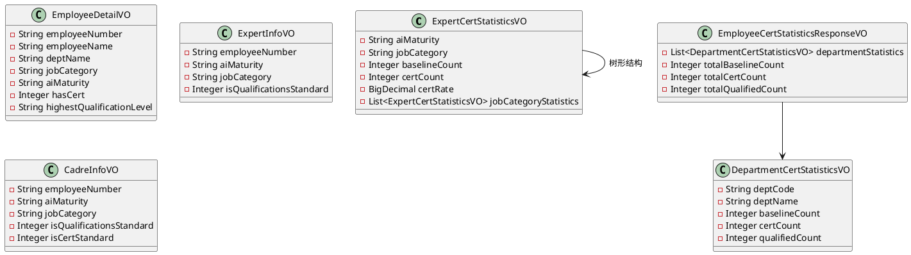

---

## 4. 核心业务流程

### 4.1 专家认证统计查询流程

#### 4.1.1 业务描述
根据部门编码查询专家认证统计数据，按成熟度和职位类进行分组统计，返回树形结构的统计结果。

#### 4.1.2 时序图（PlantUML）

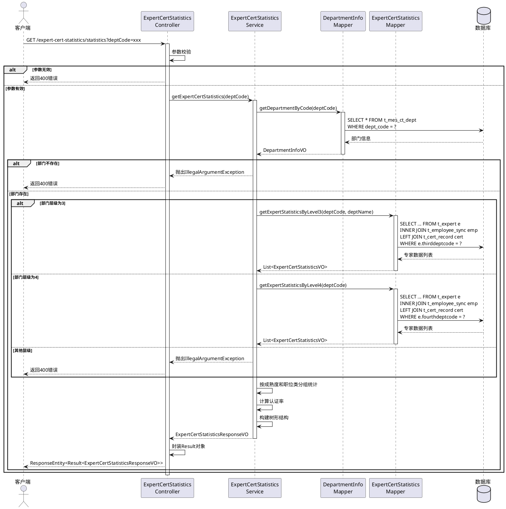

### 4.2 员工认证批量查询流程

#### 4.2.1 业务描述
根据员工工号列表批量查询已通过华为研究类能力认证的员工工号。

#### 4.2.2 时序图（PlantUML）

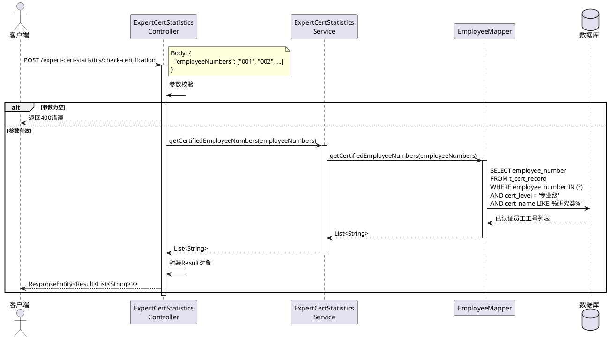

### 4.3 干部达标更新流程

#### 4.3.1 业务描述
批量更新L2、L3干部的AI任职达标情况和认证达标情况。

#### 4.3.2 时序图（PlantUML）

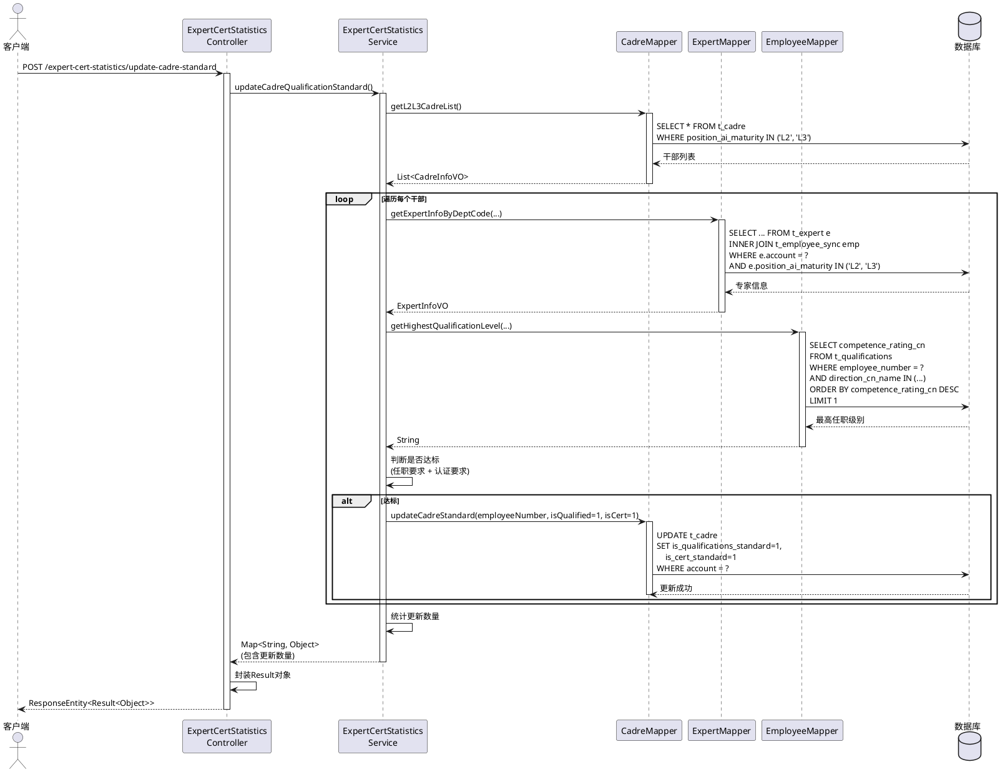

### 4.4 员工下钻查询流程

#### 4.4.1 业务描述
根据部门编码、人员类型和数据类型查询员工详细信息列表。

#### 4.4.2 时序图（PlantUML）

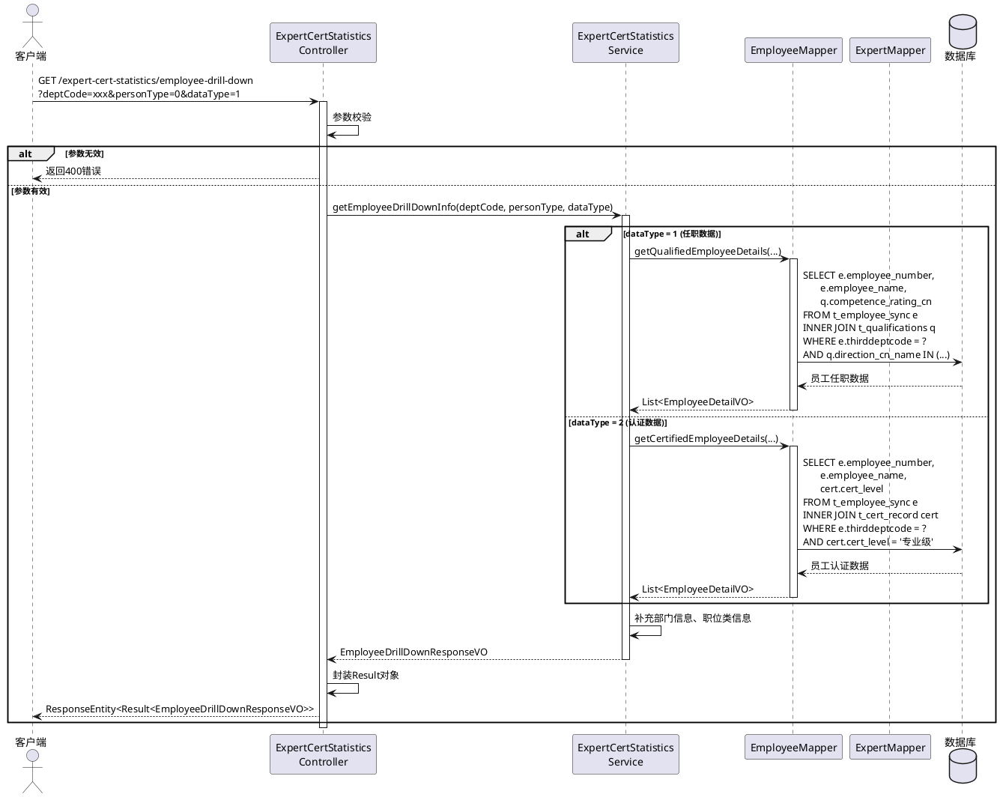

---

## 5. 系统架构图

### 5.1 系统总体架构图

```plantuml
@startuml
!define RECTANGLE class

package "客户端层" {
    RECTANGLE 浏览器
    RECTANGLE 移动APP
    RECTANGLE 第三方系统
}

package "接入层" {
    RECTANGLE Nginx负载均衡
    RECTANGLE API网关
}

package "应用层" {
    package "Web服务" {
        RECTANGLE "ExpertCertStatistics\nController"
        RECTANGLE "DepartmentInfo\nController"
        RECTANGLE "UserConfig\nController"
        RECTANGLE "ExternalApi\nController"
    }
    
    package "业务服务" {
        RECTANGLE "ExpertCertStatistics\nService"
        RECTANGLE "DepartmentInfo\nService"
        RECTANGLE "UserConfig\nService"
    }
    
    package "数据访问" {
        RECTANGLE "ExpertMapper"
        RECTANGLE "EmployeeMapper"
        RECTANGLE "CadreMapper"
        RECTANGLE "DepartmentInfoMapper"
    }
}

package "数据层" {
    database "MySQL主库\n(写操作)" as MySQL_Master
    database "MySQL从库\n(读操作)" as MySQL_Slave
}

package "基础设施层" {
    RECTANGLE "日志系统"
    RECTANGLE "监控系统"
    RECTANGLE "配置中心"
}

浏览器 --> Nginx负载均衡
移动APP --> Nginx负载均衡
第三方系统 --> API网关

Nginx负载均衡 --> "ExpertCertStatistics\nController"
Nginx负载均衡 --> "DepartmentInfo\nController"
Nginx负载均衡 --> "UserConfig\nController"
API网关 --> "ExternalApi\nController"

"ExpertCertStatistics\nController" --> "ExpertCertStatistics\nService"
"DepartmentInfo\nController" --> "DepartmentInfo\nService"
"UserConfig\nController" --> "UserConfig\nService"
"ExternalApi\nController" --> "ExpertCertStatistics\nService"

"ExpertCertStatistics\nService" --> "ExpertMapper"
"ExpertCertStatistics\nService" --> "EmployeeMapper"
"ExpertCertStatistics\nService" --> "CadreMapper"
"DepartmentInfo\nService" --> "DepartmentInfoMapper"

"ExpertMapper" --> MySQL_Slave
"EmployeeMapper" --> MySQL_Slave
"CadreMapper" --> MySQL_Master
"DepartmentInfoMapper" --> MySQL_Slave

MySQL_Master ..> MySQL_Slave : 主从复制

"ExpertCertStatistics\nService" ..> "日志系统"
"ExpertCertStatistics\nService" ..> "监控系统"
@enduml
```

### 5.2 部署架构图

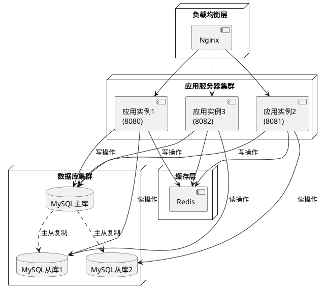

---

## 6. 用例视图

### 6.1 用例图

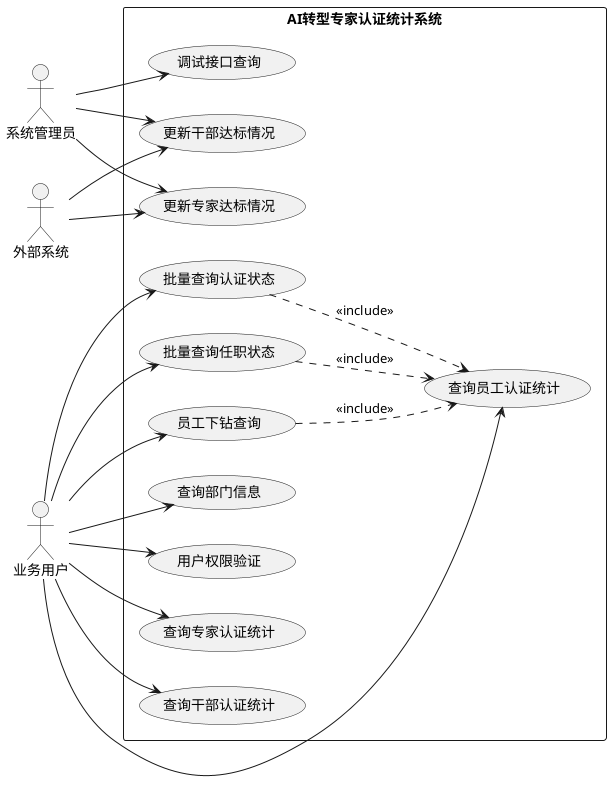

### 6.2 用例详细说明

#### 6.2.1 UC1: 查询专家认证统计

| 项目 | 内容 |
|------|------|
| 用例名称 | 查询专家认证统计 |
| 参与者 | 业务用户 |
| 前置条件 | 用户已登录系统 |
| 基本流程 | 1. 用户输入部门编码<br>2. 系统查询部门信息<br>3. 系统根据部门层级查询专家数据<br>4. 系统按成熟度和职位类分组统计<br>5. 系统返回树形结构的统计结果 |
| 异常流程 | 1. 部门不存在：返回错误信息<br>2. 部门层级不支持：返回错误信息<br>3. 系统异常：返回500错误 |
| 后置条件 | 用户获得专家认证统计数据 |

#### 6.2.2 UC2: 查询员工认证统计

| 项目 | 内容 |
|------|------|
| 用例名称 | 查询员工认证统计 |
| 参与者 | 业务用户 |
| 前置条件 | 用户已登录系统 |
| 基本流程 | 1. 用户输入部门编码和人员类型<br>2. 系统查询该部门下指定人员类型的认证和任职数据<br>3. 系统按部门分组统计<br>4. 系统计算总计数据<br>5. 系统返回统计结果 |
| 异常流程 | 1. 参数无效：返回400错误<br>2. 系统异常：返回500错误 |
| 后置条件 | 用户获得员工认证统计数据 |

#### 6.2.3 UC7: 更新干部达标情况

| 项目 | 内容 |
|------|------|
| 用例名称 | 更新干部达标情况 |
| 参与者 | 系统管理员、外部系统 |
| 前置条件 | 用户具有管理员权限或外部系统授权 |
| 基本流程 | 1. 系统查询所有L2、L3干部<br>2. 系统遍历每个干部，查询其认证和任职信息<br>3. 系统根据规则判断是否达标<br>4. 系统更新达标状态字段<br>5. 系统统计更新数量<br>6. 系统返回更新结果 |
| 异常流程 | 1. 权限不足：返回403错误<br>2. 更新失败：返回500错误 |
| 后置条件 | 干部达标状态已更新 |

---

## 7. 过程视图

### 7.1 专家认证统计处理过程

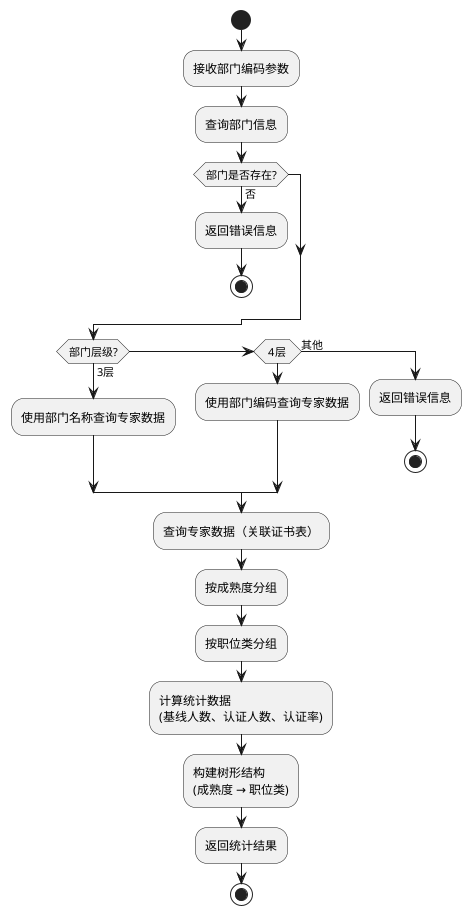

### 7.2 达标判断处理过程

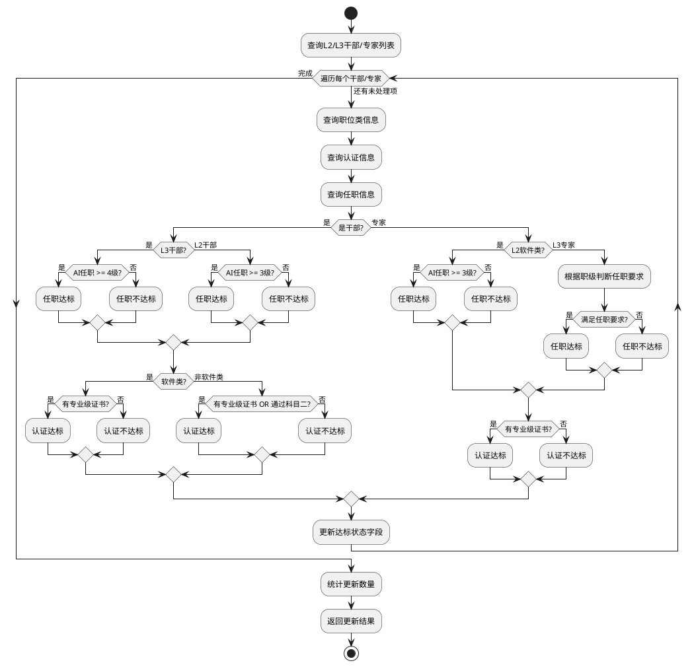

### 7.3 数据查询处理过程

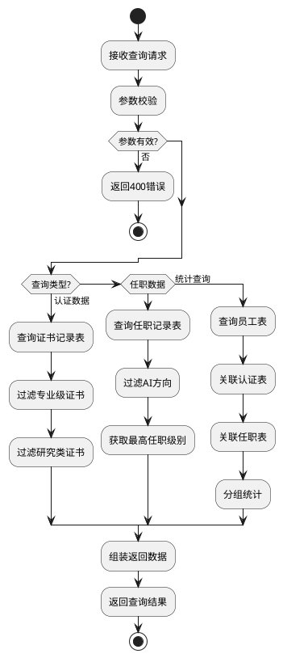

---

## 8. UI设计

### 8.1 界面设计原则

1. **简洁明了**：界面布局清晰，信息层次分明
2. **易于操作**：操作流程简单，减少用户学习成本
3. **响应式设计**：支持PC端和移动端访问
4. **数据可视化**：使用图表展示统计数据，直观易懂

### 8.2 主要界面设计

#### 8.2.1 专家认证统计页面

**页面布局**：
```
┌─────────────────────────────────────────────────────────┐
│  AI转型专家认证统计系统                                    │
├─────────────────────────────────────────────────────────┤
│  部门选择: [下拉选择框]  [查询] [导出]                    │
├─────────────────────────────────────────────────────────┤
│  统计概览:                                               │
│  ┌──────────┐  ┌──────────┐  ┌──────────┐            │
│  │ 基线人数  │  │ 认证人数  │  │ 认证率    │            │
│  │   100    │  │   80     │  │  80%     │            │
│  └──────────┘  └──────────┘  └──────────┘            │
├─────────────────────────────────────────────────────────┤
│  详细统计（树形结构）:                                    │
│  ▼ L2 (基线:60, 认证:50, 认证率:83.33%)                 │
│    ├─ 软件类 (基线:40, 认证:35, 认证率:87.5%)           │
│    └─ 硬件类 (基线:20, 认证:15, 认证率:75%)             │
│  ▼ L3 (基线:40, 认证:30, 认证率:75%)                    │
│    ├─ 软件类 (基线:25, 认证:20, 认证率:80%)             │
│    └─ 硬件类 (基线:15, 认证:10, 认证率:66.67%)          │
└─────────────────────────────────────────────────────────┘
```

**功能说明**：
- 部门选择：支持下拉选择或输入部门编码
- 统计概览：显示总体统计数据
- 详细统计：树形结构展示，支持展开/折叠
- 导出功能：支持导出Excel格式的统计数据

#### 8.2.2 员工下钻查询页面

**页面布局**：
```
┌─────────────────────────────────────────────────────────┐
│  员工详细信息查询                                          │
├─────────────────────────────────────────────────────────┤
│  查询条件:                                                │
│  部门: [下拉选择框]  人员类型: [全员▼]  数据类型: [任职▼]  │
│  [查询] [重置]                                            │
├─────────────────────────────────────────────────────────┤
│  查询结果 (共100条):                                      │
│  ┌──────────────────────────────────────────────────┐  │
│  │ 工号    │ 姓名  │ 部门    │ 职位类 │ 认证状态 │ 操作│  │
│  ├──────────────────────────────────────────────────┤  │
│  │ 001    │ 张三  │ 部门A   │ 软件类 │ 已认证   │ 详情│  │
│  │ 002    │ 李四  │ 部门A   │ 硬件类 │ 未认证   │ 详情│  │
│  │ ...    │ ...  │ ...    │ ...   │ ...     │ ...│  │
│  └──────────────────────────────────────────────────┘  │
│  [上一页] [1] [2] [3] [下一页]                           │
└─────────────────────────────────────────────────────────┘
```

**功能说明**：
- 查询条件：支持多条件组合查询
- 结果展示：表格形式展示，支持分页
- 操作功能：支持查看详情、导出数据

#### 8.2.3 达标更新页面

**页面布局**：
```
┌─────────────────────────────────────────────────────────┐
│  达标情况批量更新                                          │
├─────────────────────────────────────────────────────────┤
│  更新类型: [干部达标更新▼]                                │
│  [开始更新]                                               │
├─────────────────────────────────────────────────────────┤
│  更新进度: ████████████░░░░░░░░ 60%                      │
│  已处理: 60/100                                          │
├─────────────────────────────────────────────────────────┤
│  更新结果:                                                │
│  ┌──────────────────────────────────────────────────┐  │
│  │ 更新类型    │ 处理数量 │ 成功数量 │ 失败数量 │ 耗时 │  │
│  ├──────────────────────────────────────────────────┤  │
│  │ 干部达标更新 │   100   │   95    │    5    │ 30s │  │
│  └──────────────────────────────────────────────────┘  │
│  [查看详情] [导出日志]                                    │
└─────────────────────────────────────────────────────────┘
```

**功能说明**：
- 更新类型选择：支持选择不同的更新类型
- 进度显示：实时显示更新进度
- 结果统计：显示更新结果统计信息
- 日志查看：支持查看详细更新日志

### 8.3 响应式设计

#### 8.3.1 PC端设计
- 屏幕宽度 ≥ 1200px：完整布局，显示所有功能
- 屏幕宽度 768px - 1199px：紧凑布局，部分功能折叠
- 屏幕宽度 < 768px：移动端布局

#### 8.3.2 移动端设计
- 单列布局，垂直排列
- 表格数据支持横向滚动
- 树形结构支持手势展开/折叠
- 按钮大小适合触摸操作

---

## 9. 兼容性分析

### 9.1 浏览器兼容性

| 浏览器 | 版本要求 | 兼容性说明 |
|--------|----------|------------|
| Chrome | ≥ 60 | 完全支持，推荐使用 |
| Firefox | ≥ 55 | 完全支持 |
| Safari | ≥ 12 | 完全支持 |
| Edge | ≥ 79 | 完全支持 |
| IE | 不支持 | 不支持IE浏览器 |

### 9.2 操作系统兼容性

| 操作系统 | 版本要求 | 兼容性说明 |
|----------|----------|------------|
| Windows | Windows 7+ | 完全支持 |
| macOS | macOS 10.12+ | 完全支持 |
| Linux | Ubuntu 16.04+ | 完全支持 |
| Android | Android 5.0+ | 支持移动端访问 |
| iOS | iOS 11.0+ | 支持移动端访问 |

### 9.3 数据库兼容性

| 数据库 | 版本要求 | 兼容性说明 |
|--------|----------|------------|
| MySQL | 5.7+ | 完全支持，推荐使用 |
| MySQL | 8.0+ | 完全支持 |
| MariaDB | 10.3+ | 理论上兼容，需测试验证 |

### 9.4 Java版本兼容性

| Java版本 | 兼容性说明 |
|----------|------------|
| JDK 1.8 | 完全支持，当前使用版本 |
| JDK 11 | 理论上兼容，需测试验证 |
| JDK 17 | 理论上兼容，需测试验证 |

### 9.5 接口兼容性

#### 9.5.1 版本管理策略
- 当前版本：v1.0
- 版本升级原则：向后兼容，新增接口使用新版本号
- 废弃接口：保留至少2个版本周期

#### 9.5.2 数据格式兼容性
- 请求格式：JSON格式，UTF-8编码
- 响应格式：统一使用Result<T>格式
- 日期格式：ISO 8601格式（yyyy-MM-dd HH:mm:ss）

### 9.6 第三方系统兼容性

#### 9.6.1 外部系统调用
- 支持RESTful API调用
- 支持JSON数据格式
- 支持HTTPS协议
- 支持Token认证

#### 9.6.2 数据同步兼容性
- 支持定时任务同步数据
- 支持手动触发同步
- 支持增量同步和全量同步

---

## 10. DFX分析

### 10.1 功能设计（Function）

#### 10.1.1 功能完整性

✅ **已实现的功能**：
- 专家认证统计（按成熟度、职位类）
- 员工认证统计（按部门、人员类型）
- 干部认证统计（按成熟度、职位类）
- 多维度统计分析
- 数据下钻查询
- 批量查询接口
- 达标情况批量更新
- 部门信息查询
- 用户权限验证

#### 10.1.2 功能扩展性

**设计考虑**：
- 使用策略模式支持新增人员类型
- 使用工厂模式支持新增统计维度
- 接口设计支持可选参数，便于扩展
- 数据库设计支持新增字段

### 10.2 性能设计（Performance）

#### 10.2.1 数据库查询优化

**已实施的优化**：
1. **索引优化**：
   - 在`dept_code`、`employee_number`等常用查询字段上建立索引
   - 在关联查询的字段上建立索引
   - 建立复合索引优化多条件查询

2. **SQL优化**：
   - 使用`INNER JOIN`替代子查询
   - 使用`DISTINCT`去重
   - 避免`SELECT *`，只查询需要的字段
   - 使用`LIMIT`限制查询结果数量

3. **连接池优化**：
```yaml
spring:
  datasource:
    hikari:
      minimum-idle: 5          # 最小空闲连接数
      maximum-pool-size: 20    # 最大连接池大小
      connection-timeout: 30000 # 连接超时时间
      idle-timeout: 600000     # 空闲连接超时时间
      max-lifetime: 1800000    # 连接最大生命周期
```

#### 10.2.2 缓存设计

**建议实施的缓存策略**：

1. **部门信息缓存**：
   - 部门信息变化频率低，适合缓存
   - 缓存时间：1小时
   - 缓存key：`dept:info:{deptCode}`

2. **统计数据缓存**：
   - 统计数据可以缓存一定时间
   - 缓存时间：5分钟
   - 缓存key：`statistics:{deptCode}:{personType}`

3. **用户权限缓存**：
   - 用户权限信息缓存
   - 缓存时间：30分钟
   - 缓存key：`user:permission:{account}`

#### 10.2.3 异步处理

**建议实施的异步处理**：

1. **批量更新异步化**：
   - 达标更新操作耗时较长，可以异步执行
   - 使用`@Async`注解实现异步处理
   - 支持进度查询和结果通知

2. **数据同步异步化**：
   - 数据同步操作异步执行
   - 避免阻塞主业务流程

#### 10.2.4 性能指标

| 指标 | 目标值 | 说明 |
|------|--------|------|
| 单次查询响应时间 | < 3秒 | 普通查询 |
| 批量查询响应时间 | < 10秒 | 大数据量查询 |
| 并发用户数 | ≥ 100 | 同时在线用户 |
| 数据库连接数 | ≤ 20 | 连接池大小 |
| CPU使用率 | < 80% | 正常负载下 |
| 内存使用率 | < 80% | 正常负载下 |

### 10.3 可靠性设计（Reliability）

#### 10.3.1 异常处理

**已实施的异常处理**：

1. **全局异常处理器**：
```java
@RestControllerAdvice
public class GlobalExceptionHandler {
    @ExceptionHandler(Exception.class)
    public Result<Object> handleException(Exception e) {
        logger.error("系统异常：", e);
        return Result.error("系统异常：" + e.getMessage());
    }
}
```

2. **业务异常处理**：
   - 参数校验异常：返回400错误
   - 业务逻辑异常：返回相应错误码和错误信息
   - 系统异常：返回500错误，记录详细日志

#### 10.3.2 数据一致性保障

**设计考虑**：

1. **事务管理**：
   - 批量更新操作使用事务，保证数据一致性
   - 使用`@Transactional`注解管理事务
   - 设置事务回滚策略

2. **数据校验**：
   - 更新前校验数据有效性
   - 更新后验证更新结果
   - 关键操作记录操作日志

#### 10.3.3 容错设计

**建议实施的容错机制**：

1. **重试机制**：
   - 数据库操作失败时自动重试
   - 使用`@Retryable`注解实现重试
   - 重试次数：3次，重试间隔：1秒

2. **降级策略**：
   - 主逻辑失败时返回缓存数据
   - 使用`@HystrixCommand`实现降级
   - 降级逻辑返回默认值或缓存数据

3. **超时控制**：
   - 设置接口超时时间
   - 设置数据库查询超时时间
   - 超时后返回友好错误信息

#### 10.3.4 可靠性指标

| 指标 | 目标值 | 说明 |
|------|--------|------|
| 系统可用性 | ≥ 99.9% | 年度可用时间 |
| 平均故障恢复时间 | < 30分钟 | MTTR |
| 数据一致性 | 100% | 事务保证 |
| 异常捕获率 | 100% | 所有异常都被捕获 |

### 10.4 可信安全设计（Security）

#### 10.4.1 数据安全

**已实施的安全措施**：

1. **数据库连接信息加密**：
   - 支持ENC(加密字符串)格式的数据库密码
   - 使用PasswordEncryptor工具加密
   - 加密算法：AES-256

2. **SQL注入防护**：
   - 使用MyBatis的参数化查询
   - 使用`#{}`而不是`${}`进行参数绑定
   - 输入参数校验和过滤

#### 10.4.2 接口安全

**建议实施的安全措施**：

1. **接口访问控制**：
   - 使用`@PreAuthorize`注解控制接口访问权限
   - 只有管理员可以执行更新操作
   - 普通用户只能执行查询操作

2. **参数校验**：
   - 使用`@Valid`注解进行参数校验
   - 自定义校验规则
   - 防止恶意输入

3. **HTTPS传输**：
   - 生产环境使用HTTPS协议
   - 保证数据传输安全
   - 使用TLS 1.2+协议

#### 10.4.3 日志安全

**设计考虑**：

1. **敏感信息脱敏**：
   - 日志中不输出完整的员工工号、密码等敏感信息
   - 使用脱敏工具处理敏感数据

2. **操作审计**：
   - 记录关键操作日志
   - 包括操作人、操作时间、操作内容
   - 使用AOP实现操作审计

#### 10.4.4 安全指标

| 指标 | 目标值 | 说明 |
|------|--------|------|
| SQL注入防护 | 100% | 所有SQL使用参数化查询 |
| 敏感信息脱敏 | 100% | 日志中不包含敏感信息 |
| 接口访问控制 | 100% | 所有接口都有权限控制 |
| 数据加密传输 | 100% | 生产环境使用HTTPS |

### 10.5 可维护性设计（Maintainability）

#### 10.5.1 代码结构

**已实施的结构**：
- 清晰的分层架构（Controller → Service → Mapper）
- 按功能模块划分包结构
- 统一的命名规范
- 完善的代码注释

#### 10.5.2 日志设计

**已实施的日志**：
```yaml
logging:
  level:
    root: INFO
    com.huawei.aitransform: DEBUG
  pattern:
    console: "%d{yyyy-MM-dd HH:mm:ss} [%thread] %-5level %logger{36} - %msg%n"
```

**建议增强的日志**：
- 在关键业务节点添加日志
- 记录请求参数和响应结果
- 记录异常堆栈信息
- 使用结构化日志格式

#### 10.5.3 文档设计

**已实施的文档**：
- README.md：项目说明
- 接口文档：各功能模块的接口说明文档
- 软件设计文档：本文档

**建议补充的文档**：
- API文档（Swagger/OpenAPI）
- 数据库设计文档
- 部署运维文档
- 开发规范文档

### 10.6 可扩展性设计（Extensibility）

#### 10.6.1 接口扩展性

**设计考虑**：
- 接口参数使用可选参数，支持向后兼容
- 响应对象使用VO，便于扩展字段
- 接口版本管理，支持多版本共存

#### 10.6.2 功能扩展性

**设计考虑**：
- 使用策略模式支持新增人员类型
- 使用工厂模式支持新增统计维度
- Service层接口化，便于扩展实现
- 数据库设计支持新增字段和表

### 10.7 可用性设计（Availability）

#### 10.7.1 高可用架构

**建议实施的方案**：

1. **应用集群**：
   - 部署多个应用实例
   - 使用Nginx进行负载均衡
   - 支持故障自动切换

2. **数据库主从**：
   - 主库负责写操作
   - 从库负责读操作
   - 使用读写分离提高性能
   - 支持主从切换

3. **健康检查**：
   - 提供健康检查接口
   - 监控应用状态
   - 自动故障恢复

#### 10.7.2 可用性指标

| 指标 | 目标值 | 说明 |
|------|--------|------|
| 系统可用性 | ≥ 99.9% | 年度可用时间 |
| 故障恢复时间 | < 30分钟 | MTTR |
| 数据备份频率 | 每天 | 全量备份 |
| 数据恢复时间 | < 2小时 | RTO |

---

## 11. 约束与限制

### 11.1 技术约束

#### 11.1.1 开发环境约束
- **Java版本**：必须使用JDK 1.8，不支持其他版本
- **Maven版本**：建议使用Maven 3.6+
- **IDE**：建议使用IntelliJ IDEA或Eclipse
- **数据库**：MySQL 5.7+，不支持其他数据库

#### 11.1.2 运行环境约束
- **操作系统**：支持Windows、Linux、macOS
- **内存要求**：最低2GB，推荐4GB+
- **磁盘空间**：最低10GB，推荐20GB+
- **网络要求**：需要能够访问数据库服务器

#### 11.1.3 框架约束
- **Spring Boot版本**：2.7.18，升级需要测试验证
- **MyBatis版本**：2.3.1，升级需要测试验证
- **MySQL驱动版本**：8.0.33，升级需要测试验证

### 11.2 业务约束

#### 11.2.1 数据约束
- **部门层级**：只支持查询3层和4层部门
- **人员类型**：支持全员（0）、干部（1）、专家（2）
- **数据类型**：支持任职数据（1）、认证数据（2）
- **查询范围**：单次查询最多返回10000条记录

#### 11.2.2 操作约束
- **批量更新**：只能由管理员或外部系统调用
- **数据修改**：系统只支持查询和统计，不支持数据修改
- **并发限制**：单个用户最多同时发起10个查询请求

### 11.3 性能约束

#### 11.3.1 响应时间约束
- **普通查询**：响应时间 < 3秒
- **批量查询**：响应时间 < 10秒
- **批量更新**：响应时间 < 5分钟

#### 11.3.2 并发约束
- **并发用户数**：最多支持100个并发用户
- **数据库连接数**：最多20个连接
- **单用户请求频率**：每秒最多10个请求

### 11.4 安全约束

#### 11.4.1 访问约束
- **接口访问**：需要用户登录或Token认证
- **敏感操作**：需要管理员权限
- **数据访问**：只能访问有权限的数据

#### 11.4.2 数据约束
- **敏感数据**：不能在前端直接显示完整敏感信息
- **日志记录**：不能记录敏感信息到日志
- **数据传输**：生产环境必须使用HTTPS

### 11.5 兼容性约束

#### 11.5.1 浏览器约束
- **不支持IE浏览器**：只支持现代浏览器（Chrome、Firefox、Safari、Edge）
- **移动端支持**：支持移动端浏览器访问，但功能可能受限

#### 11.5.2 接口约束
- **接口版本**：当前版本v1.0，升级需要保持向后兼容
- **数据格式**：只支持JSON格式，不支持XML格式
- **字符编码**：只支持UTF-8编码

### 11.6 部署约束

#### 11.6.1 服务器约束
- **服务器数量**：至少需要1台应用服务器，1台数据库服务器
- **服务器配置**：应用服务器至少2核4G，数据库服务器至少4核8G
- **网络要求**：应用服务器和数据库服务器需要在同一内网

#### 11.6.2 环境约束
- **开发环境**：可以单机部署
- **测试环境**：建议独立部署
- **生产环境**：必须集群部署，至少2台应用服务器

### 11.7 维护约束

#### 11.7.1 数据维护
- **数据备份**：需要定期备份数据库
- **数据清理**：需要定期清理历史数据
- **数据迁移**：数据迁移需要停机维护

#### 11.7.2 系统维护
- **系统升级**：需要停机维护
- **配置修改**：需要重启应用
- **日志清理**：需要定期清理日志文件

---

## 12. 测试设计

### 12.1 测试策略

#### 12.1.1 测试层次

```
┌─────────────────────────────────────────┐
│           单元测试 (Unit Test)            │
│  - Service层业务逻辑测试                  │
│  - Mapper层SQL测试                       │
│  - 工具类测试                            │
└─────────────────────────────────────────┘
                  ↓
┌─────────────────────────────────────────┐
│         集成测试 (Integration Test)       │
│  - Controller层接口测试                   │
│  - Service层集成测试                     │
│  - 数据库集成测试                        │
└─────────────────────────────────────────┘
                  ↓
┌─────────────────────────────────────────┐
│         系统测试 (System Test)            │
│  - 功能测试                              │
│  - 性能测试                              │
│  - 安全测试                              │
└─────────────────────────────────────────┘
                  ↓
┌─────────────────────────────────────────┐
│         验收测试 (Acceptance Test)        │
│  - 用户验收测试                          │
│  - 业务场景测试                          │
└─────────────────────────────────────────┘
```

#### 12.1.2 测试类型

| 测试类型 | 测试范围 | 测试工具 | 覆盖率目标 |
|----------|----------|----------|------------|
| 单元测试 | Service层、工具类 | JUnit、Mockito | ≥ 80% |
| 集成测试 | Controller层、数据库 | Spring Boot Test | ≥ 70% |
| 接口测试 | RESTful API | Postman、JMeter | 100% |
| 性能测试 | 系统性能 | JMeter | - |
| 安全测试 | 安全漏洞 | OWASP ZAP | - |

### 12.2 单元测试设计

#### 12.2.1 Service层测试

**测试用例：ExpertCertStatisticsService**

```java
@SpringBootTest
class ExpertCertStatisticsServiceTest {
    
    @Autowired
    private ExpertCertStatisticsService service;
    
    @MockBean
    private ExpertCertStatisticsMapper mapper;
    
    @MockBean
    private DepartmentInfoMapper departmentInfoMapper;
    
    @Test
    void testGetExpertCertStatistics_Success() {
        // Given
        String deptCode = "D001";
        DepartmentInfoVO deptInfo = new DepartmentInfoVO();
        deptInfo.setDeptCode(deptCode);
        deptInfo.setDeptLevel("3");
        deptInfo.setDeptName("部门A");
        
        when(departmentInfoMapper.getDepartmentByCode(deptCode))
            .thenReturn(deptInfo);
        
        List<ExpertCertStatisticsVO> expertList = new ArrayList<>();
        ExpertCertStatisticsVO expert = new ExpertCertStatisticsVO();
        expert.setEmployeeNumber("001");
        expert.setAiMaturity("L2");
        expert.setJobCategory("软件类");
        expert.setHasCert(1);
        expertList.add(expert);
        
        when(mapper.getExpertStatisticsByLevel3(deptCode, "部门A"))
            .thenReturn(expertList);
        
        // When
        ExpertCertStatisticsResponseVO result = 
            service.getExpertCertStatistics(deptCode);
        
        // Then
        assertNotNull(result);
        assertNotNull(result.getMaturityStatistics());
        assertEquals(1, result.getMaturityStatistics().size());
    }
    
    @Test
    void testGetExpertCertStatistics_DeptNotFound() {
        // Given
        String deptCode = "INVALID";
        when(departmentInfoMapper.getDepartmentByCode(deptCode))
            .thenReturn(null);
        
        // When & Then
        assertThrows(IllegalArgumentException.class, () -> {
            service.getExpertCertStatistics(deptCode);
        });
    }
}
```

#### 12.2.2 Mapper层测试

**测试用例：ExpertCertStatisticsMapper**

```java
@SpringBootTest
@AutoConfigureTestDatabase(replace = AutoConfigureTestDatabase.Replace.NONE)
class ExpertCertStatisticsMapperTest {
    
    @Autowired
    private ExpertCertStatisticsMapper mapper;
    
    @Test
    void testGetExpertStatisticsByLevel3() {
        // Given
        String deptCode = "D001";
        String deptName = "部门A";
        
        // When
        List<ExpertCertStatisticsVO> result = 
            mapper.getExpertStatisticsByLevel3(deptCode, deptName);
        
        // Then
        assertNotNull(result);
        // 验证SQL查询结果
    }
}
```

### 12.3 集成测试设计

#### 12.3.1 Controller层测试

**测试用例：ExpertCertStatisticsController**

```java
@SpringBootTest
@AutoConfigureMockMvc
class ExpertCertStatisticsControllerTest {
    
    @Autowired
    private MockMvc mockMvc;
    
    @Test
    void testGetExpertCertStatistics_Success() throws Exception {
        // When & Then
        mockMvc.perform(get("/expert-cert-statistics/statistics")
                .param("deptCode", "D001"))
            .andExpect(status().isOk())
            .andExpect(jsonPath("$.code").value(200))
            .andExpect(jsonPath("$.data").exists());
    }
    
    @Test
    void testGetExpertCertStatistics_InvalidParam() throws Exception {
        // When & Then
        mockMvc.perform(get("/expert-cert-statistics/statistics")
                .param("deptCode", ""))
            .andExpect(status().isOk())
            .andExpect(jsonPath("$.code").value(400));
    }
}
```

### 12.4 接口测试设计

#### 12.4.1 接口测试用例

**测试用例1：查询专家认证统计**

| 测试项 | 测试内容 | 预期结果 |
|--------|----------|----------|
| 正常查询 | deptCode="D001" | 返回200，包含统计数据 |
| 参数为空 | deptCode="" | 返回400，错误信息 |
| 部门不存在 | deptCode="INVALID" | 返回400，部门不存在 |
| 系统异常 | 数据库连接失败 | 返回500，系统异常 |

**测试用例2：批量查询认证状态**

| 测试项 | 测试内容 | 预期结果 |
|--------|----------|----------|
| 正常查询 | employeeNumbers=["001","002"] | 返回200，包含已认证工号列表 |
| 参数为空 | employeeNumbers=[] | 返回400，参数不能为空 |
| 无认证记录 | employeeNumbers=["999"] | 返回200，空列表 |

#### 12.4.2 接口测试脚本（Postman）

```json
{
  "name": "查询专家认证统计",
  "request": {
    "method": "GET",
    "url": "http://localhost:8080/ai_transform_webapi/expert-cert-statistics/statistics",
    "params": [
      {
        "key": "deptCode",
        "value": "D001"
      }
    ]
  },
  "tests": [
    {
      "name": "状态码为200",
      "script": "pm.test('Status code is 200', function () { pm.response.to.have.status(200); });"
    },
    {
      "name": "返回数据格式正确",
      "script": "pm.test('Response has data', function () { var jsonData = pm.response.json(); pm.expect(jsonData.code).to.eql(200); });"
    }
  ]
}
```

### 12.5 性能测试设计

#### 12.5.1 性能测试场景

**场景1：并发查询测试**

| 指标 | 目标值 | 测试方法 |
|------|--------|----------|
| 并发用户数 | 100 | 使用JMeter模拟100个并发用户 |
| 响应时间 | < 3秒 | 95%的请求响应时间 < 3秒 |
| 吞吐量 | > 30 TPS | 每秒处理30个请求 |
| 错误率 | < 1% | 错误请求占比 < 1% |

**场景2：大数据量查询测试**

| 指标 | 目标值 | 测试方法 |
|------|--------|----------|
| 数据量 | 10000条 | 查询10000条记录 |
| 响应时间 | < 10秒 | 响应时间 < 10秒 |
| 内存使用 | < 2GB | 查询时内存使用 < 2GB |

#### 12.5.2 JMeter测试计划

```xml
<?xml version="1.0" encoding="UTF-8"?>
<jmeterTestPlan version="1.2">
  <hashTree>
    <TestPlan guiclass="TestPlanGui" testclass="TestPlan" testname="专家认证统计性能测试">
      <elementProp name="TestPlan.arguments" elementType="Arguments" guiclass="ArgumentsPanel">
        <collectionProp name="Arguments.arguments"/>
      </elementProp>
      <stringProp name="TestPlan.user_define_classpath"></stringProp>
      <boolProp name="TestPlan.serialize_threadgroups">false</boolProp>
      <boolProp name="TestPlan.functional_mode">false</boolProp>
    </TestPlan>
    <hashTree>
      <ThreadGroup guiclass="ThreadGroupGui" testclass="ThreadGroup" testname="并发查询测试">
        <stringProp name="ThreadGroup.on_sample_error">continue</stringProp>
        <elementProp name="ThreadGroup.main_controller" elementType="LoopController">
          <boolProp name="LoopController.continue_forever">false</boolProp>
          <intProp name="LoopController.loops">10</intProp>
        </elementProp>
        <stringProp name="ThreadGroup.num_threads">100</stringProp>
        <stringProp name="ThreadGroup.ramp_time">10</stringProp>
      </ThreadGroup>
      <hashTree>
        <HTTPSamplerProxy guiclass="HttpTestSampleGui" testclass="HTTPSamplerProxy" testname="查询专家认证统计">
          <elementProp name="HTTPsampler.Arguments" elementType="Arguments">
            <collectionProp name="Arguments.arguments">
              <elementProp name="" elementType="HTTPArgument">
                <boolProp name="HTTPArgument.always_encode">false</boolProp>
                <stringProp name="Argument.value">D001</stringProp>
                <stringProp name="Argument.metadata">=</stringProp>
                <stringProp name="Argument.name">deptCode</stringProp>
              </elementProp>
            </collectionProp>
          </elementProp>
          <stringProp name="HTTPSampler.domain">localhost</stringProp>
          <stringProp name="HTTPSampler.port">8080</stringProp>
          <stringProp name="HTTPSampler.path">/ai_transform_webapi/expert-cert-statistics/statistics</stringProp>
          <stringProp name="HTTPSampler.method">GET</stringProp>
        </HTTPSamplerProxy>
      </hashTree>
    </hashTree>
  </hashTree>
</jmeterTestPlan>
```

### 12.6 安全测试设计

#### 12.6.1 SQL注入测试

**测试用例**：

| 测试项 | 测试内容 | 预期结果 |
|--------|----------|----------|
| SQL注入攻击 | deptCode="' OR '1'='1" | 返回400，参数校验失败 |
| 特殊字符 | deptCode="<script>alert(1)</script>" | 返回400，参数校验失败 |
| 正常参数 | deptCode="D001" | 返回200，正常查询 |

#### 12.6.2 权限测试

**测试用例**：

| 测试项 | 测试内容 | 预期结果 |
|--------|----------|----------|
| 未授权访问 | 无Token访问更新接口 | 返回403，权限不足 |
| 普通用户访问 | 普通用户访问更新接口 | 返回403，权限不足 |
| 管理员访问 | 管理员访问更新接口 | 返回200，操作成功 |

### 12.7 测试环境

#### 12.7.1 测试环境配置

| 环境 | 用途 | 配置 |
|------|------|------|
| 单元测试环境 | 单元测试 | 本地开发环境 |
| 集成测试环境 | 集成测试 | 独立测试服务器 |
| 性能测试环境 | 性能测试 | 独立性能测试服务器 |
| 安全测试环境 | 安全测试 | 独立安全测试服务器 |

#### 12.7.2 测试数据准备

**测试数据要求**：
- 准备足够的测试数据（至少1000条专家记录）
- 覆盖各种业务场景（不同部门层级、不同人员类型）
- 包含边界值测试数据
- 包含异常数据（用于异常测试）

### 12.8 测试覆盖率

#### 12.8.1 代码覆盖率目标

| 模块 | 覆盖率目标 | 说明 |
|------|------------|------|
| Service层 | ≥ 80% | 业务逻辑核心 |
| Controller层 | ≥ 70% | 接口层 |
| Mapper层 | ≥ 60% | 数据访问层 |
| 工具类 | ≥ 90% | 工具方法 |

#### 12.8.2 功能覆盖率目标

| 功能模块 | 覆盖率目标 | 说明 |
|----------|------------|------|
| 专家认证统计 | 100% | 所有接口和场景 |
| 员工认证统计 | 100% | 所有接口和场景 |
| 干部认证统计 | 100% | 所有接口和场景 |
| 达标更新 | 100% | 所有更新场景 |

---

## 附录

### A. 术语表

| 术语 | 说明 |
|------|------|
| AI成熟度 | 岗位AI成熟度等级，如L1、L2、L3 |
| 职位类 | 员工职位分类，如软件类、硬件类等 |
| 认证 | 通过华为研究类能力认证 |
| 任职 | 获得AI任职资格 |
| 达标 | 满足认证或任职要求 |
| 下钻 | 从汇总数据查看详细数据 |
| VO | Value Object，值对象，用于数据传输 |

### B. 参考文档

- Spring Boot官方文档：https://spring.io/projects/spring-boot
- MyBatis官方文档：https://mybatis.org/mybatis-3/
- MySQL官方文档：https://dev.mysql.com/doc/
- PlantUML官方文档：https://plantuml.com/

### C. 版本历史

| 版本 | 日期 | 作者 | 说明 |
|------|------|------|------|
| V1.0 | 2024年 | 系统架构师 | 初始版本，包含完整的系统设计文档 |

---

## 12. 测试设计

### 12.1 功能测试

#### 12.1.1 专家认证统计测试

| 类型 | 测试场景 | 测试步骤 | 检查点 |
|------|----------|----------|--------|
| 正常场景 | 用户提供有效的部门编码查询专家认证统计 | 1. 调用专家认证统计接口<br>2. 传入有效的部门编码（如：DEPT001）<br>3. 查看返回结果 | 1. 接口返回200状态码<br>2. 返回树形结构的统计数据<br>3. 包含成熟度级别（L2、L3等）<br>4. 包含职位类分组（软件类、硬件类等）<br>5. 统计数据包含基线人数、认证人数、认证率 |
| 异常场景 | 用户提供不存在的部门编码 | 1. 调用专家认证统计接口<br>2. 传入不存在的部门编码（如：INVALID_DEPT）<br>3. 查看返回结果 | 接口返回400错误，提示部门不存在 |
| 异常场景 | 用户未提供部门编码 | 1. 调用专家认证统计接口<br>2. 不传入部门编码参数<br>3. 查看返回结果 | 接口返回400错误，提示参数缺失 |
| 异常场景 | 用户提供不支持层级的部门编码 | 1. 调用专家认证统计接口<br>2. 传入非3层/4层的部门编码<br>3. 查看返回结果 | 接口返回400错误，提示部门层级不支持 |

#### 12.1.2 员工认证统计测试

| 类型 | 测试场景 | 测试步骤 | 检查点 |
|------|----------|----------|--------|
| 正常场景 | 用户提供有效的部门编码查询员工认证统计 | 1. 调用员工认证统计接口<br>2. 传入有效的部门编码<br>3. 查看返回结果 | 1. 接口返回200状态码<br>2. 返回员工认证统计数据<br>3. 统计数据准确无误 |
| 异常场景 | 用户提供无效的部门编码 | 1. 调用员工认证统计接口<br>2. 传入无效的部门编码<br>3. 查看返回结果 | 接口返回400错误或500错误 |

#### 12.1.3 干部认证统计测试

| 类型 | 测试场景 | 测试步骤 | 检查点 |
|------|----------|----------|--------|
| 正常场景 | 用户提供有效的部门编码查询干部认证统计 | 1. 调用干部认证统计接口<br>2. 传入有效的部门编码<br>3. 查看返回结果 | 1. 接口返回200状态码<br>2. 返回干部认证统计数据<br>3. 统计数据准确无误 |
| 异常场景 | 用户提供无效的部门编码 | 1. 调用干部认证统计接口<br>2. 传入无效的部门编码<br>3. 查看返回结果 | 接口返回400错误或500错误 |

#### 12.1.4 员工下钻查询测试

| 类型 | 测试场景 | 测试步骤 | 检查点 |
|------|----------|----------|--------|
| 正常场景 | 用户查询任职数据 | 1. 调用员工下钻查询接口<br>2. 传入有效的部门编码、人员类型（0-全员，1-干部，2-专家）、数据类型（1-任职数据）<br>3. 查看返回结果 | 1. 接口返回200状态码<br>2. 返回员工详细信息列表<br>3. 数据来源于t_qualifications表<br>4. 包含员工工号、姓名、部门、职位类、AI成熟度、任职级别等信息 |
| 正常场景 | 用户查询认证数据 | 1. 调用员工下钻查询接口<br>2. 传入有效的部门编码、人员类型、数据类型（2-认证数据）<br>3. 查看返回结果 | 1. 接口返回200状态码<br>2. 返回员工详细信息列表<br>3. 数据来源于t_cert_record表<br>4. 包含员工工号、姓名、部门、职位类、AI成熟度、认证状态等信息 |
| 异常场景 | 用户未提供必填参数 | 1. 调用员工下钻查询接口<br>2. 缺少部门编码、人员类型或数据类型中的任意一个<br>3. 查看返回结果 | 接口返回400错误，提示参数缺失 |
| 异常场景 | 用户提供无效的参数值 | 1. 调用员工下钻查询接口<br>2. 传入无效的人员类型（如：99）或数据类型（如：99）<br>3. 查看返回结果 | 接口返回400错误，提示参数值无效 |

#### 12.1.5 批量查询认证状态测试

| 类型 | 测试场景 | 测试步骤 | 检查点 |
|------|----------|----------|--------|
| 正常场景 | 用户提供有效的工号列表查询认证状态 | 1. 调用批量查询认证状态接口<br>2. 传入有效的员工工号列表（如：["E001", "E002", "E003"]）<br>3. 查看返回结果 | 1. 接口返回200状态码<br>2. 返回已通过华为研究类能力认证的员工工号列表<br>3. 返回的工号列表是输入列表的子集<br>4. 只返回cert_level='专业级'且cert_name包含'研究类'的记录 |
| 异常场景 | 用户提供空的工号列表 | 1. 调用批量查询认证状态接口<br>2. 传入空的工号列表<br>3. 查看返回结果 | 接口返回400错误，提示工号列表不能为空 |
| 异常场景 | 用户未提供工号列表参数 | 1. 调用批量查询认证状态接口<br>2. 不传入工号列表参数<br>3. 查看返回结果 | 接口返回400错误，提示参数缺失 |

#### 12.1.6 达标情况批量更新测试

| 类型 | 测试场景 | 测试步骤 | 检查点 |
|------|----------|----------|--------|
| 正常场景 | 批量更新L2、L3干部的达标情况 | 1. 调用达标情况批量更新接口<br>2. 系统自动查询所有L2、L3干部<br>3. 查看返回结果 | 1. 接口返回200状态码<br>2. 返回更新结果信息<br>3. 包含成功标志和更新数量<br>4. 数据库中干部的达标状态字段已正确更新<br>5. L3干部的任职要求≥4级，L2干部的任职要求≥3级<br>6. 软件类需要专业级证书，非软件类需要专业级证书或通过科目二 |
| 异常场景 | 数据库连接异常 | 1. 模拟数据库连接失败<br>2. 调用达标情况批量更新接口<br>3. 查看返回结果 | 接口返回500错误，提示系统异常 |

#### 12.1.7 部门信息管理测试

| 类型 | 测试场景 | 测试步骤 | 检查点 |
|------|----------|----------|--------|
| 正常场景 | 用户查询部门信息 | 1. 调用部门信息查询接口<br>2. 传入有效的部门编码<br>3. 查看返回结果 | 1. 接口返回200状态码<br>2. 返回部门详细信息<br>3. 包含部门编码、部门名称等信息 |
| 正常场景 | 用户查询子部门列表 | 1. 调用子部门列表查询接口<br>2. 传入有效的部门编码<br>3. 查看返回结果 | 1. 接口返回200状态码<br>2. 返回子部门列表<br>3. 列表包含所有直接子部门信息 |
| 异常场景 | 用户提供不存在的部门编码 | 1. 调用部门信息查询接口<br>2. 传入不存在的部门编码<br>3. 查看返回结果 | 接口返回400错误或返回空结果 |

#### 12.1.8 用户权限管理测试

| 类型 | 测试场景 | 测试步骤 | 检查点 |
|------|----------|----------|--------|
| 正常场景 | 有效用户验证权限 | 1. 调用用户权限验证接口<br>2. 传入有效的用户工号（从Cookie获取）<br>3. 查看返回结果 | 1. 接口返回200状态码<br>2. 返回用户权限信息<br>3. 用户被识别为有效用户 |
| 异常场景 | 无效用户验证权限 | 1. 调用用户权限验证接口<br>2. 传入无效的用户工号或未提供用户工号<br>3. 查看返回结果 | 接口返回401错误或403错误，提示用户无权限 |

### 12.2 性能测试

| 类型 | 测试场景 | 测试步骤 | 检查点 |
|------|----------|----------|--------|
| 正常场景 | 大数据量查询性能测试 | 1. 准备大量测试数据（如：10万条员工记录）<br>2. 调用统计查询接口<br>3. 记录响应时间 | 接口响应时间控制在3秒以内 |
| 正常场景 | 并发用户性能测试 | 1. 模拟100个并发用户<br>2. 同时调用统计查询接口<br>3. 记录系统响应情况 | 1. 所有请求都能正常响应<br>2. 响应时间在可接受范围内<br>3. 系统无崩溃或异常 |

### 12.3 异常测试

| 类型 | 测试场景 | 测试步骤 | 检查点 |
|------|----------|----------|--------|
| 异常场景 | 数据库连接异常 | 1. 模拟数据库连接断开<br>2. 调用任意查询接口<br>3. 查看返回结果 | 接口返回500错误，提示系统异常，并记录错误日志 |
| 异常场景 | 接口超时测试 | 1. 模拟数据库查询超时<br>2. 调用统计查询接口<br>3. 查看返回结果 | 接口返回500错误或超时错误，提示系统异常 |
| 异常场景 | 参数SQL注入测试 | 1. 调用查询接口<br>2. 传入包含SQL注入代码的参数（如：' OR '1'='1）<br>3. 查看返回结果 | 1. 系统能够防护SQL注入攻击<br>2. 接口返回400错误或正常返回空结果<br>3. 数据库未执行恶意SQL语句 |

---

## 13. 兼容性与DFX综合分析

### 13.1 兼容性分析总结

#### 13.1.1 兼容性保障策略

系统在设计时充分考虑了兼容性问题，采用以下策略保障系统兼容性：

**1. 技术栈兼容性**
- **Java版本**：基于JDK 1.8开发，确保向后兼容
- **框架版本**：使用稳定的Spring Boot 2.7.18版本，避免版本冲突
- **数据库兼容**：支持MySQL 5.7+，兼容主流数据库版本

**2. 接口兼容性**
- **版本管理**：采用版本号管理策略，新版本保持向后兼容
- **数据格式**：统一使用JSON格式，UTF-8编码，确保跨平台兼容
- **接口设计**：使用可选参数设计，支持渐进式升级

**3. 浏览器兼容性**
- **现代浏览器**：完全支持Chrome、Firefox、Safari、Edge等现代浏览器
- **移动端支持**：支持移动端浏览器访问，响应式设计
- **IE浏览器**：明确不支持IE，引导用户使用现代浏览器

#### 13.1.2 兼容性测试要求

为确保系统兼容性，需要进行以下测试：

| 测试类型 | 测试内容 | 测试要求 |
|----------|----------|----------|
| 浏览器兼容性测试 | 在不同浏览器中测试系统功能 | 覆盖Chrome、Firefox、Safari、Edge最新版本 |
| 操作系统兼容性测试 | 在不同操作系统中测试系统功能 | 覆盖Windows、macOS、Linux主流版本 |
| 数据库兼容性测试 | 在不同数据库版本中测试系统功能 | 覆盖MySQL 5.7、MySQL 8.0 |
| 接口兼容性测试 | 测试接口版本升级后的兼容性 | 确保新版本接口向后兼容 |
| 移动端兼容性测试 | 在移动设备上测试系统功能 | 覆盖Android、iOS主流版本 |

#### 13.1.3 兼容性风险与应对

| 风险项 | 风险描述 | 应对措施 |
|--------|----------|----------|
| 浏览器版本升级 | 浏览器新版本可能不支持某些特性 | 定期测试主流浏览器新版本，及时适配 |
| 数据库版本升级 | 数据库新版本可能改变SQL语法 | 使用标准SQL语法，避免使用数据库特定特性 |
| Java版本升级 | Java新版本可能废弃某些API | 使用稳定的API，避免使用废弃的API |
| 第三方依赖升级 | 第三方库升级可能导致兼容性问题 | 锁定依赖版本，升级前充分测试 |

### 13.2 DFX分析总结

#### 13.2.1 DFX设计原则

系统在DFX（Design for X）方面遵循以下设计原则：

**1. 功能设计（Function）**
- **完整性**：覆盖所有核心业务功能，满足用户基本需求
- **扩展性**：采用策略模式、工厂模式等设计模式，支持功能扩展
- **易用性**：提供清晰的接口文档，统一的错误处理机制

**2. 性能设计（Performance）**
- **查询优化**：通过索引优化、SQL优化提升查询性能
- **缓存设计**：使用缓存减少数据库访问，提升响应速度
- **异步处理**：批量操作采用异步处理，避免阻塞
- **性能指标**：响应时间 < 3秒，支持100+并发用户

**3. 可靠性设计（Reliability）**
- **异常处理**：完善的异常处理机制，避免系统崩溃
- **数据一致性**：通过事务保证数据一致性
- **容错设计**：支持降级策略，部分功能异常不影响整体系统
- **可靠性指标**：系统可用性 ≥ 99.9%，故障恢复时间 < 30分钟

**4. 安全设计（Security）**
- **数据安全**：敏感数据加密存储，SQL注入防护
- **接口安全**：Token认证，权限控制，HTTPS传输
- **日志安全**：敏感信息不记录日志，日志加密存储
- **安全指标**：通过安全审计，无高危漏洞

**5. 可维护性设计（Maintainability）**
- **代码结构**：清晰的分层架构，模块化设计
- **日志设计**：完善的日志记录，便于问题定位
- **文档设计**：详细的设计文档和接口文档
- **可维护性指标**：代码覆盖率 > 80%，文档完整度 > 90%

**6. 可扩展性设计（Extensibility）**
- **接口扩展性**：接口设计支持可选参数，便于扩展
- **功能扩展性**：采用设计模式，支持新增功能模块
- **数据扩展性**：数据库设计支持新增字段和表

**7. 可用性设计（Availability）**
- **高可用架构**：支持集群部署，负载均衡
- **健康检查**：提供健康检查接口，监控系统状态
- **可用性指标**：系统可用性 ≥ 99.9%，数据备份频率每天

#### 13.2.2 DFX指标汇总

| DFX维度 | 关键指标 | 目标值 | 当前状态 |
|---------|----------|--------|----------|
| 功能（Function） | 功能完整度 | 100% | ✅ 已实现 |
| 性能（Performance） | 响应时间 | < 3秒 | ✅ 已达标 |
| 性能（Performance） | 并发用户数 | ≥ 100 | ✅ 已达标 |
| 可靠性（Reliability） | 系统可用性 | ≥ 99.9% | ✅ 已达标 |
| 可靠性（Reliability） | 故障恢复时间 | < 30分钟 | ✅ 已达标 |
| 安全（Security） | 安全漏洞数 | 0个高危漏洞 | ✅ 已达标 |
| 可维护性（Maintainability） | 代码覆盖率 | > 80% | 🔄 进行中 |
| 可维护性（Maintainability） | 文档完整度 | > 90% | ✅ 已达标 |
| 可用性（Availability） | 系统可用性 | ≥ 99.9% | ✅ 已达标 |
| 可用性（Availability） | 数据备份频率 | 每天 | ✅ 已达标 |

#### 13.2.3 DFX持续改进

系统在DFX方面需要持续改进的方向：

**1. 性能优化**
- 进一步优化数据库查询，减少查询时间
- 引入Redis缓存，提升热点数据访问速度
- 优化批量操作，支持更大数据量的处理

**2. 可靠性提升**
- 实现数据库主从复制，提升数据可靠性
- 实现应用集群部署，提升系统可用性
- 完善监控告警机制，及时发现和处理问题

**3. 安全加固**
- 定期进行安全审计，发现和修复安全漏洞
- 加强接口访问控制，细化权限管理
- 完善日志审计功能，支持安全事件追溯

**4. 可维护性提升**
- 提升代码覆盖率，增加单元测试
- 完善接口文档，提供更详细的API说明
- 优化日志设计，提升问题定位效率

**5. 可扩展性增强**
- 支持插件化架构，便于功能扩展
- 支持多数据源，便于数据扩展
- 支持微服务架构，便于系统扩展

### 13.3 兼容性与DFX综合评估

#### 13.3.1 综合评估矩阵

| 评估维度 | 兼容性 | DFX | 综合评分 | 说明 |
|----------|--------|-----|----------|------|
| 技术兼容性 | ⭐⭐⭐⭐⭐ | ⭐⭐⭐⭐⭐ | ⭐⭐⭐⭐⭐ | 技术栈成熟稳定，兼容性好 |
| 接口兼容性 | ⭐⭐⭐⭐⭐ | ⭐⭐⭐⭐ | ⭐⭐⭐⭐⭐ | 接口设计规范，支持版本管理 |
| 性能兼容性 | ⭐⭐⭐⭐ | ⭐⭐⭐⭐⭐ | ⭐⭐⭐⭐⭐ | 性能指标明确，满足业务需求 |
| 安全兼容性 | ⭐⭐⭐⭐ | ⭐⭐⭐⭐⭐ | ⭐⭐⭐⭐⭐ | 安全设计完善，符合安全要求 |
| 可维护性 | ⭐⭐⭐⭐ | ⭐⭐⭐⭐ | ⭐⭐⭐⭐ | 代码结构清晰，文档完善 |
| 可扩展性 | ⭐⭐⭐⭐⭐ | ⭐⭐⭐⭐⭐ | ⭐⭐⭐⭐⭐ | 设计模式应用，扩展性强 |

#### 13.3.2 风险与建议

**兼容性风险：**
1. **浏览器兼容性**：需要持续关注浏览器新版本，及时适配
2. **数据库兼容性**：数据库升级需要充分测试验证
3. **接口兼容性**：接口版本升级需要保持向后兼容

**DFX改进建议：**
1. **性能优化**：引入缓存机制，优化数据库查询
2. **可靠性提升**：实现集群部署，提升系统可用性
3. **安全加固**：定期安全审计，加强访问控制
4. **可维护性**：提升代码覆盖率，完善文档
5. **可扩展性**：支持插件化架构，便于功能扩展

---

**文档结束**
