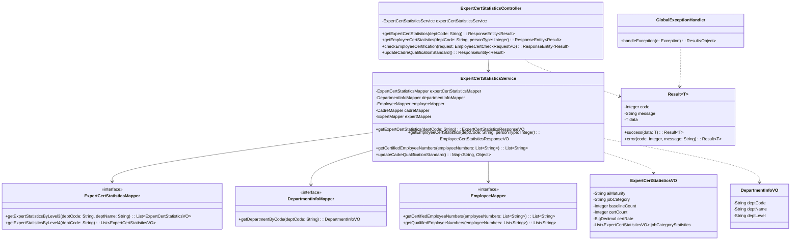
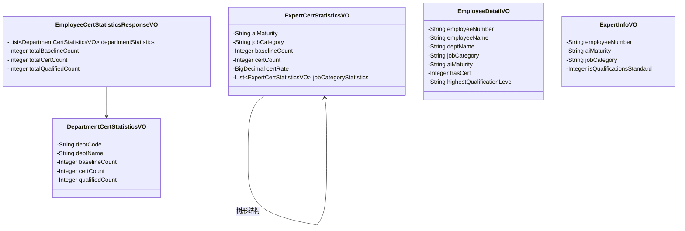
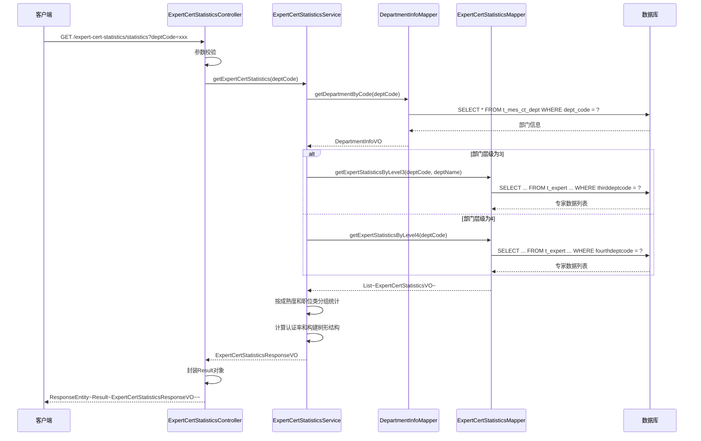
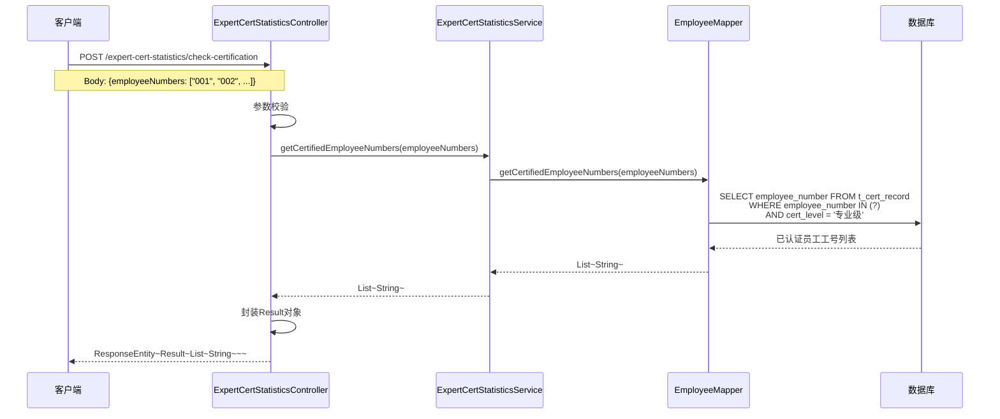
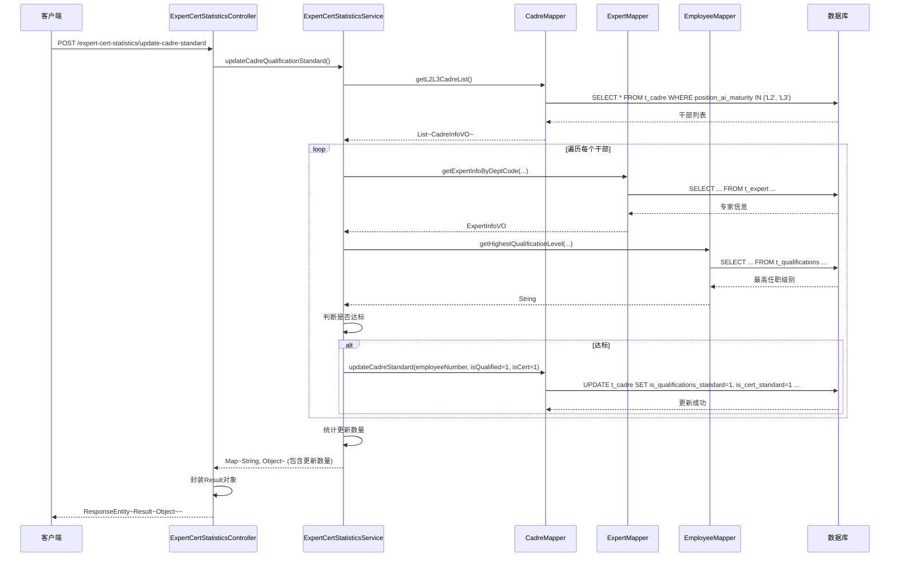

# AI转型专家认证统计系统 - 软件设计文档

## 文档信息

| 项目 | 内容 |
|------|------|
| 文档名称 | AI转型专家认证统计系统软件设计文档 |
| 版本号 | V1.0 |
| 编写日期 | 2024年 |
| 编写人 | 系统架构师 |
| 审核人 | - |
| 批准人 | - |

---

## 目录

1. [系统概述](#1-系统概述)
2. [功能需求分析](#2-功能需求分析)
3. [系统架构设计](#3-系统架构设计)
4. [详细设计](#4-详细设计)
5. [设计模式应用](#5-设计模式应用)
6. [SOLID设计原则](#6-solid设计原则)
7. [DFX设计考虑](#7-dfx设计考虑)
8. [数据库设计](#8-数据库设计)
9. [接口设计](#9-接口设计)
10. [部署架构](#10-部署架构)
11. [编码实现指导](#11-编码实现指导)

---

## 1. 系统概述

### 1.1 系统背景

AI转型专家认证统计系统是一个面向企业AI能力建设的统计与分析平台，主要用于统计和管理专家、干部、员工的AI认证和任职情况，支持多维度数据分析和下钻查询，为企业AI人才队伍建设提供数据支撑。

### 1.2 系统目标

- **功能目标**：提供全面的专家认证统计、员工认证统计、干部认证统计等功能，支持按部门、职位类、成熟度等多维度统计分析
- **性能目标**：支持大数据量查询，响应时间控制在3秒以内
- **可靠性目标**：系统可用性达到99.9%，支持异常恢复和数据一致性保障
- **安全目标**：支持数据库连接信息加密，接口访问控制，数据安全传输

### 1.3 技术栈

- **开发语言**：Java 1.8
- **框架**：Spring Boot 2.7.18
- **持久层**：MyBatis 2.3.1
- **数据库**：MySQL 5.7+
- **构建工具**：Maven
- **应用服务器**：内嵌Tomcat

---

## 2. 功能需求分析

### 2.1 功能模块划分

#### 2.1.1 专家认证统计模块

**功能描述**：
- 查询专家任职认证数据（按成熟度和职位类统计）
- 查询专家AI认证数据
- 查询专家AI任职数据
- 专家认证达标情况更新

**核心场景**：
1. **场景1：专家认证统计查询**
   - 输入：部门编码（deptCode）
   - 处理：根据部门层级（3层/4层）查询专家数据，按成熟度和职位类分组统计
   - 输出：树形结构的统计结果（成熟度 -> 职位类 -> 统计数据）

2. **场景2：专家认证达标更新**
   - 输入：无（批量更新）
   - 处理：根据专家职级和职位类判断是否达标，更新is_cert_standard字段
   - 输出：更新结果和更新数量

#### 2.1.2 员工认证统计模块

**功能描述**：
- 查询全员任职认证信息（支持全员、干部、专家三种人员类型）
- 按职位类统计认证和任职人数
- 按组织成熟度统计认证和任职人数
- 员工下钻查询（查看详细信息）

**核心场景**：
1. **场景1：员工认证统计**
   - 输入：部门编码（deptCode）、人员类型（personType：0-全员，1-干部，2-专家）
   - 处理：查询该部门下指定人员类型的认证和任职数据，按部门分组统计
   - 输出：各部门统计数据和总计数据

2. **场景2：员工下钻查询**
   - 输入：部门编码、人员类型、数据类型（1-任职数据，2-认证数据）
   - 处理：查询符合条件的员工详细信息列表
   - 输出：员工详细信息列表（包含工号、姓名、部门、职位类、认证状态等）

#### 2.1.3 干部认证统计模块

**功能描述**：
- 查询干部任职认证数据（按成熟度和职位类统计）
- 干部认证达标情况更新
- 干部任职达标情况更新

**核心场景**：
1. **场景1：干部认证统计**
   - 输入：部门编码（deptCode）
   - 处理：查询L2、L3干部的认证和任职数据，按成熟度和职位类分组
   - 输出：干部认证统计结果

2. **场景2：干部达标更新**
   - 输入：无（批量更新）
   - 处理：根据干部级别（L2/L3）和职位类判断认证和任职是否达标
   - 输出：更新结果和更新数量

#### 2.1.4 通用查询模块

**功能描述**：
- 根据工号列表查询已通过认证的员工
- 根据工号列表查询获得AI任职的员工
- 单个员工认证状态快速查询

**核心场景**：
1. **场景1：批量认证查询**
   - 输入：员工工号列表
   - 处理：查询这些工号中已通过华为研究类能力认证的员工
   - 输出：已通过认证的员工工号列表

2. **场景2：批量任职查询**
   - 输入：员工工号列表
   - 处理：查询这些工号中获得AI任职的员工
   - 输出：获得AI任职的员工工号列表

#### 2.1.5 部门信息管理模块

**功能描述**：
- 部门信息查询
- 部门层级管理

#### 2.1.6 用户配置管理模块

**功能描述**：
- 用户权限配置
- 用户访问控制

### 2.2 非功能需求

#### 2.2.1 性能需求
- 单次查询响应时间 < 3秒
- 支持并发用户数 ≥ 100
- 数据库查询优化，避免全表扫描

#### 2.2.2 可靠性需求
- 系统可用性 ≥ 99.9%
- 异常情况自动恢复
- 数据一致性保障

#### 2.2.3 安全需求
- 数据库连接信息加密存储
- 接口访问权限控制
- 数据传输加密（HTTPS）
- SQL注入防护

#### 2.2.4 可维护性需求
- 代码结构清晰，模块化设计
- 完善的日志记录
- 异常信息可追溯

#### 2.2.5 可扩展性需求
- 支持新增统计维度
- 支持新增人员类型
- 支持新增查询条件

---

## 3. 系统架构设计

### 3.1 总体架构

系统采用经典的三层架构模式：**表现层（Controller）** → **业务层（Service）** → **数据访问层（Mapper）**

```
┌─────────────────────────────────────────────────────────┐
│                     表现层 (Controller)                   │
│  ┌──────────────┐  ┌──────────────┐  ┌──────────────┐  │
│  │ ExpertCert   │  │ Department   │  │ UserConfig   │  │
│  │ Statistics   │  │ Info         │  │              │  │
│  │ Controller   │  │ Controller   │  │ Controller   │  │
│  └──────────────┘  └──────────────┘  └──────────────┘  │
└─────────────────────────────────────────────────────────┘
                          ↓
┌─────────────────────────────────────────────────────────┐
│                     业务层 (Service)                      │
│  ┌──────────────┐  ┌──────────────┐  ┌──────────────┐  │
│  │ ExpertCert   │  │ Department   │  │ UserConfig   │  │
│  │ Statistics   │  │ Info         │  │              │  │
│  │ Service      │  │ Service      │  │ Service      │  │
│  └──────────────┘  └──────────────┘  └──────────────┘  │
└─────────────────────────────────────────────────────────┘
                          ↓
┌─────────────────────────────────────────────────────────┐
│                   数据访问层 (Mapper)                      │
│  ┌──────────────┐  ┌──────────────┐  ┌──────────────┐  │
│  │ Expert       │  │ Employee     │  │ Cadre        │  │
│  │ Mapper       │  │ Mapper       │  │ Mapper       │  │
│  └──────────────┘  └──────────────┘  └──────────────┘  │
└─────────────────────────────────────────────────────────┘
                          ↓
┌─────────────────────────────────────────────────────────┐
│                     数据库层 (MySQL)                       │
│  ┌──────────────┐  ┌──────────────┐  ┌──────────────┐  │
│  │ t_expert     │  │ t_employee   │  │ t_cadre      │  │
│  │ t_qualifi-   │  │ t_cert_      │  │ t_exam_      │  │
│  │ cations      │  │ record       │  │ record       │  │
│  └──────────────┘  └──────────────┘  └──────────────┘  │
└─────────────────────────────────────────────────────────┘
```

### 3.2 架构分层说明

#### 3.2.1 表现层（Controller Layer）

**职责**：
- 接收HTTP请求
- 参数校验
- 调用Service层处理业务逻辑
- 返回统一格式的响应结果
- 异常捕获和转换

**设计要点**：
- 使用`@RestController`注解，自动序列化响应
- 统一使用`Result<T>`作为响应格式
- 使用`GlobalExceptionHandler`统一处理异常
- 参数校验在Controller层进行

#### 3.2.2 业务层（Service Layer）

**职责**：
- 业务逻辑处理
- 数据聚合和计算
- 调用Mapper层进行数据访问
- 事务管理

**设计要点**：
- 使用`@Service`注解标识服务类
- 业务逻辑封装在Service层，Controller层不包含业务逻辑
- 复杂业务逻辑可以拆分为多个私有方法
- 使用`@Transactional`管理事务（如需要）

#### 3.2.3 数据访问层（Mapper Layer）

**职责**：
- 数据库操作封装
- SQL语句定义
- 结果集映射

**设计要点**：
- 使用MyBatis的`@Mapper`接口
- SQL语句定义在XML文件中
- 使用VO（Value Object）作为数据传输对象
- 避免在Mapper层包含业务逻辑

### 3.3 架构演进考虑

#### 3.3.1 当前架构（V1.0）

- **特点**：单体应用，三层架构
- **适用场景**：中小规模系统，功能相对集中
- **优势**：开发简单，部署方便，维护成本低

#### 3.3.2 未来演进方向（V2.0+）

**微服务化演进**：
```
当前架构 → 服务拆分 → 微服务架构
```

**拆分策略**：
1. **按业务域拆分**：
   - 专家服务（Expert Service）
   - 员工服务（Employee Service）
   - 干部服务（Cadre Service）
   - 统计服务（Statistics Service）

2. **按功能拆分**：
   - 查询服务（Query Service）
   - 更新服务（Update Service）
   - 报表服务（Report Service）

**技术栈演进**：
- 引入Spring Cloud进行服务治理
- 引入Redis进行缓存
- 引入消息队列（RabbitMQ/Kafka）进行异步处理
- 引入Elasticsearch进行全文搜索

---

## 4. 详细设计

### 4.1 类图设计

#### 4.1.1 核心类图



#### 4.1.2 实体类关系图



### 4.2 时序图设计

#### 4.2.1 专家认证统计查询时序图



#### 4.2.2 员工认证批量查询时序图



#### 4.2.3 干部达标更新时序图



### 4.3 核心业务流程设计

#### 4.3.1 专家认证统计流程

```
开始
  ↓
接收部门编码参数
  ↓
查询部门信息（验证部门是否存在）
  ↓
判断部门层级
  ├─ 3层 → 使用部门名称查询专家
  └─ 4层 → 使用部门编码查询专家
  ↓
查询专家数据（关联证书表）
  ↓
按成熟度分组
  ↓
按职位类分组
  ↓
计算统计数据（基线人数、认证人数、认证率）
  ↓
构建树形结构（成熟度 → 职位类）
  ↓
返回统计结果
  ↓
结束
```

#### 4.3.2 达标判断流程

```
开始
  ↓
查询L2/L3干部/专家列表
  ↓
遍历每个干部/专家
  ↓
查询职位类信息
  ↓
查询认证信息
  ↓
查询任职信息
  ↓
根据规则判断是否达标
  ├─ 干部规则：
  │   ├─ L3干部：AI任职≥4级
  │   ├─ L2干部：AI任职≥3级
  │   ├─ 软件类：需要专业级证书
  │   └─ 非软件类：通过科目二或专业级证书
  └─ 专家规则：
      ├─ L2软件类：AI任职≥3级
      ├─ L3 19级：AI任职≥4级
      ├─ L3 20级：AI任职≥5级
      ├─ L3 21级：AI任职≥6级
      ├─ L3 22级：AI任职≥7级
      └─ L3 23+级：AI任职=8级
  ↓
更新达标状态字段
  ↓
统计更新数量
  ↓
返回更新结果
  ↓
结束
```

---

## 5. 设计模式应用

### 5.1 已应用的设计模式

#### 5.1.1 单例模式（Singleton Pattern）

**应用场景**：Spring Bean管理

**实现方式**：
- Spring容器管理的Bean默认是单例模式
- 使用`@Service`、`@Controller`、`@Mapper`等注解标识的类，Spring会自动创建单例实例

**代码示例**：
```java
@Service  // Spring自动管理为单例
public class ExpertCertStatisticsService {
    // ...
}
```

#### 5.1.2 依赖注入模式（Dependency Injection）

**应用场景**：Controller、Service、Mapper之间的依赖关系

**实现方式**：
- 使用`@Autowired`注解进行依赖注入
- Spring容器自动管理依赖关系

**代码示例**：
```java
@RestController
public class ExpertCertStatisticsController {
    @Autowired
    private ExpertCertStatisticsService expertCertStatisticsService;
}
```

#### 5.1.3 模板方法模式（Template Method Pattern）

**应用场景**：统一响应格式处理

**实现方式**：
- `Result<T>`类提供统一的响应格式模板
- 通过静态方法`success()`和`error()`创建不同类型的响应

**代码示例**：
```java
public class Result<T> {
    public static <T> Result<T> success(T data) {
        return new Result<>(200, "操作成功", data);
    }
    
    public static <T> Result<T> error(Integer code, String message) {
        return new Result<>(code, message, null);
    }
}
```

#### 5.1.4 策略模式（Strategy Pattern）

**应用场景**：不同部门层级的查询策略

**实现方式**：
- 根据部门层级（3层/4层）选择不同的查询策略
- 在Service层使用if-else或策略接口实现

**代码示例**：
```java
public ExpertCertStatisticsResponseVO getExpertCertStatistics(String deptCode) {
    DepartmentInfoVO deptInfo = departmentInfoMapper.getDepartmentByCode(deptCode);
    
    List<ExpertCertStatisticsVO> expertList;
    if ("3".equals(deptInfo.getDeptLevel())) {
        // 3层部门查询策略
        expertList = expertCertStatisticsMapper.getExpertStatisticsByLevel3(...);
    } else if ("4".equals(deptInfo.getDeptLevel())) {
        // 4层部门查询策略
        expertList = expertCertStatisticsMapper.getExpertStatisticsByLevel4(...);
    }
    // ...
}
```

### 5.2 建议应用的设计模式

#### 5.2.1 工厂模式（Factory Pattern）

**应用场景**：创建不同类型的统计服务

**设计建议**：
```java
public interface StatisticsService {
    StatisticsResponseVO getStatistics(String deptCode, Integer personType);
}

public class StatisticsServiceFactory {
    public static StatisticsService createService(Integer personType) {
        switch (personType) {
            case 0: return new EmployeeStatisticsService();
            case 1: return new CadreStatisticsService();
            case 2: return new ExpertStatisticsService();
            default: throw new IllegalArgumentException("不支持的人员类型");
        }
    }
}
```

#### 5.2.2 建造者模式（Builder Pattern）

**应用场景**：构建复杂的统计响应对象

**设计建议**：
```java
public class ExpertCertStatisticsResponseVOBuilder {
    private ExpertCertStatisticsResponseVO response = new ExpertCertStatisticsResponseVO();
    
    public ExpertCertStatisticsResponseVOBuilder addMaturityStatistics(...) {
        // 添加成熟度统计
        return this;
    }
    
    public ExpertCertStatisticsResponseVOBuilder calculateTotal() {
        // 计算总计
        return this;
    }
    
    public ExpertCertStatisticsResponseVO build() {
        return response;
    }
}
```

#### 5.2.3 责任链模式（Chain of Responsibility Pattern）

**应用场景**：参数校验链

**设计建议**：
```java
public abstract class ValidationHandler {
    protected ValidationHandler next;
    
    public void setNext(ValidationHandler handler) {
        this.next = handler;
    }
    
    public abstract void handle(String deptCode, Integer personType);
}

public class DeptCodeValidationHandler extends ValidationHandler {
    public void handle(String deptCode, Integer personType) {
        if (deptCode == null || deptCode.trim().isEmpty()) {
            throw new IllegalArgumentException("部门ID不能为空");
        }
        if (next != null) {
            next.handle(deptCode, personType);
        }
    }
}
```

---

## 6. SOLID设计原则

### 6.1 单一职责原则（Single Responsibility Principle, SRP）

**原则说明**：一个类应该只有一个引起它变化的原因。

**应用情况**：

✅ **符合SRP的设计**：

1. **Controller层**：只负责接收请求、参数校验、调用Service、返回响应
   ```java
   @RestController
   public class ExpertCertStatisticsController {
       // 只负责HTTP请求处理，不包含业务逻辑
       public ResponseEntity<Result<...>> getExpertCertStatistics(String deptCode) {
           // 参数校验
           // 调用Service
           // 返回响应
       }
   }
   ```

2. **Service层**：只负责业务逻辑处理
   ```java
   @Service
   public class ExpertCertStatisticsService {
       // 只包含业务逻辑，不包含HTTP处理
       public ExpertCertStatisticsResponseVO getExpertCertStatistics(String deptCode) {
           // 业务逻辑处理
       }
   }
   ```

3. **Mapper层**：只负责数据访问
   ```java
   @Mapper
   public interface ExpertCertStatisticsMapper {
       // 只包含数据访问方法，不包含业务逻辑
       List<ExpertCertStatisticsVO> getExpertStatisticsByLevel3(...);
   }
   ```

❌ **需要改进的地方**：

- `ExpertCertStatisticsService`类过大（3838行），包含了多个职责：
  - 专家统计
  - 员工统计
  - 干部统计
  - 达标更新

**改进建议**：
```java
// 拆分为多个Service
@Service
public class ExpertStatisticsService {
    // 只负责专家相关统计
}

@Service
public class EmployeeStatisticsService {
    // 只负责员工相关统计
}

@Service
public class CadreStatisticsService {
    // 只负责干部相关统计
}

@Service
public class StandardUpdateService {
    // 只负责达标更新
}
```

### 6.2 开闭原则（Open-Closed Principle, OCP）

**原则说明**：对扩展开放，对修改关闭。

**应用情况**：

✅ **符合OCP的设计**：

1. **使用接口定义Mapper**：可以轻松替换实现
   ```java
   @Mapper
   public interface ExpertCertStatisticsMapper {
       // 接口定义，实现可以扩展
   }
   ```

2. **统一响应格式**：`Result<T>`支持泛型，可以扩展不同类型的数据
   ```java
   public class Result<T> {
       // 支持任意类型的data
   }
   ```

❌ **需要改进的地方**：

- 人员类型判断使用硬编码的if-else，扩展新类型需要修改代码

**改进建议**：
```java
// 使用策略模式
public interface PersonTypeHandler {
    StatisticsResponseVO getStatistics(String deptCode);
}

@Service
public class EmployeeTypeHandler implements PersonTypeHandler {
    public StatisticsResponseVO getStatistics(String deptCode) {
        // 员工统计逻辑
    }
}

@Service
public class StatisticsService {
    private Map<Integer, PersonTypeHandler> handlers;
    
    public StatisticsResponseVO getStatistics(String deptCode, Integer personType) {
        PersonTypeHandler handler = handlers.get(personType);
        return handler.getStatistics(deptCode);
    }
}
```

### 6.3 里氏替换原则（Liskov Substitution Principle, LSP）

**原则说明**：子类对象可以替换父类对象，而程序的功能不受影响。

**应用情况**：

✅ **符合LSP的设计**：

- 系统主要使用接口和实现类，符合LSP原则
- VO类可以相互替换使用

### 6.4 接口隔离原则（Interface Segregation Principle, ISP）

**原则说明**：客户端不应该依赖它不需要的接口。

**应用情况**：

✅ **符合ISP的设计**：

- Mapper接口按功能划分，每个Mapper只包含相关的方法
  ```java
  @Mapper
  public interface ExpertMapper {
      // 只包含专家相关的方法
  }
  
  @Mapper
  public interface EmployeeMapper {
      // 只包含员工相关的方法
  }
  ```

❌ **需要改进的地方**：

- 如果Service接口过大，可以拆分为多个小接口

**改进建议**：
```java
// 拆分为多个接口
public interface ExpertQueryService {
    ExpertCertStatisticsResponseVO getExpertCertStatistics(String deptCode);
}

public interface ExpertUpdateService {
    Map<String, Object> updateExpertCertStandard();
}

@Service
public class ExpertCertStatisticsService 
    implements ExpertQueryService, ExpertUpdateService {
    // 实现多个接口
}
```

### 6.5 依赖倒置原则（Dependency Inversion Principle, DIP）

**原则说明**：高层模块不应该依赖低层模块，两者都应该依赖抽象。

**应用情况**：

✅ **符合DIP的设计**：

- Controller依赖Service接口（通过`@Autowired`注入）
- Service依赖Mapper接口
- 使用Spring的依赖注入，实现了依赖倒置

**代码示例**：
```java
@RestController
public class ExpertCertStatisticsController {
    @Autowired
    private ExpertCertStatisticsService expertCertStatisticsService;  // 依赖接口/抽象
}

@Service
public class ExpertCertStatisticsService {
    @Autowired
    private ExpertCertStatisticsMapper expertCertStatisticsMapper;  // 依赖接口
}
```

---

## 7. DFX设计考虑

### 7.1 功能设计（Function）

#### 7.1.1 功能完整性

✅ **已实现的功能**：
- 专家认证统计
- 员工认证统计
- 干部认证统计
- 多维度统计分析（按部门、职位类、成熟度）
- 下钻查询
- 达标情况更新
- 批量查询接口

#### 7.1.2 功能扩展性

**设计考虑**：
- 使用策略模式支持新增人员类型
- 使用工厂模式支持新增统计维度
- 接口设计支持可选参数，便于扩展

### 7.2 性能设计（Performance）

#### 7.2.1 数据库查询优化

**已实施的优化**：

1. **索引优化**：
   - 在`dept_code`、`employee_number`等常用查询字段上建立索引
   - 在关联查询的字段上建立索引

2. **SQL优化**：
   - 使用`INNER JOIN`替代子查询
   - 使用`DISTINCT`去重
   - 避免`SELECT *`，只查询需要的字段

3. **分页查询**（建议实施）：
   ```java
   // 对于大数据量查询，建议添加分页
   public List<EmployeeDetailVO> getEmployeeDrillDownInfo(
       String deptCode, Integer personType, Integer dataType,
       Integer pageNum, Integer pageSize) {
       // 使用LIMIT进行分页
   }
   ```

#### 7.2.2 缓存设计

**建议实施的缓存策略**：

1. **部门信息缓存**：
   ```java
   @Cacheable(value = "deptInfo", key = "#deptCode")
   public DepartmentInfoVO getDepartmentByCode(String deptCode) {
       // 部门信息变化频率低，适合缓存
   }
   ```

2. **统计数据缓存**：
   ```java
   @Cacheable(value = "statistics", key = "#deptCode + '_' + #personType")
   public EmployeeCertStatisticsResponseVO getEmployeeCertStatistics(
       String deptCode, Integer personType) {
       // 统计数据可以缓存一定时间（如5分钟）
   }
   ```

#### 7.2.3 异步处理

**建议实施的异步处理**：

1. **批量更新异步化**：
   ```java
   @Async
   public CompletableFuture<Map<String, Object>> updateCadreQualificationStandard() {
       // 达标更新操作耗时较长，可以异步执行
   }
   ```

#### 7.2.4 连接池优化

**已实施的优化**：
```yaml
spring:
  datasource:
    hikari:
      minimum-idle: 5          # 最小空闲连接数
      maximum-pool-size: 20    # 最大连接池大小
      connection-timeout: 30000 # 连接超时时间
      idle-timeout: 600000     # 空闲连接超时时间
      max-lifetime: 1800000    # 连接最大生命周期
```

### 7.3 可靠性设计（Reliability）

#### 7.3.1 异常处理

**已实施的异常处理**：

1. **全局异常处理器**：
   ```java
   @RestControllerAdvice
   public class GlobalExceptionHandler {
       @ExceptionHandler(Exception.class)
       public Result<Object> handleException(Exception e) {
           logger.error("系统异常：", e);
           return Result.error("系统异常：" + e.getMessage());
       }
   }
   ```

2. **业务异常处理**：
   ```java
   try {
       if (deptCode == null || deptCode.trim().isEmpty()) {
           return ResponseEntity.ok(Result.error(400, "部门ID不能为空"));
       }
       // 业务处理
   } catch (IllegalArgumentException e) {
       return ResponseEntity.ok(Result.error(400, e.getMessage()));
   } catch (Exception e) {
       return ResponseEntity.ok(Result.error(500, "系统异常：" + e.getMessage()));
   }
   ```

#### 7.3.2 数据一致性保障

**设计考虑**：

1. **事务管理**：
   ```java
   @Transactional(rollbackFor = Exception.class)
   public Map<String, Object> updateCadreQualificationStandard() {
       // 批量更新操作使用事务，保证数据一致性
   }
   ```

2. **数据校验**：
   - 更新前校验数据有效性
   - 更新后验证更新结果

#### 7.3.3 容错设计

**建议实施的容错机制**：

1. **重试机制**：
   ```java
   @Retryable(value = {SQLException.class}, maxAttempts = 3)
   public List<ExpertCertStatisticsVO> getExpertStatisticsByLevel3(...) {
       // 数据库操作失败时自动重试
   }
   ```

2. **降级策略**：
   ```java
   @HystrixCommand(fallbackMethod = "getStatisticsFallback")
   public ExpertCertStatisticsResponseVO getExpertCertStatistics(String deptCode) {
       // 主逻辑
   }
   
   public ExpertCertStatisticsResponseVO getStatisticsFallback(String deptCode) {
       // 降级逻辑：返回缓存数据或默认值
   }
   ```

### 7.4 可信安全设计（Security）

#### 7.4.1 数据安全

**已实施的安全措施**：

1. **数据库连接信息加密**：
   ```java
   // 支持ENC(加密字符串)格式的数据库密码
   // 使用PasswordEncryptor工具加密
   username: ENC(加密后的用户名)
   password: ENC(加密后的密码)
   ```

2. **SQL注入防护**：
   - 使用MyBatis的参数化查询，防止SQL注入
   - 使用`#{}`而不是`${}`进行参数绑定

#### 7.4.2 接口安全

**建议实施的安全措施**：

1. **接口访问控制**：
   ```java
   @PreAuthorize("hasRole('ADMIN')")
   @PostMapping("/update-cadre-standard")
   public ResponseEntity<Result<Object>> updateCadreQualificationStandard() {
       // 只有管理员可以执行更新操作
   }
   ```

2. **参数校验**：
   ```java
   @PostMapping("/check-certification")
   public ResponseEntity<Result<List<String>>> checkEmployeeCertification(
       @Valid @RequestBody EmployeeCertCheckRequestVO request) {
       // 使用@Valid进行参数校验
   }
   ```

3. **HTTPS传输**：
   - 生产环境使用HTTPS协议，保证数据传输安全

#### 7.4.3 日志安全

**设计考虑**：

1. **敏感信息脱敏**：
   ```java
   // 日志中不输出完整的员工工号、密码等敏感信息
   logger.info("查询员工认证信息，工号：{}", maskEmployeeNumber(employeeNumber));
   ```

2. **操作审计**：
   ```java
   @Aspect
   public class AuditAspect {
       @Around("@annotation(AuditLog)")
       public Object audit(ProceedingJoinPoint joinPoint) {
           // 记录操作日志，包括操作人、操作时间、操作内容
       }
   }
   ```

### 7.5 可维护性设计（Maintainability）

#### 7.5.1 代码结构

**已实施的结构**：
- 清晰的分层架构（Controller → Service → Mapper）
- 按功能模块划分包结构
- 统一的命名规范

#### 7.5.2 日志设计

**已实施的日志**：
```yaml
logging:
  level:
    root: INFO
    com.huawei.aitransform: DEBUG
  pattern:
    console: "%d{yyyy-MM-dd HH:mm:ss} [%thread] %-5level %logger{36} - %msg%n"
```

**建议增强的日志**：
```java
// 在关键业务节点添加日志
logger.info("开始查询专家认证统计，部门编码：{}", deptCode);
logger.debug("查询到专家数量：{}", expertList.size());
logger.info("专家认证统计查询完成，耗时：{}ms", duration);
```

#### 7.5.3 文档设计

**已实施的文档**：
- README.md：项目说明
- 接口文档：各功能模块的接口说明文档

**建议补充的文档**：
- API文档（Swagger/OpenAPI）
- 数据库设计文档
- 部署运维文档

### 7.6 可扩展性设计（Extensibility）

#### 7.6.1 接口扩展性

**设计考虑**：
- 接口参数使用可选参数，支持向后兼容
- 响应对象使用VO，便于扩展字段

#### 7.6.2 功能扩展性

**设计考虑**：
- 使用策略模式支持新增人员类型
- 使用工厂模式支持新增统计维度
- Service层接口化，便于扩展实现

### 7.7 可用性设计（Availability）

#### 7.7.1 高可用架构

**建议实施的方案**：

1. **应用集群**：
   - 部署多个应用实例，使用负载均衡
   - 使用Nginx或Spring Cloud Gateway进行负载均衡

2. **数据库主从**：
   - 主库负责写操作
   - 从库负责读操作
   - 使用读写分离提高性能

3. **健康检查**：
   ```java
   @RestController
   public class HealthController {
       @GetMapping("/health")
       public ResponseEntity<Map<String, String>> health() {
           // 健康检查接口
           Map<String, String> status = new HashMap<>();
           status.put("status", "UP");
           return ResponseEntity.ok(status);
       }
   }
   ```

---

## 8. 数据库设计

### 8.1 核心表结构

#### 8.1.1 专家表（t_expert）

| 字段名 | 类型 | 说明 | 索引 |
|--------|------|------|------|
| account | VARCHAR | 员工工号（主键） | PRIMARY |
| position_ai_maturity | VARCHAR | 岗位AI成熟度（L2/L3） | INDEX |
| orig_position_grade | INT | 原始职级 | |
| is_qualifications_standard | TINYINT | 任职是否达标（0/1） | |
| is_cert_standard | TINYINT | 认证是否达标（0/1） | |

#### 8.1.2 员工表（t_employee_sync）

| 字段名 | 类型 | 说明 | 索引 |
|--------|------|------|------|
| employee_number | VARCHAR | 员工工号（主键） | PRIMARY |
| period_id | INT | 周期ID | INDEX |
| job_category | VARCHAR | 职位类 | INDEX |
| firstdeptcode | VARCHAR | 一级部门编码 | INDEX |
| seconddeptcode | VARCHAR | 二级部门编码 | INDEX |
| thirddeptcode | VARCHAR | 三级部门编码 | INDEX |
| fourthdeptcode | VARCHAR | 四级部门编码 | INDEX |

#### 8.1.3 证书记录表（t_cert_record）

| 字段名 | 类型 | 说明 | 索引 |
|--------|------|------|------|
| id | BIGINT | 主键 | PRIMARY |
| employee_number | VARCHAR | 员工工号 | INDEX |
| cert_level | VARCHAR | 证书级别（工作级/专业级） | |
| cert_name | VARCHAR | 证书名称 | |

#### 8.1.4 任职记录表（t_qualifications）

| 字段名 | 类型 | 说明 | 索引 |
|--------|------|------|------|
| id | BIGINT | 主键 | PRIMARY |
| employee_number | VARCHAR | 员工工号 | INDEX |
| direction_cn_name | VARCHAR | 方向名称 | |
| competence_rating_cn | VARCHAR | 能力等级（1级-8级） | |
| competence_from | DATE | 任职开始时间 | |
| competence_to | DATE | 任职结束时间 | |

#### 8.1.5 部门表（t_mes_ct_dept）

| 字段名 | 类型 | 说明 | 索引 |
|--------|------|------|------|
| dept_code | VARCHAR | 部门编码（主键） | PRIMARY |
| dept_name | VARCHAR | 部门名称 | |
| dept_level | VARCHAR | 部门层级（1-7） | INDEX |
| parent_dept_code | VARCHAR | 父部门编码 | INDEX |

### 8.2 数据库优化建议

#### 8.2.1 索引优化

**已建立的索引**：
- 主键索引：所有表的主键
- 外键索引：关联查询字段（employee_number、dept_code等）

**建议新增的索引**：
```sql
-- 复合索引，优化多条件查询
CREATE INDEX idx_employee_dept_period ON t_employee_sync(employee_number, period_id, thirddeptcode);
CREATE INDEX idx_qualifications_employee_direction ON t_qualifications(employee_number, direction_cn_name);
```

#### 8.2.2 分区设计

**建议实施的分区**：
- 对于大数据量表（如t_qualifications），可以按时间分区
- 对于历史数据表，可以按周期分区

#### 8.2.3 读写分离

**建议实施的方案**：
- 主库：处理写操作和实时查询
- 从库：处理统计查询和报表查询
- 使用MyBatis的读写分离插件或Spring的AbstractRoutingDataSource

---

## 9. 接口设计

### 9.1 RESTful API设计规范

#### 9.1.1 URL设计

**规范**：
- 使用名词，不使用动词
- 使用复数形式
- 使用小写字母和连字符（-）
- 层级不超过3层

**示例**：
```
GET    /expert-cert-statistics/statistics          # 查询专家认证统计
GET    /expert-cert-statistics/employee-cert-statistics  # 查询员工认证统计
POST   /expert-cert-statistics/check-certification # 批量查询认证
POST   /expert-cert-statistics/update-cadre-standard # 更新干部达标
```

#### 9.1.2 HTTP方法使用

| 方法 | 用途 | 示例 |
|------|------|------|
| GET | 查询操作 | GET /expert-cert-statistics/statistics |
| POST | 创建/复杂查询 | POST /expert-cert-statistics/check-certification |
| PUT | 更新操作（全量） | - |
| PATCH | 更新操作（部分） | - |
| DELETE | 删除操作 | - |

#### 9.1.3 响应格式

**统一响应格式**：
```json
{
  "code": 200,
  "message": "查询成功",
  "data": {
    // 业务数据
  }
}
```

**错误响应格式**：
```json
{
  "code": 400,
  "message": "部门ID不能为空",
  "data": null
}
```

### 9.2 核心接口列表

#### 9.2.1 专家认证统计接口

**接口1：查询专家任职认证数据**
```
GET /expert-cert-statistics/statistics?deptCode={deptCode}

请求参数：
- deptCode: String (必填) 部门编码

响应示例：
{
  "code": 200,
  "message": "查询成功",
  "data": {
    "maturityStatistics": [
      {
        "aiMaturity": "L2",
        "baselineCount": 100,
        "certCount": 80,
        "certRate": 80.00,
        "jobCategoryStatistics": [
          {
            "jobCategory": "软件类",
            "baselineCount": 60,
            "certCount": 50,
            "certRate": 83.33
          }
        ]
      }
    ]
  }
}
```

#### 9.2.2 员工认证统计接口

**接口2：查询全员任职认证信息**
```
GET /expert-cert-statistics/employee-cert-statistics?deptCode={deptCode}&personType={personType}

请求参数：
- deptCode: String (必填) 部门编码
- personType: Integer (必填) 人员类型（0-全员，1-干部，2-专家）

响应示例：
{
  "code": 200,
  "message": "查询成功",
  "data": {
    "departmentStatistics": [
      {
        "deptCode": "D001",
        "deptName": "部门1",
        "baselineCount": 200,
        "certCount": 150,
        "qualifiedCount": 140
      }
    ],
    "totalBaselineCount": 200,
    "totalCertCount": 150,
    "totalQualifiedCount": 140
  }
}
```

#### 9.2.3 批量查询接口

**接口3：批量查询已通过认证的员工**
```
POST /expert-cert-statistics/check-certification

请求体：
{
  "employeeNumbers": ["001", "002", "003"]
}

响应示例：
{
  "code": 200,
  "message": "查询成功",
  "data": ["001", "003"]
}
```

### 9.3 接口版本管理

**建议实施的版本管理**：
```
/api/v1/expert-cert-statistics/statistics
/api/v2/expert-cert-statistics/statistics
```

---

## 10. 部署架构

### 10.1 部署架构图

```
                    ┌─────────────┐
                    │   客户端     │
                    │  (浏览器/APP) │
                    └──────┬───────┘
                           │ HTTPS
                           ↓
                    ┌─────────────┐
                    │   Nginx      │
                    │  (负载均衡)   │
                    └──────┬───────┘
                           │
            ┌──────────────┼──────────────┐
            ↓              ↓              ↓
    ┌───────────┐  ┌───────────┐  ┌───────────┐
    │ 应用实例1  │  │ 应用实例2  │  │ 应用实例3  │
    │ (8080)    │  │ (8081)    │  │ (8082)    │
    └─────┬─────┘  └─────┬─────┘  └─────┬─────┘
          │              │              │
          └──────────────┼──────────────┘
                         ↓
                  ┌─────────────┐
                  │   MySQL     │
                  │  (主从复制)  │
                  │  主库:写操作  │
                  │  从库:读操作  │
                  └─────────────┘
```

### 10.2 部署环境

#### 10.2.1 开发环境

- **服务器**：本地开发机
- **数据库**：本地MySQL
- **配置**：application-dev.yml

#### 10.2.2 测试环境

- **服务器**：测试服务器
- **数据库**：测试数据库（主从）
- **配置**：application-test.yml

#### 10.2.3 生产环境

- **服务器**：生产服务器集群（至少2台）
- **数据库**：生产数据库（主从，读写分离）
- **配置**：application-prod.yml
- **监控**：应用监控、数据库监控、日志监控

### 10.3 容器化部署

**Docker部署方案**：

```dockerfile
# Dockerfile
FROM openjdk:8-jre-alpine
COPY target/ai-transform-1.0.0.jar app.jar
EXPOSE 8080
ENTRYPOINT ["java", "-jar", "/app.jar"]
```

```yaml
# docker-compose.yml
version: '3.8'
services:
  app:
    build: .
    ports:
      - "8080:8080"
    environment:
      - SPRING_PROFILES_ACTIVE=prod
    depends_on:
      - mysql
      
  mysql:
    image: mysql:5.7
    environment:
      - MYSQL_ROOT_PASSWORD=root
      - MYSQL_DATABASE=ai_transform
    ports:
      - "3306:3306"
```

---

## 11. 编码实现指导

### 11.1 代码规范

#### 11.1.1 命名规范

- **类名**：大驼峰（PascalCase），如`ExpertCertStatisticsService`
- **方法名**：小驼峰（camelCase），如`getExpertCertStatistics`
- **常量**：全大写下划线分隔，如`CLOUD_CORE_NETWORK_DEPT_CODE`
- **变量**：小驼峰，如`deptCode`

#### 11.1.2 代码格式

- **缩进**：使用4个空格
- **大括号**：if、for、while等语句必须使用大括号
- **拖尾逗号**：对象和数组定义时使用拖尾逗号

**示例**：
```java
if (deptCode == null || deptCode.trim().isEmpty()) {
    return ResponseEntity.ok(Result.error(400, "部门ID不能为空"));
}

const hero = {
    firstName: 'Dana',
    lastName: 'Scully',
};
```

#### 11.1.3 注释规范

- **类注释**：说明类的职责
- **方法注释**：使用JavaDoc格式，说明参数、返回值、异常
- **复杂逻辑注释**：说明业务逻辑

**示例**：
```java
/**
 * 查询专家任职认证数据
 * @param deptCode 部门ID（部门编码）
 * @return 统计结果
 * @throws IllegalArgumentException 当部门不存在或部门层级不支持时抛出
 */
public ExpertCertStatisticsResponseVO getExpertCertStatistics(String deptCode) {
    // ...
}
```

### 11.2 异常处理规范

#### 11.2.1 异常分类

- **业务异常**：使用`IllegalArgumentException`等标准异常
- **系统异常**：使用`Exception`，由全局异常处理器统一处理

#### 11.2.2 异常处理原则

- Controller层捕获异常，转换为统一响应格式
- Service层抛出异常，不捕获（除非需要特殊处理）
- Mapper层不处理异常，直接抛出

**示例**：
```java
// Controller层
try {
    ExpertCertStatisticsResponseVO result = 
        expertCertStatisticsService.getExpertCertStatistics(deptCode);
    return ResponseEntity.ok(Result.success("查询成功", result));
} catch (IllegalArgumentException e) {
    return ResponseEntity.ok(Result.error(400, e.getMessage()));
} catch (Exception e) {
    return ResponseEntity.ok(Result.error(500, "系统异常：" + e.getMessage()));
}

// Service层
public ExpertCertStatisticsResponseVO getExpertCertStatistics(String deptCode) {
    DepartmentInfoVO deptInfo = departmentInfoMapper.getDepartmentByCode(deptCode);
    if (deptInfo == null) {
        throw new IllegalArgumentException("部门不存在：" + deptCode);
    }
    // ...
}
```

### 11.3 事务管理规范

#### 11.3.1 事务使用场景

- **写操作**：更新、插入、删除操作使用事务
- **批量操作**：批量更新使用事务
- **读操作**：查询操作不使用事务（或使用只读事务）

#### 11.3.2 事务注解使用

```java
@Transactional(rollbackFor = Exception.class)
public Map<String, Object> updateCadreQualificationStandard() {
    // 批量更新操作
}

@Transactional(readOnly = true)
public ExpertCertStatisticsResponseVO getExpertCertStatistics(String deptCode) {
    // 只读操作，提高性能
}
```

### 11.4 日志记录规范

#### 11.4.1 日志级别

- **ERROR**：系统错误、异常信息
- **WARN**：警告信息、潜在问题
- **INFO**：关键业务操作、系统状态
- **DEBUG**：调试信息、详细执行流程

#### 11.4.2 日志记录原则

- 关键业务节点记录INFO日志
- 异常情况记录ERROR日志
- 敏感信息不记录到日志
- 使用占位符，避免字符串拼接

**示例**：
```java
logger.info("开始查询专家认证统计，部门编码：{}", deptCode);
logger.debug("查询到专家数量：{}", expertList.size());
logger.error("查询专家认证统计失败，部门编码：{}", deptCode, e);
```

### 11.5 单元测试规范

#### 11.5.1 测试覆盖

- **Controller层**：测试接口参数校验、响应格式
- **Service层**：测试业务逻辑、异常处理
- **Mapper层**：测试SQL语句、结果映射

#### 11.5.2 测试示例

```java
@SpringBootTest
class ExpertCertStatisticsServiceTest {
    
    @Autowired
    private ExpertCertStatisticsService service;
    
    @Test
    void testGetExpertCertStatistics_Success() {
        // Given
        String deptCode = "D001";
        
        // When
        ExpertCertStatisticsResponseVO result = 
            service.getExpertCertStatistics(deptCode);
        
        // Then
        assertNotNull(result);
        assertNotNull(result.getMaturityStatistics());
    }
    
    @Test
    void testGetExpertCertStatistics_DeptNotFound() {
        // Given
        String deptCode = "INVALID";
        
        // When & Then
        assertThrows(IllegalArgumentException.class, () -> {
            service.getExpertCertStatistics(deptCode);
        });
    }
}
```

---

## 12. 总结

### 12.1 设计亮点

1. **清晰的分层架构**：Controller → Service → Mapper，职责明确
2. **统一响应格式**：使用`Result<T>`统一接口响应
3. **完善的异常处理**：全局异常处理器统一处理异常
4. **灵活的查询设计**：支持多维度统计和下钻查询
5. **数据库安全**：支持数据库连接信息加密

### 12.2 改进建议

1. **服务拆分**：将`ExpertCertStatisticsService`拆分为多个Service，符合单一职责原则
2. **引入缓存**：对部门信息、统计数据等实施缓存，提高性能
3. **接口版本管理**：实施API版本管理，支持向后兼容
4. **完善监控**：添加应用监控、性能监控、日志监控
5. **单元测试**：提高单元测试覆盖率，保证代码质量

### 12.3 后续演进方向

1. **微服务化**：按业务域拆分为微服务
2. **引入消息队列**：异步处理批量更新操作
3. **引入搜索引擎**：使用Elasticsearch支持全文搜索
4. **引入缓存中间件**：使用Redis进行缓存
5. **容器化部署**：使用Docker和Kubernetes进行容器化部署

---

## 附录

### A. 术语表

| 术语 | 说明 |
|------|------|
| AI成熟度 | 岗位AI成熟度等级，如L1、L2、L3 |
| 职位类 | 员工职位分类，如软件类、硬件类等 |
| 认证 | 通过华为研究类能力认证 |
| 任职 | 获得AI任职资格 |
| 达标 | 满足认证或任职要求 |

### B. 参考文档

- Spring Boot官方文档：https://spring.io/projects/spring-boot
- MyBatis官方文档：https://mybatis.org/mybatis-3/
- MySQL官方文档：https://dev.mysql.com/doc/

### C. 版本历史

| 版本 | 日期 | 作者 | 说明 |
|------|------|------|------|
| V1.0 | 2024年 | 系统架构师 | 初始版本 |

---

**文档结束**

